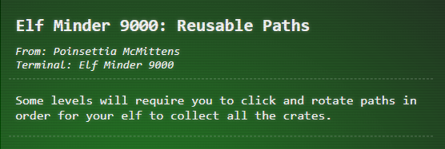
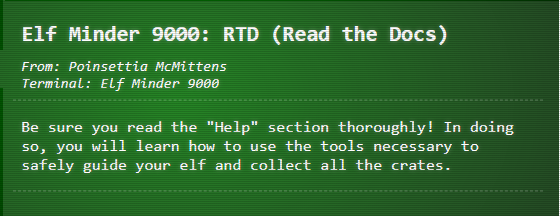
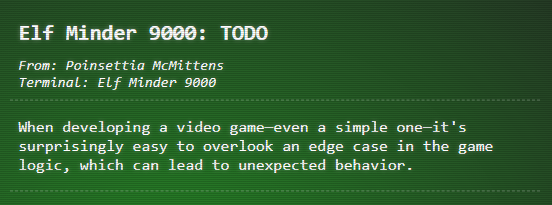
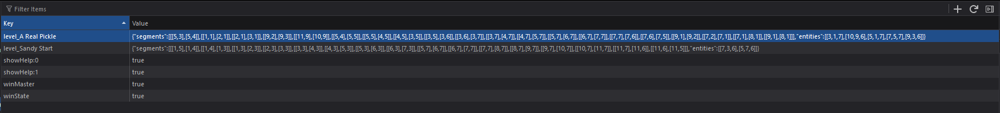

# Elf Minder 9000

## Rules
[(https://github.com/Security-Researcher-Cloud/Writeups/tree/main/Assets/videos/prologue/elf-minder/prologue-elf-minder-rules.mp4)

## Hints







## Pathway Options

### Sandy Start
<video src="../../../Assets/videos/prologue/elf-minder/prologue-elf-minder-video-sandy-start.mp4"></video>

### Waves & Crates
<video src="../../../Assets/videos/prologue/elf-minder/prologue-elf-minder-video-waves-and-crates.mp4"></video>

### Tidal Treasures
<video src="../../../Assets/videos/prologue/elf-minder/prologue-elf-minder-video-tidal-treasures-map.mp4"></video>

### Dune Dash
<video src="../../../Assets/videos/prologue/elf-minder/prologue-elf-minder-video-dune-dash-level.mp4"></video>

### Coral Cove
<video src="../../../Assets/videos/prologue/elf-minder/prologue-elf-minder-video-coral-cove-level.mp4"></video>

### Shell Seekers
<video src="../../../Assets/videos/prologue/elf-minder/prologue-elf-minder-video-shell-seekers-level.mp4"></video>

### Palm Grove Shuffle
<video src="../../../Assets/videos/prologue/elf-minder/prologue-elf-minder-video-palm-grove-shuffle-level.mp4"></video>

### Tropical Tangle
<video src="../../../Assets/videos/prologue/elf-minder/prologue-elf-minder-video-tropical-tangle-level.mp4"></video>

### Crate Caper
<video src="../../../Assets/videos/prologue/elf-minder/prologue-elf-minder-video-crate-caper-level.mp4"></video>

### Shoreline Shuffle
<video src="../../../Assets/videos/prologue/elf-minder/prologue-elf-minder-video-shoreline-shuffle-level.mp4"></video>

### Beachy Bounty
<video src="../../../Assets/videos/prologue/elf-minder/prologue-elf-minder-video-beachy-bounty-level.mp4"></video>

### Driftwood Dunes
<video src="../../../Assets/videos/prologue/elf-minder/prologue-elf-minder-video-driftwood-dunes-level.mp4"></video>

### Bonus Stage - `A Real Pickle`

#### No Cheating Method
<video src="../../../Assets/videos/prologue/elf-minder/prologue-elf-minder-video-a-real-pickle-nocheat-level.mp4"></video>

#### Let's Play Around A Bit
<video src="../../../Assets/videos/prologue/elf-minder/prologue-elf-minder-video-regular-a-real-pickle-level.mp4"></video>

Requires modification of the local storage

#### Reproduction Steps
This puzzle is not possible without a few modifications. In order support the modifications, we need 1 extra spring to create an obstacle.
- Modify your `Local Storage` to contain the following for the key `level_A Real Pickle`:
```json
{
  "segments":[
    [
      [5,3],
      [5,4]
    ],
    [
      [1,1],
      [2,1]
    ],
    [
      [2,1],
      [3,1]
    ],
    [
      [9,2],
      [9,3]
    ],
    [
      [11,9],
      [10,9]
    ],
    [
      [5,4],
      [5,5]
    ],
    [
      [5,5],
      [4,5]
    ],
    [
      [4,5],
      [3,5]
    ],
    [
      [3,5],
      [3,6]
    ],
    [
      [3,6],
      [3,7]
    ],
    [
      [3,7],
      [4,7]
    ],
    [
      [4,7],
      [5,7]
    ],
    [
      [5,7],
      [6,7]
    ],[
      [6,7],
      [7,7]
    ],
    [
      [7,7],
      [7,6]
    ],
    [
      [7,6],
      [7,5]
    ],
    [
      [9,1],
      [9,2]
    ],
    [
      [7,2],
      [7,1]
    ],
    [
      [7,1],
      [8,1]
    ],
    [
      [9,1],
      [8,1]
    ]
  ],
  "entities":[
    [3,1,7],
    [10,9,6],
    [5,1,7],
    [7,5,7],
    [9,3,6]
  ]
}
```
- At first nothing will show on the screen. Hit the start button, then restart, and everything should show up.
- Rotate segments as normal to follow the path to get crates and use ladder to go to the end flag
  
