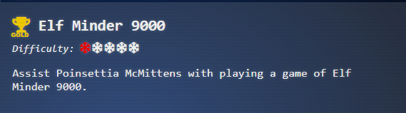
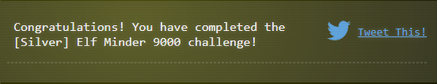
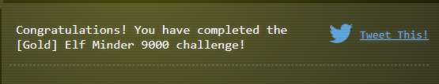

# Elf Minder 9000

## Objectives


## Challenge
_I need you to help me focus because this whole "moving back to the North Pole" situation has really thrown me off my 
game! It's a simple puzzle where you guide an elf to the exit as quickly as possible, but I've noticed some strange
issues with the springs. If I had made this game, it would be much more stable, though I won't comment any further on 
that!_

## Hints


## Rules
https://github.com/user-attachments/assets/31c71bdf-3455-405c-affc-b1f41a02f776

## Solution (Silver)
> [!NOTE] 
> The solutions demonstrated below are the solutions that I came up with when doing the challenge. Note that these solutions
are not optimized for the good score, bad score, or time, only that the meet the minimum requirement of getting the final
flag before the 999 ticks expire

### Sandy Start
https://github.com/user-attachments/assets/cee7c341-83d3-494a-b73c-6ede2ef85177

### Waves & Crates
https://github.com/user-attachments/assets/027826b5-a150-4c4e-99cd-85607ca36a52

### Tidal Treasures
https://github.com/user-attachments/assets/f6138af9-dfe2-496e-9d0b-5115f4428b88

### Dune Dash
https://github.com/user-attachments/assets/b8d75aef-808c-4846-99a5-bfa2079ac798

### Coral Cove
https://github.com/user-attachments/assets/d52e6868-b94c-487c-a75b-d48ecc182c37

### Shell Seekers
https://github.com/user-attachments/assets/372bb157-aaa0-4f89-893d-e804d394ec18

### Palm Grove Shuffle
https://github.com/user-attachments/assets/046c0a1a-7e0e-4e17-b1c8-1bc2232025ca

### Tropical Tangle
https://github.com/user-attachments/assets/08d0e6ed-6693-4a5f-bd9a-2de8302f9d62

### Crate Caper
https://github.com/user-attachments/assets/06223d5c-e8b7-4729-b04a-e3b3b10497c3

### Shoreline Shuffle
https://github.com/user-attachments/assets/86480985-88e7-463d-9203-a22e04203415

### Beachy Bounty
https://github.com/user-attachments/assets/d0c8cff4-5297-45be-9b3c-bbd4ad789510

### Driftwood Dunes
https://github.com/user-attachments/assets/1f0170fb-14c0-49b1-82e2-0e5deaf846e7

After completing all 12 of the puzzles, you will be awarded the silver completion for the Elf Minder 9000 challenge.


## Solution (Gold)

### Bonus Stage - `A Real Pickle`

#### No Cheating Method
https://github.com/user-attachments/assets/c0e9ed32-0094-4b1a-8a89-6a8ca9a8fa27

#### Let's Play Around A Bit
https://github.com/user-attachments/assets/8ac558c9-f431-47ac-b213-024eccd204f9

> [!CAUTION]
> Requires modification of the local storage. Be sure to only modify the local storage of this challenge and not of other
> sites as this may result in unexpected changes. Additionally, modification of the contents may result in several errors
> in the game. If this occurs simply refresh the page or delete the key from storage. This however may result in the 
> placements being lost

#### Reproduction Steps
This puzzle is not possible without a few modifications. In order support the modifications, we need 1 extra spring to 
create an obstacle. To do this we have to modify the JSON structure in local storage. The structure is as follows:
- **segements** : consists of the starting grid coordinate and the ending grid coordinate for each line within a single
block
- **entities** : consists of the placement by row, column and entity type for a given resource. 

```javascript
// Excerpt from guide.js
const EntityTypesRef = {
    0: 'start',
    1: 'end',
    2: 'crate',
    3: 'blocker',
    4: 'hazard',
    5: 'steam',
    6: 'portal',
    7: 'spring',
};

```

Modify your `Local Storage` (available via the development tools in your browser) to contain the following for the key 
`level_A Real Pickle`:
```json
{
  "segments":[
    [ [5,3], [5,4] ],
    [ [1,1], [2,1] ],
    [ [2,1], [3,1] ],
    [ [9,2], [9,3] ],
    [ [11,9], [10,9] ],
    [ [5,4], [5,5] ],
    [ [5,5], [4,5] ],
    [ [4,5], [3,5] ],
    [ [3,5], [3,6] ],
    [ [3,6], [3,7] ],
    [ [3,7], [4,7] ],
    [ [4,7], [5,7] ],
    [ [5,7], [6,7] ],
    [ [6,7], [7,7] ],
    [ [7,7], [7,6] ],
    [ [7,6], [7,5] ],
    [ [9,1], [9,2] ],
    [ [7,2], [7,1] ],
    [ [7,1], [8,1] ],
    [ [9,1], [8,1] ]
  ],
  "entities":[
    [3,1,7],
    [10,9,6],
    [5,1,7],
    [7,5,7],
    [9,3,6]
  ]
}
```
- At first nothing will show on the screen. Hit the start button, then restart, and everything should show up.
- Rotate segments as normal to follow the path to get crates and use ladder to go to the end flag
  

