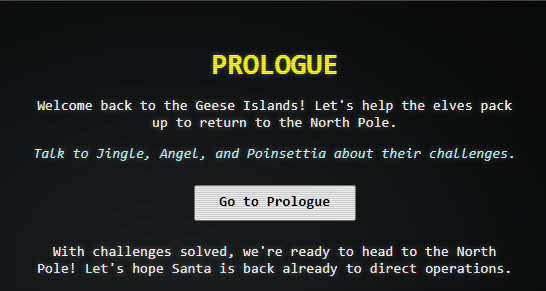
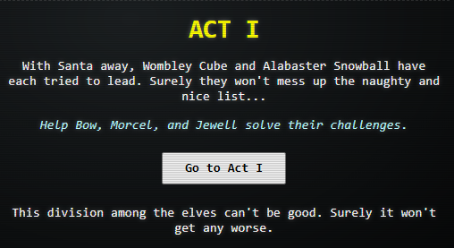

# SANS Holiday Hacking Challenge 2024

## General Notes
- This walkthrough will assume that you just talk to everyone before starting the specific challenges unless a specific sequence is required in which case the walkthrough will note those sequences.
- You should talk to as many of the NPCs (Non-Player Characters) as you can, as they will give you hints on how to achieve each level (Gold, Silver, Bronze) as applicable to each challenge
## Introduction
Whether you're a first-time player or a seasoned participant, this year’s Holiday Hack brings exciting new features you won’t want to miss! We’ve introduced a new dynamic for this year: challenges will be gradually released* in sync with the story, keeping the experience fresh and immersive. See challenges release dates and new features included.

- November 7........Prologue
- November 11......Act 1
- November 18......Act 2
- December 2........Act 3

**Skill** **Levels**: Every challenge will offer two modes: an easy mode and a harder mode. Players can choose either mode to solve the challenge, depending on their skill level or preference.

**Challenge Skipping**: Each challenge will include a “play-through” mode, allowing players to advance the storyline without solving the challenge immediately. You can skip a challenge and return to it later.

**Share Solutions**: For the Prologue, Act 1, and Act 2, participants can post answers or livestream their solutions starting one week after each section's release. This allows others to learn from shared solutions and progress in the game. However, for Act 3, players must wait until after the competition ends before sharing their answers or solutions.

**Scoreboard and Cohorts**: Track your progress on a live scoreboard of all players, plus a separate scoreboard dedicated to a cohort exclusively for your organization or group of friends, allowing you to have a friendly competition with peers.

## Table of Contents
1. [Prologue](#prologue)
    - [Prologue - Locations.md](Acts/Prologue/Prologue%20-%20Locations.md)
    - [Prologue First Terminal.md](Acts/Prologue/Prologue%20First%20Terminal.md)
    - [Prologue Elf Connect.md](Acts/Prologue/Prologue%20Elf%20Connect.md)
    - [Prologue Elf Minder 9000.md](Acts/Prologue/Prologue%20Elf%20Minder%209000.md)
    - [Conversations - Prologue.md](Acts/Prologue/Conversations%20-%20Prologue.md)
2. [Act I ](#act-i)
    - [Act 1 - Locations.md](Acts/Act%20I/Act%201%20-%20Locations.md)
    - [Act 1 - cURLing.md](Acts/Act%20I/Act%201%20-%20cURLing.md)
    - [Act 1 - Frosty Keypad.md](Acts/Act%20I/Act%201%20-%20Frosty%20Keypad.md)
    - [Act 1 - Hardware Part I.md](Acts/Act%20I/Act%201%20-%20Hardware%20Part%20I.md)
    - [Act 1 - Hardware Part II.md](Acts/Act%20I/Act%201%20-%20Hardware%20Part%20II.md)
    - [Conversations - Act I.md](Acts/Act%20I/Conversations%20-%20Act%20I.md)
3. [Act II](#act-ii)
4. [Act III](#act-iii)

## Prologue
_*Released: November 7, 2024*_

## Act I
_*Released: November 11, 2024*_

## Act II
_*Released: November 18, 2024*_

## Act III
_*Released: December 2, 2024*_
