## Objectives
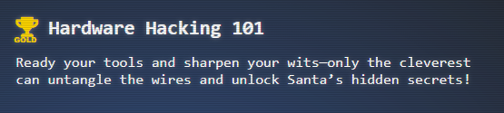
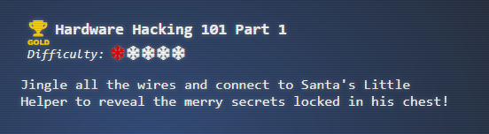
## Hints
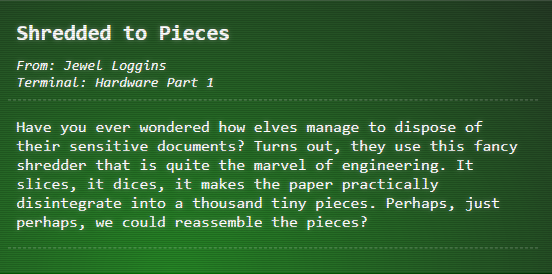
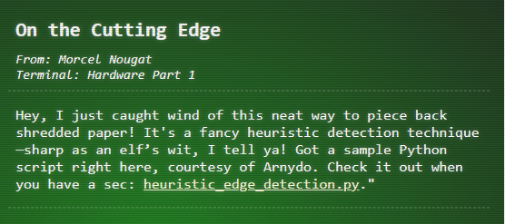
## Resources
### De-shred Image
```python
import os
import numpy as np
from PIL import Image

def load_images(folder):
    images = []
    filenames = sorted(os.listdir(folder))
    for filename in filenames:
        if filename.endswith('.png') or filename.endswith('.jpg'):
            img = Image.open(os.path.join(folder, filename)).convert('RGB')
            images.append(np.array(img))
    return images

def calculate_difference(slice1, slice2):
    # Calculate the sum of squared differences between the right edge of slice1 and the left edge of slice2
    return np.sum((slice1[:, -1] - slice2[:, 0]) ** 2)

def find_best_match(slices):
    n = len(slices)
    matched_slices = [slices[0]]
    slices.pop(0)

    while slices:
        last_slice = matched_slices[-1]
        differences = [calculate_difference(last_slice, s) for s in slices]
        best_match_index = np.argmin(differences)
        matched_slices.append(slices.pop(best_match_index))

    return matched_slices

def save_image(images, output_path):
    heights, widths, _ = zip(*(i.shape for i in images))

    total_width = sum(widths)
    max_height = max(heights)

    new_image = Image.new('RGB', (total_width, max_height))

    x_offset = 0
    for img in images:
        pil_img = Image.fromarray(img)
        new_image.paste(pil_img, (x_offset, 0))
        x_offset += pil_img.width

    new_image.save(output_path)

def main():
    input_folder = './slices'
    output_path = './assembled_image.png'

    slices = load_images(input_folder)
    matched_slices = find_best_match(slices)
    save_image(matched_slices, output_path)

if __name__ == '__main__':
    main()
```

## Solution
### Silver
#### Santas Message (Shredded Image):

- flip image
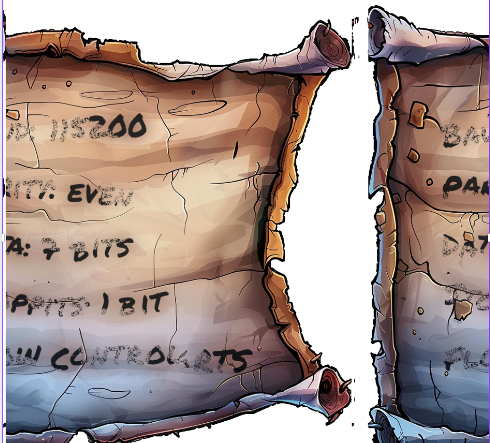
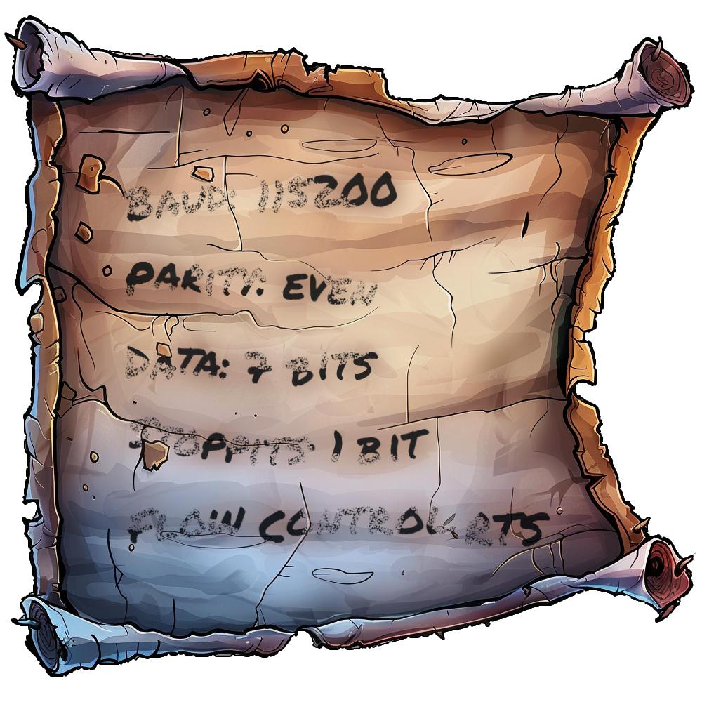
#### Manual
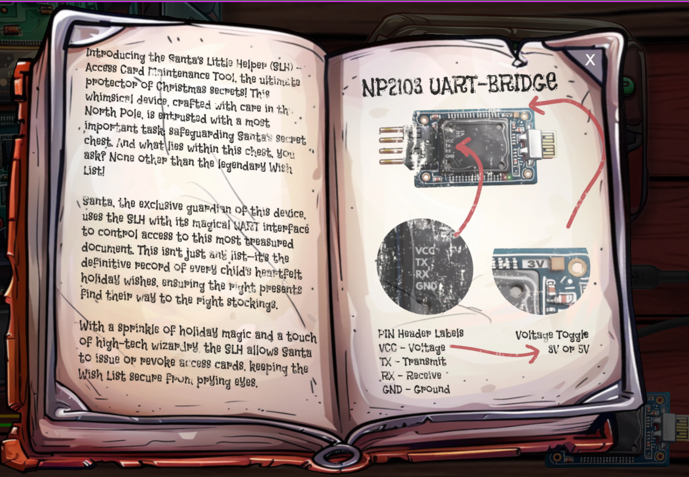
#### Steps
- Connect the USB Cable
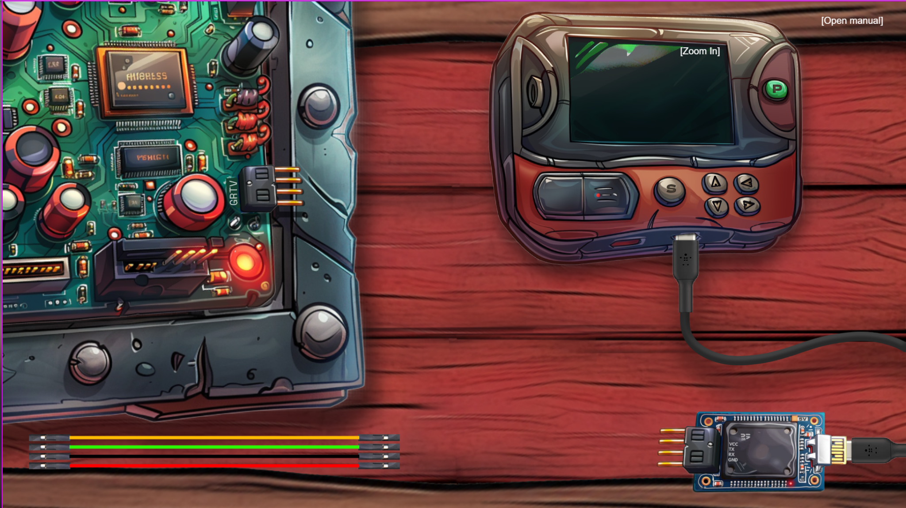
- Connect Ground, Connect Voltage Control (VCC), Connect Receive (RX), Connect Transmission (TX), Making sure to swap TX/RX
```
const targetPins = [
      { pin: this.children.getByName('gnd'), dest: this.children.getByName('uGnd'), color: 0x000000 },
      { pin: this.children.getByName('tx'), dest: this.children.getByName('uRx'), color: 0x1bff00 },
      { pin: this.children.getByName('rx'), dest: this.children.getByName('uTx'), color: 0xff8700 },
      { pin: this.children.getByName('v3'), dest: this.children.getByName('uVcc'), color: 0xff0000 }
    ];
```
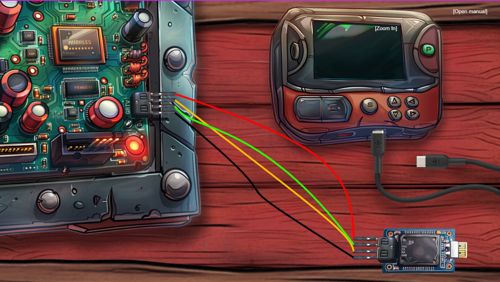
- Change the Voltage to 3V
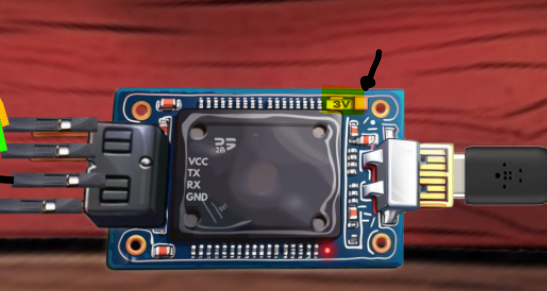
- Power on device
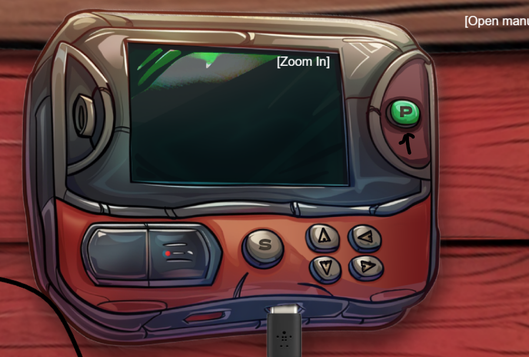
- Press "S" to start the connection
- Hit "↓" (Down Arrow Key) to see the options
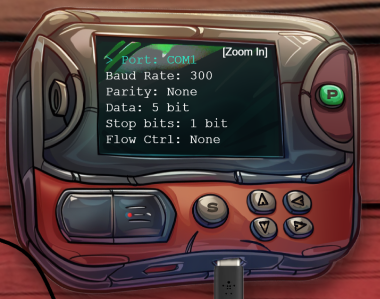
9. Set conditions per the shredded paper
```
- Baud - 115200
- Parity - Even
- Data - 7 Bits
- 1 Biit
- Flow: RTS
```
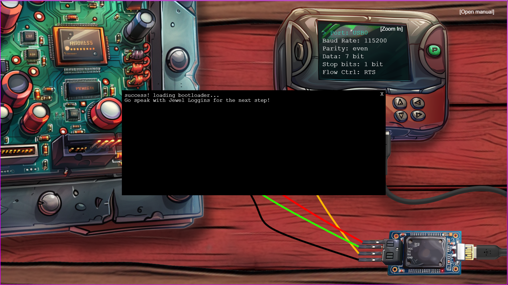

### Solution (Gold)
- look through the source code and you will see some comments:


- send an API request to v1, exactly the same as the one that was sent to v2.  To do this go to the Network tab in the developers console. 
- look at the request that just completed for the silver challenge. This will give you all the parameters in the right order
> [!TIP]
> If you did not stay in your session after the silver, you can review the code to determine what order the connections should be in. This is viewable via the JavaScript source.


- In the section below that, look at the Request as Raw data and copy it


- Send the request
> [!NOTE] 
> This part can be accomplished in the console window similar to what is seen in the JavaScript command show below but this is also doable externally via an alternative language. Neither of these are well optimized since the are focused more around the brute force aspect and not the known endpoint aspect
> - [Python Script - Brute Force](../../../Assets/code/act1/hardware-part1/brute-force-connection.py)
> - [Golang Application](../../../Assets/code/act1/hardware-part1/py-to-go-bad-transform-connection-force.go)

```javascript
fetch("https://hhc24-hardwarehacking.holidayhackchallenge.com/api/v1/complete", {  
	method: “POST”,  
	headers: {  
		“Content-Type”: “application/json”,  
		“Referer”: “**<ADD YOUR REFERER INFO HERE>**"  
	},  
	body: JSON.stringify({  
		requestID: “**<ADD YOUR REQUEST ID HERE>**”,  
		serial: [3, 9, 2, 2, 0, 3],  
		voltage: 3  
	})  
})  
.then(response => response.json())  
.then(data => console.log(data))  
.catch(error => console.error(“Error:”, error));
```
