## Objective
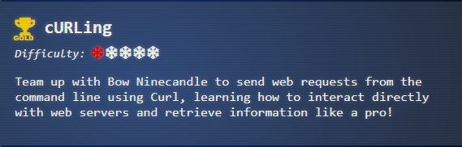
## Challenge
```
I'm Bow Ninecandle, and while everyone's busy unpacking, I'd much rather invite you to try something more exciting - a curling challenge without ice! I'm talking about using Curl, a magical command-line tool for sending web requests - it's as simple as typing 'curl https://example.com' to start with, and while that's just scratching the surface, I'm here to help if you get stuck!
```
## Hints
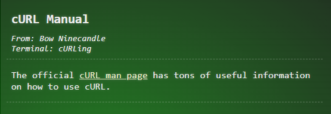
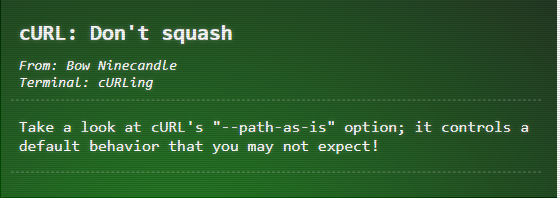
## Solution

> [!TIP]
> Highly recommend reviewing the Manual / Man Docs for CURL if you are not familiar with this command. Many of the flags in this challenge are entirely built around you reading this document and then using it. Those already familiar with curl may not need to read this though. Documentation: https://curl.se/docs/manpage.html

### Silver
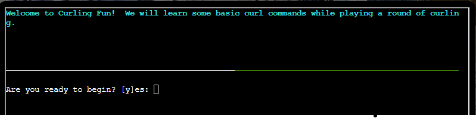
- `y`

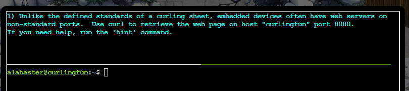

> [!TIP]
> HINT: Use a colon after the hostname to specify the port number, such as: curl http://curlingfun:8080/ 

- `curl http://curlingfun:8080`
```
You have successfully accessed the site on port 8080!

If you need help, please remember to run "hint" for a hint!
```

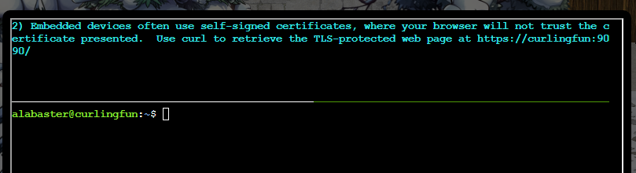

> [!TIP]
> HINT: curl has an "--insecure" option that can be used to ignore security warnings, such as self-signed certificates.

- `curl -k https://curlingfun:9090`

```
You have successfully bypassed the self-signed certificate warning!
Subsequent requests will continue to require "--insecure", or "-k" for short.

If you need help, please remember to run "hint" for a hint!
```

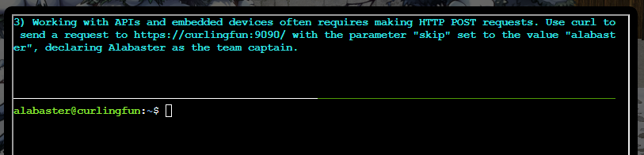

> [!TIP]
> HINT: Use curl's "--data" option to pass HTTP POST parameters, such as: curl --insecure --data "name=value" https://curlingfun:9090/

- `curl -k https://curlingfun:9090 -X POST --data "skip=alabaster"`

```
You have successfully made a POST request!
```

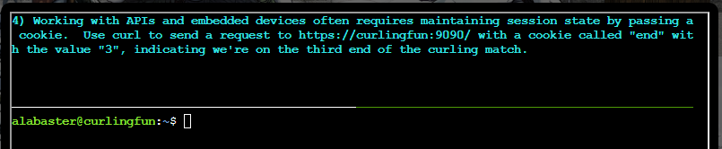

> [!TIP]
> HINT: Use curl's "--cookie" option to pass cookies, such as: curl --insecure --cookie "name=value" https://curlingfun:9090/

- `curl -k https://curlingfun:9090 --cookie "end=3"`

```
You have successfully set a cookie!
```

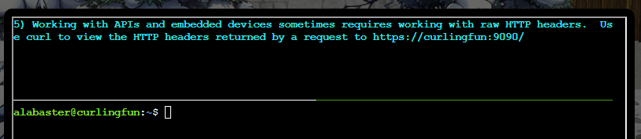

> [!TIP]
> HINT: Use curl's "--verbose" option to view HTTP headers, such as: curl --insecure --verbose https://curlingfun:9090/

- `curl -k -v https://curlingfun:9090/`

```
*   Trying 127.0.1.1:9090...
* Connected to curlingfun (127.0.1.1) port 9090 (#0)
* ALPN, offering h2
* ALPN, offering http/1.1
* TLSv1.0 (OUT), TLS header, Certificate Status (22):
* TLSv1.3 (OUT), TLS handshake, Client hello (1):
* TLSv1.2 (IN), TLS header, Certificate Status (22):
* TLSv1.3 (IN), TLS handshake, Server hello (2):
* TLSv1.2 (OUT), TLS header, Finished (20):
* TLSv1.3 (OUT), TLS change cipher, Change cipher spec (1):
* TLSv1.2 (OUT), TLS header, Certificate Status (22):
* TLSv1.3 (OUT), TLS handshake, Client hello (1):
* TLSv1.2 (IN), TLS header, Finished (20):
* TLSv1.2 (IN), TLS header, Certificate Status (22):
* TLSv1.3 (IN), TLS handshake, Server hello (2):
* TLSv1.2 (IN), TLS header, Supplemental data (23):
* TLSv1.3 (IN), TLS handshake, Encrypted Extensions (8):
* TLSv1.2 (IN), TLS header, Supplemental data (23):
* TLSv1.3 (IN), TLS handshake, Certificate (11):
* TLSv1.2 (IN), TLS header, Supplemental data (23):
* TLSv1.3 (IN), TLS handshake, CERT verify (15):
* TLSv1.2 (IN), TLS header, Supplemental data (23):
* TLSv1.3 (IN), TLS handshake, Finished (20):
* TLSv1.2 (OUT), TLS header, Supplemental data (23):
* TLSv1.3 (OUT), TLS handshake, Finished (20):
* SSL connection using TLSv1.3 / TLS_AES_256_GCM_SHA384
* ALPN, server accepted to use http/1.1
* Server certificate:
*  subject: C=US; ST=Some-State; O=Internet Widgits Pty Ltd; CN=localhost
*  start date: Feb  7 16:23:39 2024 GMT
*  expire date: Feb  6 16:23:39 2025 GMT
*  issuer: C=US; ST=Some-State; O=Internet Widgits Pty Ltd; CN=localhost
*  SSL certificate verify result: self-signed certificate (18), continuing anyway.
* TLSv1.2 (OUT), TLS header, Supplemental data (23):
> GET / HTTP/1.1
> Host: curlingfun:9090
> User-Agent: curl/7.81.0
> Accept: */*
> 
* TLSv1.2 (IN), TLS header, Supplemental data (23):
* TLSv1.3 (IN), TLS handshake, Newsession Ticket (4):
* TLSv1.2 (IN), TLS header, Supplemental data (23):
* TLSv1.3 (IN), TLS handshake, Newsession Ticket (4):
* old SSL session ID is stale, removing
* TLSv1.2 (IN), TLS header, Supplemental data (23):
* Mark bundle as not supporting multiuse
< HTTP/1.1 200 OK
< Server: nginx/1.18.0 (Ubuntu)
< Date: Mon, 11 Nov 2024 18:53:34 GMT
< Content-Type: text/plain;charset=UTF-8
< Transfer-Encoding: chunked
< Connection: keep-alive
< Custom-Header: You have found the custom header!
< 
You have successfully bypassed the self-signed certificate warning!
Subsequent requests will continue to require "--insecure", or "-k" for short.

If you need help, please remember to run "hint" for a hint!
* Connection #0 to host curlingfun left intact
```

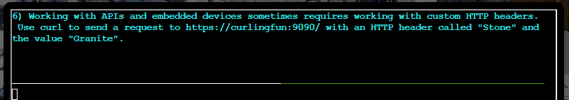

> [!TIP]
> HINT: Use curl's "--header" option to pass custom headers, such as: curl --insecure --header "Name: Value" https://curlingfun:9090/

- `curl -k https://curlingfun:9090 -H "Stone: Granite"`

```
You have successfully set a custom HTTP header!  
```

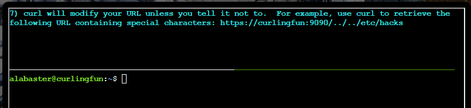

> [!TIP]
> HINT: Use curl's "--path-as-is" option to prevent curl from modifying your URL.

- `curl -k https://curlingfun:9090/../../etc/hacks --path-as-is`

```
You have successfully utilized --path-as-is to send a raw path!
```

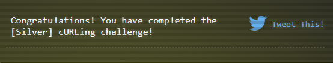

### Gold Solution

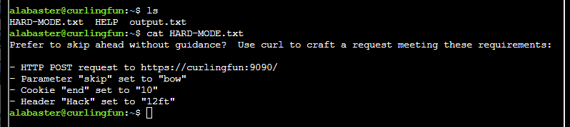
- `curl -k -X POST --data "skip=bow" --cookie "end=10" -H "Hack: 12ft" https://curlingfun:9090`

```
Excellent!  Now, use curl to access this URL: https://curlingfun:9090/../../etc/button
```

- `curl -k --path-as-is https://curlingfun:9090/../../etc/button`
```
Great!  Finally, use curl to access the page that this URL redirects to: https://curlingfun:9090/GoodSportsmanship
```

- `curl -k -L https://curlingfun:9090/GoodSportsmanship`

```
Excellent work, you have solved hard mode!  You may close this terminal once HHC grants your achievement.
```

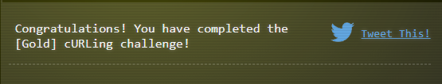