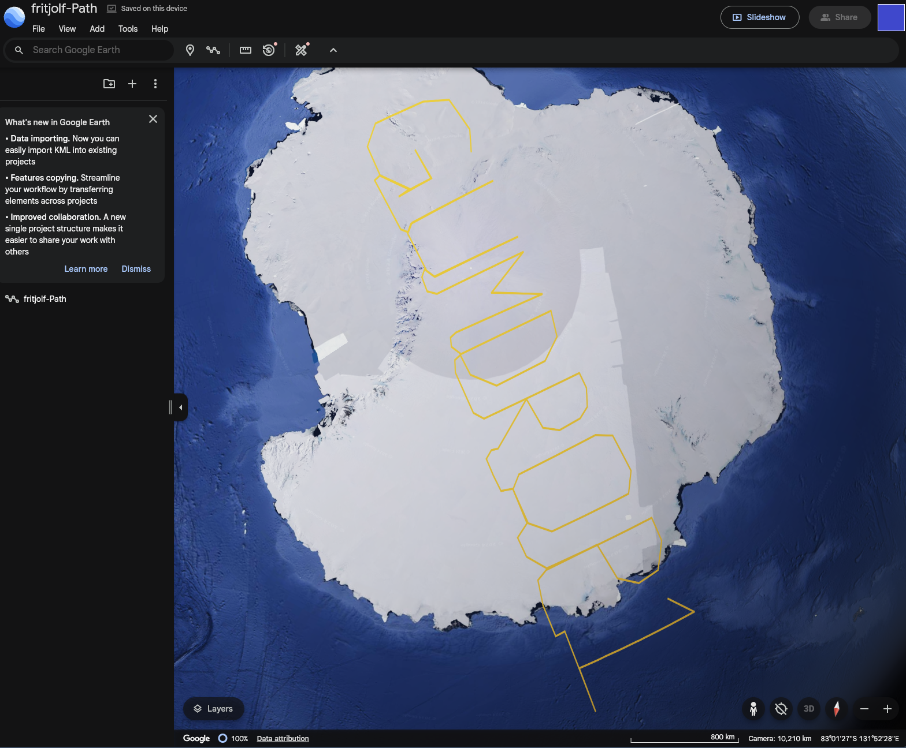
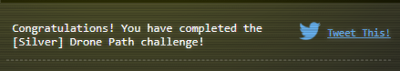
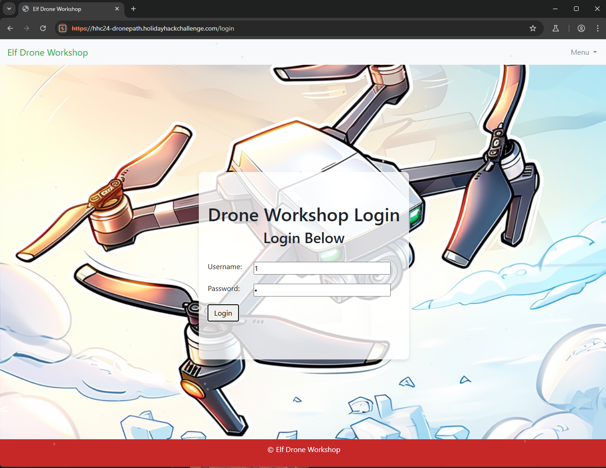

## Objective

## Hints

## Solution


### Silver
- Get the File from FileShare Menu through the hamburger icon

- Explore if the directory where file is stored is accessible. `It is Not`

- Open the KML File in Google Earth

- Appears to spell out `GUMDROP1`, which is likely the password for a login. The primary application has a login page, but we are missing a username. Perhaps we can identify what that may be by looking at the javascript code
```javascript
document.addEventListener('DOMContentLoaded', function () {
    function createSnowflake() {
        const snowflake = document.createElement('div');
        snowflake.classList.add('snowflake');

        // Set random position and animation duration
        snowflake.style.left = `${Math.random() * 100}vw`;  // Random horizontal position
        snowflake.style.animationDuration = `${Math.random() * 3 + 2}s`;  // Random fall duration between 2-5 seconds

        // Add the snowflake to the body
        document.body.appendChild(snowflake);

        // Remove the snowflake once it reaches the bottom of the screen
        setTimeout(() => {
            snowflake.remove();
        }, 5000);  // 5 seconds lifespan for each snowflake
    }

    // Continuously create new snowflakes
    setInterval(createSnowflake, 100);  // Create a new snowflake every 100ms
});

//Using our API
document.addEventListener('DOMContentLoaded', function () {
    const loginForm = document.getElementById('login-form');


    loginForm.addEventListener('submit', function (e) {
        e.preventDefault();  // Prevent the form from submitting the traditional way

        const username = document.getElementById('username').value;
        const password = document.getElementById('password').value;

        // Construct the payload for the API
        const payload = {
            username: username,
            password: password
        };

        fetch('/api/v1.0/elfLogin', {
            method: 'POST',
            headers: {
                'Content-Type': 'application/json'
            },
            body: JSON.stringify(payload)
        })
        .then(response => response.json())
        .then(data => {
            if (data.status === 'success') {
                alert('Login successful!');
                // Redirect to the homepage or workshop page
                window.location.href = '/workshop';
            } else {
                alert('Login failed: ' + data.message);
            }
        })
        .catch(error => {
            console.error('Error:', error);
        });
    });

});

document.addEventListener('DOMContentLoaded', function () {
    const searchForm = document.getElementById('search-form');
    const droneList = document.getElementById('drone-list');
    const commentSection = document.getElementById('comment-section');
    const droneTitle = document.getElementById('drone-title');
    const commentList = document.getElementById('comment-list');
    let currentDrone = '';
    // Handle search form submission
    searchForm.addEventListener('submit', function (f) {
        f.preventDefault();  // Prevent the default form submission

        const droneName = document.getElementById('drone-name').value;
        fetch(`/api/v1.0/drones?drone=${droneName}`)
            .then(response => response.json())
            .then(data => {
                droneList.innerHTML = '';  // Clear previous results
                commentSection.style.display = 'none';  // Hide comments section
                
                if (data.length === 0) {
                    droneList.innerHTML = '<li>No drones found</li>';
                } else {
                    data.forEach(drone => {
                        const droneItem = document.createElement('li');
                        droneItem.textContent = `Name: ${drone.name}, Quantity: ${drone.quantity}, Weapons: ${drone.weapons}`;
                        loadComments(drone.name);
                        droneList.appendChild(droneItem);
                    });
                }
            })
            .catch(error => console.error('Error:', error));
    });

    // Load comments for a specific drone
    function loadComments(droneName) {
        fetch(`/api/v1.0/drones/${droneName}/comments`)
            .then(response => response.json())
            .then(data => {
                droneTitle.textContent = droneName;
                currentDrone = droneName;  // Set the current drone for adding comments
                commentList.innerHTML = '';  // Clear previous comments
                
                if (data.comments.length === 0) {
                    commentList.innerHTML = '<li>No comments yet</li>';
                } else {
                    data.comments.forEach(comment => {
                        const commentItem = document.createElement('li');
                        commentItem.innerHTML = comment;
                        commentList.appendChild(commentItem);
                    });
                }
                commentSection.style.display = 'block';  // Show comments section
            })
            .catch(error => console.error('Error:', error));
    }
});

document.getElementById('code-form').addEventListener('submit', function (e) {
    e.preventDefault();  // Prevent the form from submitting in the default way

    const code = document.getElementById('code').value;

    fetch('/admin_console', {
        method: 'POST',
        headers: { 'Content-Type': 'application/x-www-form-urlencoded' },
        body: new URLSearchParams({ 'code': code })
    })
    .then(response => response.json())
    .then(data => {
        const outputDiv = document.getElementById('output');
        if (data.status === 'success') {
            outputDiv.className = 'alert alert-success';
            outputDiv.textContent = `Success: ${data.message}`;
        } else {
            outputDiv.className = 'alert alert-danger';
            outputDiv.textContent = `Error: ${data.message}`;
        }
        outputDiv.style.display = 'block';
    })
    .catch(error => console.error('Error:', error));
});
```

- Based on the JavaScript content, there does not appear to be a username, but there is a common theme, which is the use of a drone name. Maybe we can find a drone name somewhere. If we look through the HTML and the JavaScript, it is not very obvious that one is there, so maybe the file that gave us the password can give us more

```bash
./fritjolf-Path.kml | grep name
```
- Results
```xml
	<name>fritjolf-Path</name>
		<name>fritjolf-Path</name>
```
- So lets try a few variations of this. Seemingly the main options would be the name exactly `fritjolf-Path` or removing any suffix and being `fritjolf`. Assuming the password of `GUMDROP1` which was what was seen in the image, we may be able to authenticate


- Exploring some of the pages we see that basically all the pages except one require a drone name or a code. The one that does not is the Profile page. 


- Chances are we can use that csv file to determine the next breadcrumb. Maybe the content of the CSV are detail that can be fed to KML to give us a better understanding of what this content is. I used [CSV To KML Converter](https://www.convertcsv.com/csv-to-kml.htm), which results in [Preparations-drone-name.csv](../../../Assets/files/act2/drone-path/Preparations-drone-name.csv) becoming [Preparations-drone-name.kml](../../../Assets/files/act2/drone-path/Preparations-drone-name.kml)
> [!NOTE] 
> Different convertors online may produce different results as this CSV is not in a standard file format for a direct KML translation


- Almost looks like a Christmas tree. Lets examine each point individual to see what we can find:

- so the outputs we have are `H`,`L`,`- or _` , `F`,`W`,`E`,`A`, `K` -- Reference [Map Formations](#Map%20Formation%20(First%20CSV)). Putting the words together it may be Elf-Hawk. 
>[!CAUTION]
>The workshop drone names are case sensitive, so in this case all the letters shown are upper case, and so the name should  be all uppercase as well


- Looks like there is yet another CSV, so here we will run the same steps  using [CSV To KML Converter](https://www.convertcsv.com/csv-to-kml.htm) to convert [ELF-HAWK-dump.csv](../../../Assets/files/act2/drone-path/ELF-HAWK-dump.csv) to [ELF-HAWK-dump.kml](../../../Assets/files/act2/drone-path/ELF-HAWK-dump.kml)

- Well that seems like a lot to take in... Maybe a better way to visualize that data.
- [Download · QGIS Web Site](https://www.qgis.org/download/) and the [KML Tools — QGIS Python Plugins Repository](https://plugins.qgis.org/plugins/kmltools/) will be the two that you need. Once installed you will use the kml to open your [ELF-HAWK-dump.kml](../../../Assets/files/act2/drone-path/ELF-HAWK-dump.kml) file

- Once opened it will render the following output:

- Now lets jump back to the Admin Code Verification Console and input the password defined above:


### Gold

- He wants more, so there must be more to the system dat. Maybe we can try so injection attacks. SQL is the most common for authentication logins, so we can start there. 
- So we reopen the drone application and get the `iframe` link so that we can plug that into a burp instance. 
- Select `Target` and select `Open browser`

- input the username and password as `1` and `2` respectfully

- Once you see the `elfLogin` attempt request, then send that to the `Intruder`

- set the `username` as a target and then add some sql injection payloads into the list. [payloadbox/sql-injection-payload-list: 🎯 SQL Injection Payload List](https://github.com/payloadbox/sql-injection-payload-list/tree/master) might have a good list to work from if you do not already have a configured list. 
- Click `Start attack`

- Once you start the attack you should have a response pretty quickly. Would sort through the Status Codes for a 200 Response, and then look at the body to see if a session cookie is being se

- So in the example above, we can see that `' OR 1 -- -`

- Once we input the username as `' OR 1  -- -` we get pushed to the Search for a Drone, so we can attempt to use the same credentials


```markdown
- Name: ELF-HAWK, Quantity: 40, Weapons: Snowball-launcher
- Name: Pigeon-Lookalike-v4, Quantity: 20, Weapons: Surveillance Camera
- Name: FlyingZoomer, Quantity: 4, Weapons: Snowball-Dropper
- Name: Zapper, Quantity: 5, Weapons: CarrotSpike
```
- lets iterate over each of the drones, outside of `ELF-HAWK` as that one  was used during the Silver Challenge
 
- Looks like the only hint here is in the `Pigeon-Lookalike-v4` where the note is - `I heard a rumor that there is something fishing with some of the files. There was some talk about only TRUE carvers would find secrets and that FALSE ones would never find it.`  
- This hint could be interpreted as meaning converting all the TRUE and FALSE values into binary representations of 0 and 1, to create a bin file. So under that assumption we can write a quick python script which extracts the contents
```python

# Use a regular expression to extract "TRUE" and "FALSE" while maintaining their order  
import re  
import csv  
import io  
  
def convert_true_false_to_numeric(input_list):  
    """  
    Converts "TRUE" to '1' and "FALSE" to '0' in a list of strings.  
    Args:    input_list (list of str): List containing strings "TRUE" and "FALSE".  
    Returns: list: List with "TRUE" replaced by '1' and "FALSE" replaced by '0'.    
    """    
    return ['1' if item.upper() == "TRUE" else '0' for item in input_list]  
  
def execute(input_text, out_path):  
    """  
    Processes the input text to extract "TRUE" and "FALSE", convert them to '1' and '0',    and saves the result to a specified output file.  
    Args:        input_text (str): The input text containing "TRUE" and "FALSE".        
			     out_path (str): The path where the output file will be saved.    
	"""    
	
	# Find all occurrences of "TRUE" and "FALSE"  
    true_false_list = re.findall(r'\bTRUE\b|\bFALSE\b', input_text)  
  
    # Convert the extracted words to numeric representation  
    numeric_list = convert_true_false_to_numeric(true_false_list)  
  
    # Join the numeric list into a string  
    output_text = "".join(numeric_list)  
  
    # Write the output to a new file or print it  
    with open(out_path, "w") as file:  
        file.write(output_text)  
  
    print(f"Processed text with TRUE and FALSE converted has been saved to '{out_path}'.")  
  
def read_csv_to_string(file_path):  
    """  
    Reads a CSV file and converts its content into a single string.  
    Args:        file_path (str): Path to the CSV file.  
    Returns:        str: Content of the CSV file as a single string.    """    try:  
        with open(file_path, mode='r', encoding='utf-8') as file:  
            # Read the CSV file  
            reader = csv.reader(file)  
            output = io.StringIO()  
            writer = csv.writer(output)  
            # Write each row from the CSV into the StringIO  
            for row in reader:  
                writer.writerow(row)  
            return output.getvalue()  
    except Exception as e:  
        return f"An error occurred: {e}"  
  
if __name__ == "__main__":  
    input_text = read_csv_to_string("ELF-HAWK-dump.csv")  
    execute(out_path="ELF-HAWK-dump.bin.txt", input_text=input_text)  
  
    input_text = read_csv_to_string("Preparations-drone-name.csv")  
    execute(out_path="Preparations-drone-name.bin.txt", input_text=input_text)
```
>[!NOTE]
> As with any previous challenge, this can be accomplished through more than just python code. The example here is in python as it is the most common in the these types of events
> - [Go]()
> - [Python]()

- Take that output and place in CyberChef from Bin to see the results

- If we exclude any of the nulls at the end we would end up with the following:
```text
:::::::::::::::::::::::::::::::::::::::::::::::::::::::::::::::::::::::::::::::::::::::::
:::::::::::::::::::::::::::::::::::::::::::::::::::::::::::::::::::::::::::::::::::::::::
:::::::::::::::::::::::::::::::::::::::::::::::::::::::::::::::::::::::::::::::::::::::::
::::::::::::::::::::::::::::::::::::::::::::::::::::::::::::::::::::::*::::::::::::::::::
:::::::::::::::::::::::::::::::-------------=--------::::::::::::::::::::::::::::::::::::
::::::::::::::::::::::------------------------===-=======--=-::::::::::-:::::::::::::::::
::::::::::::::::::::------------:------------=-====================---:::::::::=+::::::::
:::::::::::::::::------------------------------=====================-------::::::::::::::
::::::::::::::-------------------------------------================:------:::::::::::::::
::::::::::::--------------------------------------==============-::--------:::::::::-::::
::::::::::::-------:--------@+:::::::::--=@--------:===========-::-::----==---:::::::::::
::::-------:::::----------@---::::::---+-==+@--------=========-:--:------=====---::::::::
::::--------::::::-------#--------------=-+@------------===------::-----====--==---::::::
::::-------:-:::::::------@=@=++#+++++@@@@@=-----------------:::--------------==---::::::
::::----------::::=-#-:----**%@+++++++%@@=::::::---%@------:--------:--@-+::-------::::::
::::-----:----:::::::::::--::@@**%@--::::::::::::::--=+@------------@--:::::------@::::::
::::---+@::::::---+@:::::::::#@-@--:::::-:=*=-::-----=+*=*=--------@:--:::::::-----=:::::
::::@-:::-::::::-----=@:-:::@+@%---------------==-==+@@@@@=@------@---------:::::--==+%::
:::#:::::::::::-----=+*@:::%#@#-=---------===++*%@@+@=+*#-+*=@-----#====-----------**-%::
::@--::-:::--:---==++*@-:@=+@=+-@=*+++++++**@#%*@-##**-@##%=#%@@@@#*@###@=+**@*****@@@:::
:::@*=--++++++++**@@@@@@*#@-+%@*=*+****@@@+@***@%@@%%%@-%@*@@@@@@@@@@@@@@%%#%%%@@@@@%::::
:::@@@@@@@++#*####@@@@@@@==---====+##@*%=+@*@*%%@@@@@@@@@@@@@@@=--@+@@@@+@@@@@@@@@@-:::::
::::=*%%%%%%%%%%%@@%@@#@-#*+++++====@-++###@%@*@@@@+@@@@-**+--::::--@@%@%%@%%%%%@@@-:::::
::::---@@@@##@@@@@@@@@--+@%-#+#**+=+++**%@@@@@@@##%**%--:::::::--*----=*@@@@@@@*@@---::::
::::---@@***%%%%@@@@*@-=-+=@#=#%##***##@@@@@#@@*@%%==---:::::::::::----=+---------=--::::
::::----@+=%#@@@=@@-----##@+:-=%@@%##%@@@@@@@@@@@@*+=-----::::::::::::=+*-@:----===--::::
::::---------------------*@##=+@@%@==-+@@@@@@@@@@@-+=---------------===+**--=======-:::::
:::---------------:------%+#%@@@@@#%%%%@@@@#@@@@@@@-+======---------==***#@========-:::::
:::-%-%---------:---------*-*##%@@@@@@@@@@@@@@@@@--=@@-*===++++++++++***@*===++++++=-::::
:::--+---------=-------:-----#==#@%%%@@@@@*@%@@@----@+@@@=***@@@@***@@@@%===++++-++=-::::
:::--------------:::::--------------##-----@@--------@%@#@@%%%%@@@@@@#@=====+++++++=-::::
:::---------------::::::---------------------=====---@@##@@@@@@@@@@@#%#-=====+++++--:::::
:::---======-------------------------=----==========--*=@@%@++*@@%%%@@-======:----==-::::
:::---===============------------------===============-----#@@@@@-----===-::---=====-::::
:::--=============+===--------------===-==================--------======::----=======-:::
:::--================---::::-=======-======================+=====+====::------===+===-:::
:::--===================--:::::====================+====-:---==+++=::-----=======---=-:::
:::--========:===========------:=====================:::-----====:-----==========+===-:::
 / ___/ _ \|  _ \| ____\ \      / / _ \|  _ \|  _ \   _____  ====:-----==========+===-:::
| |  | | | | | | |  _|  \ \ /\ / / | | | |_) | | | | |_____| ====:-----==========+===-:::
| |__| |_| | |_| | |___  \ V  V /| |_| |  _ <| |_| | |_____| ====:-----==========+===-:::
 \____\___/|____/|_____|__\_/\_/__\___/|_| \_\____/  _  _________   ______    _    ____  
| ____\ \/ /  _ \| ____|  _ \_   _|_   _| | | |  _ \| |/ / ____\ \ / / ___|  / \  |  _ \ 
|  _|  \  /| |_) |  _| | |_) || |   | | | | | | |_) | ' /|  _|  \ V / |     / _ \ | |_) |
| |___ /  \|  __/| |___|  _ < | |   | | | |_| |  _ <| . \| |___  | || |___ / ___ \|  _ < 
|_____/_/\_\_| __|_____|_|_\_\|_| __|_|  \___/|_| \_\_|\_\_____| |_| \____/_/   \_\_| \_\
\ \   / / ____|  _ \|  \/  | ____|  _ \  / \  | |    ==========---======++++=+=--+++=-:::
 \ \ / /|  _| | |_) | |\/| |  _| | | | |/ _ \ | |    ==========---======++++=+=--+++=-:::
  \ V / | |___|  _ <| |  | | |___| |_| / ___ \| |___ ==========---======++++=+=--+++=-:::
   \_/  |_____|_| \_\_|  |_|_____|____/_/   \_\_____|==========---======++++=+=--+++=-:::
::::--====+++=---++++++=+========------::::=-:---==============---======++++=+=--+++=-:::
::::--==+++++++==---+++++++++++========-----================++++==-========-++=++====-:::
:::::--====+++++-++--++++++++++=--------=-==============+++---------=====++=+++++::::::::
::::::::======+++=+++=+++++++++++++++=++++===========++++:-------=---=-=----:::::::::::::
::::::::::::::::--=-=======++=++++++++++++++============--------------:::::::::::::::::::
:::::::::::::::::::::::::::------===-==-===-==-----::-:::::::::::::::::::::::::::::::::::
:::::::::::::::::::::::::::::::::::::::::::::::::::::::::::::::::::::::::::::::::::::::::
:::::::::::::::::::::::::::::::::::::::::::::::::::::::::::::::::::::::::::::::::::::::::
```
- If we take that and pass it through to the admin console `EXPERTTURKEYCARVERMEDAL`

- We will get the result of 


### Map Formation (First CSV)
TOP

 

Bottom Left


Second from the Left


Third From the Left


Near the Lake


Near Mountains


Air Strip


River on Mountain

