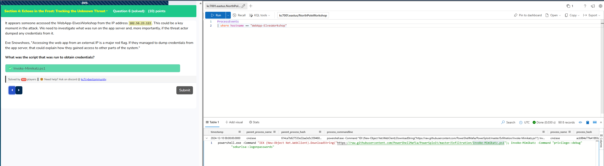

## Objectives


## Hints

### Questions


### Tables

### Section 1: KQL 101

> [!TIP]
> Yea if you copy and paste this, it may not copy the `'` properly and you may get a different variant. Easiest to just type it in here

> [!CAUTION] 
> ANSWER: ```let's do this```


```kql
Employees
| take 10
```
> [!CAUTION]
> ANSWER: `when in doubt take 10`


```kql
Employees
| count
```
> [!CAUTION]
> ANSWER: `90`


```kql
Employees
| where role == "Chief Toy Maker"
```
> [!CAUTION]
> ANSWER: `Shinny Upatree`


```text
operator
```
> [!CAUTION]
> ANSWER: `operator`


```kql
let email = toscalar(
	Employees
	| where name == "Angel Candysalt"
	| take 1
	| project email_addr
);
Email
| where recipient == email
| count
```

> [!CAUTION]
> ANSWER: `31`


```kql
Email
| where sender has "twinkle_frostington@santaworkshopgeeseislands.org"
| distinct recipient
| count
```

> [!CAUTION]
> ANSWER: `32`


```kql
let employeeIpAddress = toscalar(
	Employees
	| wheere name contains "Twinkle Frostington"
	| project ip_addr
);
OutboundNetworkEvents
| where src_ip == employeeIpAddress
| distinct url
| count
```

> [!CAUTION]
> ANSWER: `4`


```kql
PassiveDns
| where domain contains "green"
| distinct domain
| count 
```

> [!CAUTION]
> ANSWER: `10`


```kql
let twinkle_ips = 
Emplyees
| where name has "Twinkle"
| distinct ip_addr;
OutboundNetworkEvents
| where src_ip in (twinkle_ips)
| distinct url
| count;
```

> [!CAUTION]
> ANSWER: `8`


### Section 2: Operation Surrender: Alabaster's Espionage


> [!CAUTION]
> ANSWER: `surrender`


```kql
Email
| where verdict !contains "CLEAN" and subject contains "surrender"
| distinct sender
```

> [!CAUTION]
> ANSWER: `surrender@northpolemail.com`


```kql
Email
| where sender contains "surrender@northpolemail.com"
| distinct recipient
| count
```

> [!CAUTION]
> ANSWER: `22`


```kql
Email
| where sender contains "surrender@northpolemail.com"
| distinct link
```

> [!CAUTION]
> ANSWER: `Team_Wombley_Surrender.doc`


```kql
Employees
| join kind=inner (
	OutboundNetworkEvents
) on $left.ip_addr == $right.src_ip
| where url contains "Team_Wombley_Surrender.doc"
| project name, ip_addr, url, timestamp
| sort by timestamp asc
| take 1
```

> [!CAUTION]
> ANSWER: `Joyelle Tinseltoe`


```kql
ProcessEvents
| where timestamp between(datetime("2024-11-27T14:12:44Z") .. datetime("2024-11-27T20:12:44Z"))
| where hostname == "Elf-Lap-W-Tinseltoe"
```

> [!CAUTION]
> ANSWER: `keylogger`


```kql
let flag = "keylogger.exe"
let base64_encoded = base64_encode_tostring(flag);
print base64_encoded
```

> [!CAUTION]
> ANSWER: `a2V5bG9nZ2VyLmV4ZQ==` 


### Section 3: Operation Snowfall: Team Wombley's Ransomware Raid


> [!CAUTION]
> ANSWER: `snowfall`


```kql
AuthenticationEvents 
| where result == "Failed Login"
| summarize FailedAttempts = count() by username, src_ip, result
| where FailedAttempts >= 5
| sort by FailedAttempt desc
```

> [!CAUTION]
> ANSWER: `59.171.58.12`


```kql
AuthenticationEvents
| where result !contains "Failed Login" and src_ip == "59.171.58.12"
| distinct username
| count
```

> [!CAUTION]
> ANSWER: `23`


```kql
let logons = 
AuthenticationEvents 
| where result == "Successful Login"
| where src_ip == "59.171.58.12"
| distinct username; 
let results = 
search * 
| where src_ip == "59.171.58.12" 
| where username in (logons)
| where result == "Successful Login";
results 
| project $table, timestamp, username, hostname, src_ip,result, description
```

> [!CAUTION]
> ANSWER: `RDP`


```kql
let alabaster = toscalar(
Employees
| where name contains "Alabaster"
| project hostname
);
ProcessEvents
| where hostname contains "alabaster" and process_commandline contains "copy"
```

> [!CAUTION]
> ANSWER: `Secret_Files.zip`


```kql
let alabaster = toscalar(
Employees
| where name contains "Alabaster"
| project hostname
);
ProcessEvents
| where process_commandline contains "malware"
```

> [!CAUTION]
> ANSWER: `EncryptEverything.exe`


```kql
let flag = "EncryptEverything.exe"
let base64_encoded = base64_encode_tostring(flag);
print base64_encoded
```

> [!CAUTION]
> ANSWER: `RW5jcnlwdEV2ZXJ5dGhpbmcuZXhl`


### Section 4: Echoes in the Frost: Tracking the Unknown Threat


> [!CAUTION]
> ANSWER `stay frosty`


```kql
let noelemail =
Employees
| where name contains "Noel Boetie"
| project email_addr;
Email
| where recipient in (noelemail)
| where subject contains "breach"
```

> [!CAUTION]
> ANSWER `2024-12-12T14:48:55Z`


```kql
let emailadd =
Employees
| where name has "Noel"
| project email_addr;
let emailts = toscalar(
Email
| where recipient in (emailaddr)
| where subject has "breach"
| take 1
| project timestamp
);
let emp =
Employees
| where name has "Noel"
| project username;
let ip =
Employees
| where name has "Noel"
| project ip_addr;
OutboundNetworkEvents
| where timestamp between (datetime_add('hour', -1, emailts) .. datetime_add('hour', 5, emailts))
| where src_ip in (ip)
```

> [!CAUTION]
> ANSWER `2024-12-12T15:13:55Z`


```kql
let ip =
Employees
| where name contains "Noel"
| distinct ip_addr;
let urls = 
OutboundNetworkEvents
| where src_ip in (ip)
| where timestamp > (datetime(""))
```

> [!CAUTION]
> ANSWER `182.56.23.122`


```kql
let ip = 
Employees 
| where name has "Noel"
| distinct ip_addr;
let emailaddr =
Employees
| where name has "Noel"
| distinct email_addr;
let emailTS = toscalar(
	Email
	| where recipient in (emailaddr)
	| where subject has "breach"
	| take 1
	| project timestamp
); 
let employee =
Employees 
| where name has "Noel"
| distinct username;
let tz = toscalar(
	OutboundNetworkEvents
	| where timestamp between (datetime_add('hour', -1, emailTS) .. datetime_add('hour, 5, emailTS))
	| where src_ip in (ip)
	| take 1
	| project timestamp
);
let urls - OutboundNetworkEvents
| where src_ip in (ip)
| where timestamp > (tz)
| project url;
let domains = urls 
| extend Domain = extract(@"https?://([^/]+)", 1, url)
| project Domain;
let dnsIp =
PassiveDns
| where domain in (domains)
| distinct ip;
AuthenticationEvents
| where src_ip in (dnsIp)
| distinct hostname
```

> [!CAUTION]
> ANSWER `WebApp-ElvesWorkshop`



```kql
ProcessEvents
| where hostname == "WebApp-ElvesWorkshop"
```

> [!CAUTION]
> ANSWER: `Invoke-Mimikatz.ps1`


```kql
let un = Employees
| where name has "Noel Boetie"
| distinct username
ProcessEvents
| where username in (un)
| where timestamp > datetime("2024-12-12T14:48:55Z")
| project timestamp, parent_process_name, process_name, process_commandline
| sort by timestamp asc
```

> [!CAUTION]
> ANSWER: `2024-12-12T15:14:38Z`


```kql
OutboundNetworkEvents
| where url contains "holidaycandy.hta"
| project timestamp, url 
| distinct url
```

> [!CAUTION]
> ANSWER: `compromisedchristmastoys.com` 


```kql
let dropper = toscalar(
	ProcessEvents
	| where process_commandline has "frosty.zip"
	| distinct process_commandline, timestamp
	| project timestamp
);
let extraction = toscalar(
	ProcessEvent
	| where timestamp > dropper
	| project timestamp
);
FileCreationEvents 
| where timestamp > extraction
```

> [!CAUTION]
> ANSWER: `Invoke-Mimikatz.ps1`


```kql
let dropper = toscalar(
	ProcessEvents
	| where process_commandline has "frosty.zip"
	| distinct process_commandline, timestamp
	| project timestamp
);
let extraction = toscalar(
	ProcessEvent
	| where timestamp > dropper
	| project timestamp
);
let frostDrop = toscalar(
	FileCreationEvents 
	| where timestamp > extraction
	| where path contains "frost.dll"
	| distinct timestamp
);
ProcessEvents 
| where timestamp > frostDrop
```

> [!CAUTION]
> ANSWER: `frosty`


```kql
let finalflag = "frosty"
let base64_encoded = base64_encode_tostring(finalflag);
print base64_encoded
```

> [!CAUTION]
> ANSWER: `ZnJvc3R5`
## Final Winnings  


>>>>>>> 7b36ce454a08a755300d078c9ea92192180f375b
