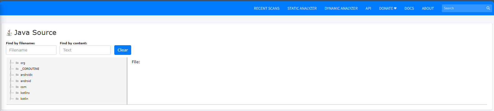
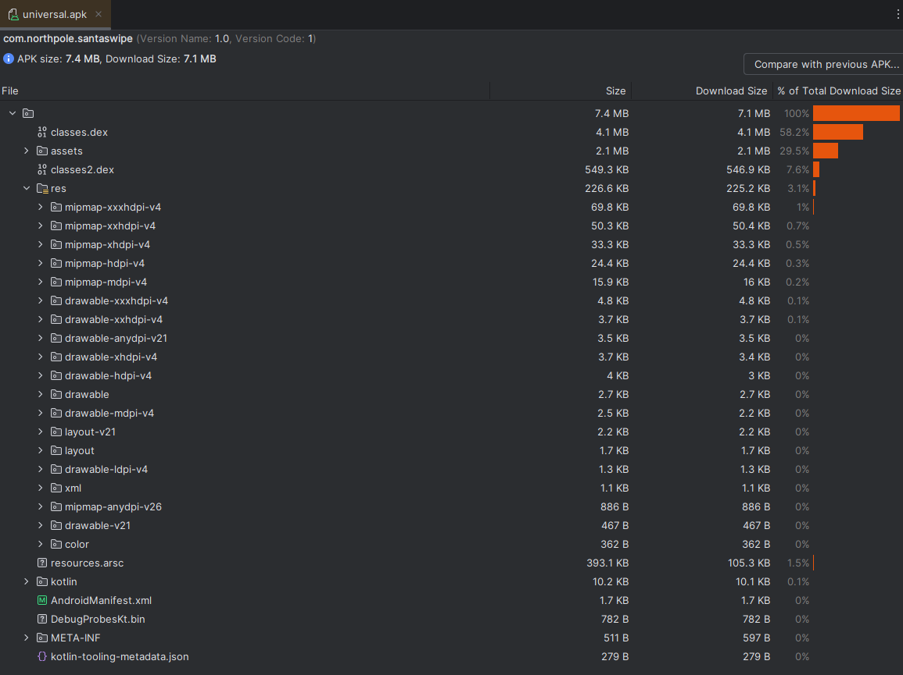

## Objective

## Hints


## Solution

>[!NOTE] 
>Unlike the terminal challenges, the answers identified during this challenge are added from the `Objectives` menu. 
>
>

### Silver Solution
#### APK Tool, JADX, Android Studio
> [!TIP]
> The HINT states that we should use APKTOOL or JADX. APKTOOL is the most common. To install that on most Debian Based Systems use `sudo apt install apktool -y` . That said if you prefer to review things through a GUI JADX may be the way to go for it `sudo apt install jadx`.  I personally took the route of installing both tools and `Andriod Studio` to see what the differences in outputs were to better understand what each tool was better at. Based on those findings, the below steps are a mixture of these tools.

#### Silver (APKTool, JADX)
##### Strings
Strings should always be a first analysis of any binary, as it may give hints to the contents of the files or things that can be used during the investigation of the file. Refer to the hint that is provided in the game for this as well in regards to the encrypted and obfuscation of the file `Mobile Analysis Hard - Encryption and Obfuscation`


`apktool decode -o ./mobile-analysis/apk/ -f ./SantaSwipe.apk`

> [!TIP]
> May take a minute but would recommend exploring the directories here so that you can notice what is not the same in the directories and what is the same. This will help finding the required locations. In this particular game there are several directories that contain the North Pole.  But ultimately the best way to view all of the NorthPole content as one is using the JADX toolset, which was the second recommend tool in the hint. This will allow us to see the database 


```java
private static final String DATABASE_NAME = "naughtynicelist.db";

public void onCreate(SQLiteDatabase db) {
	Intrinsics.checkNotNullParameter(db, "db");
	db.execSQL("CREATE TABLE IF NOT EXISTS NiceList (Item TEXT);");
	db.execSQL("CREATE TABLE IF NOT EXISTS NaughtyList (Item TEXT);");
	db.execSQL("CREATE TABLE IF NOT EXISTS NormalList (Item TEXT);");
	db.execSQL("DELETE FROM NiceList;");
	db.execSQL("DELETE FROM NaughtyList;");
	db.execSQL("DELETE FROM NormalList;");
	db.execSQL("INSERT INTO NormalList (Item) VALUES ('Carlos, Madrid, Spain');");
	db.execSQL("INSERT INTO NormalList (Item) VALUES ('Aiko, Tokyo, Japan');");
	db.execSQL("INSERT INTO NormalList (Item) VALUES ('Maria, Rio de Janeiro, Brazil');");
	db.execSQL("INSERT INTO NormalList (Item) VALUES ('Liam, Dublin, Ireland');");
	db.execSQL("INSERT INTO NormalList (Item) VALUES ('Emma, New York, USA');");
	db.execSQL("INSERT INTO NormalList (Item) VALUES ('Chen, Beijing, China');");
	db.execSQL("INSERT INTO NormalList (Item) VALUES ('Fatima, Casablanca, Morocco');");
	db.execSQL("INSERT INTO NormalList (Item) VALUES ('Hans, Berlin, Germany');");
	db.execSQL("INSERT INTO NormalList (Item) VALUES ('Olga, Moscow, Russia');");
	db.execSQL("INSERT INTO NormalList (Item) VALUES ('Ravi, Mumbai, India');");
	db.execSQL("INSERT INTO NormalList (Item) VALUES ('Amelia, Sydney, Australia');");
	db.execSQL("INSERT INTO NormalList (Item) VALUES ('Juan, Buenos Aires, Argentina');");
	db.execSQL("INSERT INTO NormalList (Item) VALUES ('Sofia, Rome, Italy');");
	db.execSQL("INSERT INTO NormalList (Item) VALUES ('Ahmed, Cairo, Egypt');");
	db.execSQL("INSERT INTO NormalList (Item) VALUES ('Yuna, Seoul, South Korea');");
	db.execSQL("INSERT INTO NormalList (Item) VALUES ('Ellie, Alabama, USA');");
	db.execSQL("INSERT INTO NormalList (Item) VALUES ('Lucas, Paris, France');");
	db.execSQL("INSERT INTO NormalList (Item) VALUES ('Mia, Toronto, Canada');");
	db.execSQL("INSERT INTO NormalList (Item) VALUES ('Sara, Stockholm, Sweden');");
	db.execSQL("INSERT INTO NormalList (Item) VALUES ('Ali, Tehran, Iran');");
	db.execSQL("INSERT INTO NormalList (Item) VALUES ('Nina, Lima, Peru');");
	db.execSQL("INSERT INTO NormalList (Item) VALUES ('Anna, Vienna, Austria');");
	db.execSQL("INSERT INTO NormalList (Item) VALUES ('Leo, Helsinki, Finland');");
	db.execSQL("INSERT INTO NormalList (Item) VALUES ('Elena, Athens, Greece');");
	db.execSQL("INSERT INTO NormalList (Item) VALUES ('Davi, Sao Paulo, Brazil');");
	db.execSQL("INSERT INTO NormalList (Item) VALUES ('Marta, Warsaw, Poland');");
	db.execSQL("INSERT INTO NormalList (Item) VALUES ('Noah, Zurich, Switzerland');");
	db.execSQL("INSERT INTO NormalList (Item) VALUES ('Ibrahim, Ankara, Turkey');");
	db.execSQL("INSERT INTO NormalList (Item) VALUES ('Emily, Wellington, New Zealand');");
	db.execSQL("INSERT INTO NormalList (Item) VALUES ('Omar, Oslo, Norway');");
	db.execSQL("INSERT INTO NormalList (Item) VALUES ('Fatou, Dakar, Senegal');");
	db.execSQL("INSERT INTO NormalList (Item) VALUES ('Olivia, Vancouver, Canada');");
	db.execSQL("INSERT INTO NormalList (Item) VALUES ('Ethan, Cape Town, South Africa');");
	db.execSQL("INSERT INTO NormalList (Item) VALUES ('Santiago, Bogota, Colombia');");
	db.execSQL("INSERT INTO NormalList (Item) VALUES ('Isabella, Barcelona, Spain');");
	db.execSQL("INSERT INTO NormalList (Item) VALUES ('Ming, Shanghai, China');");
	db.execSQL("INSERT INTO NormalList (Item) VALUES ('Chloe, Singapore, Singapore');");
	db.execSQL("INSERT INTO NormalList (Item) VALUES ('Mohammed, Dubai, UAE');");
	db.execSQL("INSERT INTO NormalList (Item) VALUES ('Ava, Melbourne, Australia');");
	db.execSQL("INSERT INTO NormalList (Item) VALUES ('Luca, Milan, Italy');");
	db.execSQL("INSERT INTO NormalList (Item) VALUES ('Sakura, Kyoto, Japan');");
	db.execSQL("INSERT INTO NormalList (Item) VALUES ('Edward, New Jersey, USA');");
}
```

With the list of the resources we can compare with other places where the Normal List is being loaded. Why `NoramlList`, because that is where all the children are being submitted to by default, so we should start there. Evaluating through the system code we can identify a piece of code 

Which we were able to find by exploring the code base in JADX

#### Silver Solution (Android Studio)

> [!NOTE]
> There are alternative tools to completing this challenge. As noted one such tool is `Android Studio`, but another such tool is `BlueStacks`, which will allow you to run the APK within the emulator. While BlueStacks is viable here, it is not compatible with MacOS on the M1+ Chips, so I have opted to use Android Studio as the way forward to keep it consistent for anyone working through these steps. But this is only for the emulator part, which is not required to complete the silver solution
 
> [!CAUTION]
> When using Android Studio to load the APK, you may encounter an error if you try to directly open the APK file `SantaSwipe.apk is unsupported binary file` This is expected. To get around this simple create a new project with no activity, then go to the `Build` menu and select `Analyze APK`

>[!NOTE]
>Android Studio will output the DEX file. For the purpose of demonstration, this is the same file as the database one identified by jdax tool that decompiled the source code for this application. Functionally providing the same information but depending on your preference, it may be faster to view the dex files as no conversions need to occur to read them

```java dex
.method public onCreate(Landroid/database/sqlite/SQLiteDatabase;)V
    .registers 3
    .param p1, "db"    # Landroid/database/sqlite/SQLiteDatabase;

    const-string v0, "db"
    invoke-static {p1, v0}, Lkotlin/jvm/internal/Intrinsics;->checkNotNullParameter(Ljava/lang/Object;Ljava/lang/String;)V

    .line 16
    const-string v0, "CREATE TABLE IF NOT EXISTS NiceList (Item TEXT);"
    invoke-virtual {p1, v0}, Landroid/database/sqlite/SQLiteDatabase;->execSQL(Ljava/lang/String;)V

    .line 17
    const-string v0, "CREATE TABLE IF NOT EXISTS NaughtyList (Item TEXT);"
    invoke-virtual {p1, v0}, Landroid/database/sqlite/SQLiteDatabase;->execSQL(Ljava/lang/String;)V

    .line 18
    const-string v0, "CREATE TABLE IF NOT EXISTS NormalList (Item TEXT);"
    invoke-virtual {p1, v0}, Landroid/database/sqlite/SQLiteDatabase;->execSQL(Ljava/lang/String;)V

    .line 21
    const-string v0, "DELETE FROM NiceList;"
    invoke-virtual {p1, v0}, Landroid/database/sqlite/SQLiteDatabase;->execSQL(Ljava/lang/String;)V

    .line 22
    const-string v0, "DELETE FROM NaughtyList;"
    invoke-virtual {p1, v0}, Landroid/database/sqlite/SQLiteDatabase;->execSQL(Ljava/lang/String;)V

    .line 23
    const-string v0, "DELETE FROM NormalList;"
    invoke-virtual {p1, v0}, Landroid/database/sqlite/SQLiteDatabase;->execSQL(Ljava/lang/String;)V

    .line 25
    const-string v0, "INSERT INTO NormalList (Item) VALUES (\'Carlos, Madrid, Spain\');"
    invoke-virtual {p1, v0}, Landroid/database/sqlite/SQLiteDatabase;->execSQL(Ljava/lang/String;)V

    .line 26
    const-string v0, "INSERT INTO NormalList (Item) VALUES (\'Aiko, Tokyo, Japan\');"
    invoke-virtual {p1, v0}, Landroid/database/sqlite/SQLiteDatabase;->execSQL(Ljava/lang/String;)V

    .line 27
    const-string v0, "INSERT INTO NormalList (Item) VALUES (\'Maria, Rio de Janeiro, Brazil\');"
    invoke-virtual {p1, v0}, Landroid/database/sqlite/SQLiteDatabase;->execSQL(Ljava/lang/String;)V

    .line 28
    const-string v0, "INSERT INTO NormalList (Item) VALUES (\'Liam, Dublin, Ireland\');"
    invoke-virtual {p1, v0}, Landroid/database/sqlite/SQLiteDatabase;->execSQL(Ljava/lang/String;)V

    .line 29
    const-string v0, "INSERT INTO NormalList (Item) VALUES (\'Emma, New York, USA\');"
    invoke-virtual {p1, v0}, Landroid/database/sqlite/SQLiteDatabase;->execSQL(Ljava/lang/String;)V

    .line 30
    const-string v0, "INSERT INTO NormalList (Item) VALUES (\'Chen, Beijing, China\');"
    invoke-virtual {p1, v0}, Landroid/database/sqlite/SQLiteDatabase;->execSQL(Ljava/lang/String;)V

    .line 31
    const-string v0, "INSERT INTO NormalList (Item) VALUES (\'Fatima, Casablanca, Morocco\');"
    invoke-virtual {p1, v0}, Landroid/database/sqlite/SQLiteDatabase;->execSQL(Ljava/lang/String;)V

    .line 32
    const-string v0, "INSERT INTO NormalList (Item) VALUES (\'Hans, Berlin, Germany\');"
    invoke-virtual {p1, v0}, Landroid/database/sqlite/SQLiteDatabase;->execSQL(Ljava/lang/String;)V

    .line 33
    const-string v0, "INSERT INTO NormalList (Item) VALUES (\'Olga, Moscow, Russia\');"
    invoke-virtual {p1, v0}, Landroid/database/sqlite/SQLiteDatabase;->execSQL(Ljava/lang/String;)V

    .line 34
    const-string v0, "INSERT INTO NormalList (Item) VALUES (\'Ravi, Mumbai, India\');"
    invoke-virtual {p1, v0}, Landroid/database/sqlite/SQLiteDatabase;->execSQL(Ljava/lang/String;)V

    .line 35
    const-string v0, "INSERT INTO NormalList (Item) VALUES (\'Amelia, Sydney, Australia\');"
    invoke-virtual {p1, v0}, Landroid/database/sqlite/SQLiteDatabase;->execSQL(Ljava/lang/String;)V

    .line 36
    const-string v0, "INSERT INTO NormalList (Item) VALUES (\'Juan, Buenos Aires, Argentina\');"
    invoke-virtual {p1, v0}, Landroid/database/sqlite/SQLiteDatabase;->execSQL(Ljava/lang/String;)V

    .line 37
    const-string v0, "INSERT INTO NormalList (Item) VALUES (\'Sofia, Rome, Italy\');"
    invoke-virtual {p1, v0}, Landroid/database/sqlite/SQLiteDatabase;->execSQL(Ljava/lang/String;)V

    .line 38
    const-string v0, "INSERT INTO NormalList (Item) VALUES (\'Ahmed, Cairo, Egypt\');"
    invoke-virtual {p1, v0}, Landroid/database/sqlite/SQLiteDatabase;->execSQL(Ljava/lang/String;)V

    .line 39
    const-string v0, "INSERT INTO NormalList (Item) VALUES (\'Yuna, Seoul, South Korea\');"
    invoke-virtual {p1, v0}, Landroid/database/sqlite/SQLiteDatabase;->execSQL(Ljava/lang/String;)V

    .line 40
    const-string v0, "INSERT INTO NormalList (Item) VALUES (\'Ellie, Alabama, USA\');"
    invoke-virtual {p1, v0}, Landroid/database/sqlite/SQLiteDatabase;->execSQL(Ljava/lang/String;)V

    .line 41
    const-string v0, "INSERT INTO NormalList (Item) VALUES (\'Lucas, Paris, France\');"
    invoke-virtual {p1, v0}, Landroid/database/sqlite/SQLiteDatabase;->execSQL(Ljava/lang/String;)V

    .line 42
    const-string v0, "INSERT INTO NormalList (Item) VALUES (\'Mia, Toronto, Canada\');"
    invoke-virtual {p1, v0}, Landroid/database/sqlite/SQLiteDatabase;->execSQL(Ljava/lang/String;)V

    .line 43
    const-string v0, "INSERT INTO NormalList (Item) VALUES (\'Sara, Stockholm, Sweden\');"
    invoke-virtual {p1, v0}, Landroid/database/sqlite/SQLiteDatabase;->execSQL(Ljava/lang/String;)V

    .line 44
    const-string v0, "INSERT INTO NormalList (Item) VALUES (\'Ali, Tehran, Iran\');"
    invoke-virtual {p1, v0}, Landroid/database/sqlite/SQLiteDatabase;->execSQL(Ljava/lang/String;)V

    .line 45
    const-string v0, "INSERT INTO NormalList (Item) VALUES (\'Nina, Lima, Peru\');"
    invoke-virtual {p1, v0}, Landroid/database/sqlite/SQLiteDatabase;->execSQL(Ljava/lang/String;)V

    .line 46
    const-string v0, "INSERT INTO NormalList (Item) VALUES (\'Anna, Vienna, Austria\');"
    invoke-virtual {p1, v0}, Landroid/database/sqlite/SQLiteDatabase;->execSQL(Ljava/lang/String;)V

    .line 47
    const-string v0, "INSERT INTO NormalList (Item) VALUES (\'Leo, Helsinki, Finland\');"
    invoke-virtual {p1, v0}, Landroid/database/sqlite/SQLiteDatabase;->execSQL(Ljava/lang/String;)V

    .line 48
    const-string v0, "INSERT INTO NormalList (Item) VALUES (\'Elena, Athens, Greece\');"
    invoke-virtual {p1, v0}, Landroid/database/sqlite/SQLiteDatabase;->execSQL(Ljava/lang/String;)V

    .line 49
    const-string v0, "INSERT INTO NormalList (Item) VALUES (\'Davi, Sao Paulo, Brazil\');"
    invoke-virtual {p1, v0}, Landroid/database/sqlite/SQLiteDatabase;->execSQL(Ljava/lang/String;)V

    .line 50
    const-string v0, "INSERT INTO NormalList (Item) VALUES (\'Marta, Warsaw, Poland\');"
    invoke-virtual {p1, v0}, Landroid/database/sqlite/SQLiteDatabase;->execSQL(Ljava/lang/String;)V

    .line 51
    const-string v0, "INSERT INTO NormalList (Item) VALUES (\'Noah, Zurich, Switzerland\');"
    invoke-virtual {p1, v0}, Landroid/database/sqlite/SQLiteDatabase;->execSQL(Ljava/lang/String;)V

    .line 52
    const-string v0, "INSERT INTO NormalList (Item) VALUES (\'Ibrahim, Ankara, Turkey\');"
    invoke-virtual {p1, v0}, Landroid/database/sqlite/SQLiteDatabase;->execSQL(Ljava/lang/String;)V

    .line 53
    const-string v0, "INSERT INTO NormalList (Item) VALUES (\'Emily, Wellington, New Zealand\');"
    invoke-virtual {p1, v0}, Landroid/database/sqlite/SQLiteDatabase;->execSQL(Ljava/lang/String;)V

    .line 54
    const-string v0, "INSERT INTO NormalList (Item) VALUES (\'Omar, Oslo, Norway\');"
    invoke-virtual {p1, v0}, Landroid/database/sqlite/SQLiteDatabase;->execSQL(Ljava/lang/String;)V

    .line 55
    const-string v0, "INSERT INTO NormalList (Item) VALUES (\'Fatou, Dakar, Senegal\');"
    invoke-virtual {p1, v0}, Landroid/database/sqlite/SQLiteDatabase;->execSQL(Ljava/lang/String;)V

    .line 56
    const-string v0, "INSERT INTO NormalList (Item) VALUES (\'Olivia, Vancouver, Canada\');"
    invoke-virtual {p1, v0}, Landroid/database/sqlite/SQLiteDatabase;->execSQL(Ljava/lang/String;)V

    .line 57
    const-string v0, "INSERT INTO NormalList (Item) VALUES (\'Ethan, Cape Town, South Africa\');"
    invoke-virtual {p1, v0}, Landroid/database/sqlite/SQLiteDatabase;->execSQL(Ljava/lang/String;)V

    .line 58
    const-string v0, "INSERT INTO NormalList (Item) VALUES (\'Santiago, Bogota, Colombia\');"
    invoke-virtual {p1, v0}, Landroid/database/sqlite/SQLiteDatabase;->execSQL(Ljava/lang/String;)V

    .line 59
    const-string v0, "INSERT INTO NormalList (Item) VALUES (\'Isabella, Barcelona, Spain\');"
    invoke-virtual {p1, v0}, Landroid/database/sqlite/SQLiteDatabase;->execSQL(Ljava/lang/String;)V

    .line 60
    const-string v0, "INSERT INTO NormalList (Item) VALUES (\'Ming, Shanghai, China\');"
    invoke-virtual {p1, v0}, Landroid/database/sqlite/SQLiteDatabase;->execSQL(Ljava/lang/String;)V

    .line 61
    const-string v0, "INSERT INTO NormalList (Item) VALUES (\'Chloe, Singapore, Singapore\');"
    invoke-virtual {p1, v0}, Landroid/database/sqlite/SQLiteDatabase;->execSQL(Ljava/lang/String;)V

    .line 62
    const-string v0, "INSERT INTO NormalList (Item) VALUES (\'Mohammed, Dubai, UAE\');"
    invoke-virtual {p1, v0}, Landroid/database/sqlite/SQLiteDatabase;->execSQL(Ljava/lang/String;)V

    .line 63
    const-string v0, "INSERT INTO NormalList (Item) VALUES (\'Ava, Melbourne, Australia\');"
    invoke-virtual {p1, v0}, Landroid/database/sqlite/SQLiteDatabase;->execSQL(Ljava/lang/String;)V

    .line 64
    const-string v0, "INSERT INTO NormalList (Item) VALUES (\'Luca, Milan, Italy\');"
    invoke-virtual {p1, v0}, Landroid/database/sqlite/SQLiteDatabase;->execSQL(Ljava/lang/String;)V

    .line 65
    const-string v0, "INSERT INTO NormalList (Item) VALUES (\'Sakura, Kyoto, Japan\');"
    invoke-virtual {p1, v0}, Landroid/database/sqlite/SQLiteDatabase;->execSQL(Ljava/lang/String;)V

    .line 66
    const-string v0, "INSERT INTO NormalList (Item) VALUES (\'Edward, New Jersey, USA\');"
    invoke-virtual {p1, v0}, Landroid/database/sqlite/SQLiteDatabase;->execSQL(Ljava/lang/String;)V

    .line 67
    return-void
.end method
```

- From the DEX file we can see a few things. A bunch of SQL Strings that are invoking `execSQL` via a string. Specifically though we see a call to the `NormalList`. Seems like we should see what is in the normal list and where that is called. 
```java
.method public final getNormalList()V
    .registers 13
    .annotation runtime Landroid/webkit/JavascriptInterface;
    .end annotation

    .line 73
    const-string v0, "WebAppInterface"

    .line 74
    :try_start_2
    iget-object v1, p0, Lcom/northpole/santaswipe/MainActivity$WebAppInterface;->this$0:Lcom/northpole/santaswipe/MainActivity;
    invoke-static {v1}, Lcom/northpole/santaswipe/MainActivity;->access$getDatabase$p(Lcom/northpole/santaswipe/MainActivity;)Landroid/database/sqlite/SQLiteDatabase;
    move-result-object v1
    const/4 v2, 0x0
    if-nez v1, :cond_11
    const-string v1, "database"
    invoke-static {v1}, Lkotlin/jvm/internal/Intrinsics;->throwUninitializedPropertyAccessException(Ljava/lang/String;)V
    move-object v1, v2
    :cond_11
    const-string v3, "SELECT Item FROM NormalList WHERE Item NOT LIKE \'%Ellie%\'"
    invoke-virtual {v1, v3, v2}, Landroid/database/sqlite/SQLiteDatabase;->rawQuery(Ljava/lang/String;[Ljava/lang/String;)Landroid/database/Cursor;
    move-result-object v1

    .line 75
    .local v1, "cursor":Landroid/database/Cursor;
    new-instance v2, Ljava/util/ArrayList;
    invoke-direct {v2}, Ljava/util/ArrayList;-><init>()V
    check-cast v2, Ljava/util/List;

    .line 77
    .local v2, "items":Ljava/util/List;
    const-string v3, "Fetching items from NormalList table"
    invoke-static {v0, v3}, Landroid/util/Log;->d(Ljava/lang/String;Ljava/lang/String;)I

    .line 79
    :goto_23
    invoke-interface {v1}, Landroid/database/Cursor;->moveToNext()Z
    move-result v3
    if-eqz v3, :cond_4b

    .line 80
    const/4 v3, 0x0
    invoke-interface {v1, v3}, Landroid/database/Cursor;->getString(I)Ljava/lang/String;
    move-result-object v3

    .line 81
    .local v3, "item":Ljava/lang/String;
    invoke-static {v3}, Lkotlin/jvm/internal/Intrinsics;->checkNotNull(Ljava/lang/Object;)V
    invoke-interface {v2, v3}, Ljava/util/List;->add(Ljava/lang/Object;)Z

    .line 82
    new-instance v4, Ljava/lang/StringBuilder;
    invoke-direct {v4}, Ljava/lang/StringBuilder;-><init>()V
    const-string v5, "Fetched item: "
    invoke-virtual {v4, v5}, Ljava/lang/StringBuilder;->append(Ljava/lang/String;)Ljava/lang/StringBuilder;
    move-result-object v4
    invoke-virtual {v4, v3}, Ljava/lang/StringBuilder;->append(Ljava/lang/String;)Ljava/lang/StringBuilder;
    move-result-object v4
    invoke-virtual {v4}, Ljava/lang/StringBuilder;->toString()Ljava/lang/String;
    move-result-object v4
    invoke-static {v0, v4}, Landroid/util/Log;->d(Ljava/lang/String;Ljava/lang/String;)I
    goto :goto_23

    .line 84
    .end local v3    # "item":Ljava/lang/String;
    :cond_4b
    invoke-interface {v1}, Landroid/database/Cursor;->close()V

    .line 86
    invoke-interface {v2}, Ljava/util/List;->isEmpty()Z
    move-result v3
    if-eqz v3, :cond_57

    .line 87
    const-string v3, "[]"
    goto :goto_70

    .line 89
    :cond_57
    move-object v3, v2
    check-cast v3, Ljava/lang/Iterable;
    const-string v4, "\",\""
    check-cast v4, Ljava/lang/CharSequence;
    const-string v5, "[\""
    check-cast v5, Ljava/lang/CharSequence;
    const-string v6, "\"]"
    check-cast v6, Ljava/lang/CharSequence;
    const/16 v10, 0x38
    const/4 v11, 0x0
    const/4 v7, 0x0
    const/4 v8, 0x0
    const/4 v9, 0x0
    invoke-static/range {v3 .. v11}, Lkotlin/collections/CollectionsKt;->joinToString$default(Ljava/lang/Iterable;Ljava/lang/CharSequence;Ljava/lang/CharSequence;Ljava/lang/CharSequence;ILjava/lang/CharSequence;Lkotlin/jvm/functions/Function1;ILjava/lang/Object;)Ljava/lang/String;
    move-result-object v3

    .line 86
    :goto_70
    nop

    .line 92
    .local v3, "jsonItems":Ljava/lang/String;
    iget-object v4, p0, Lcom/northpole/santaswipe/MainActivity$WebAppInterface;->this$0:Lcom/northpole/santaswipe/MainActivity;
    iget-object v5, p0, Lcom/northpole/santaswipe/MainActivity$WebAppInterface;->this$0:Lcom/northpole/santaswipe/MainActivity;
    new-instance v6, Lcom/northpole/santaswipe/MainActivity$WebAppInterface$$ExternalSyntheticLambda1;
    invoke-direct {v6, v3, v5}, Lcom/northpole/santaswipe/MainActivity$WebAppInterface$$ExternalSyntheticLambda1;-><init>(Ljava/lang/String;Lcom/northpole/santaswipe/MainActivity;)V
    invoke-virtual {v4, v6}, Lcom/northpole/santaswipe/MainActivity;->runOnUiThread(Ljava/lang/Runnable;)V
    :try_end_7d
    .catch Ljava/lang/Exception; {:try_start_2 .. :try_end_7d} :catch_7e
    .end local v1    # "cursor":Landroid/database/Cursor;
    .end local v2    # "items":Ljava/util/List;
    .end local v3    # "jsonItems":Ljava/lang/String;
    goto :goto_99

    .line 96
    :catch_7e
    move-exception v1

    .line 97
    .local v1, "e":Ljava/lang/Exception;
    new-instance v2, Ljava/lang/StringBuilder;
    invoke-direct {v2}, Ljava/lang/StringBuilder;-><init>()V
    const-string v3, "Error fetching NormalList: "
    invoke-virtual {v2, v3}, Ljava/lang/StringBuilder;->append(Ljava/lang/String;)Ljava/lang/StringBuilder;
    move-result-object v2
    invoke-virtual {v1}, Ljava/lang/Exception;->getMessage()Ljava/lang/String;
    move-result-object v3
    invoke-virtual {v2, v3}, Ljava/lang/StringBuilder;->append(Ljava/lang/String;)Ljava/lang/StringBuilder;
    move-result-object v2
    invoke-virtual {v2}, Ljava/lang/StringBuilder;->toString()Ljava/lang/String;
    move-result-object v2
    invoke-static {v0, v2}, Landroid/util/Log;->e(Ljava/lang/String;Ljava/lang/String;)I

    .line 99
    .end local v1    # "e":Ljava/lang/Exception;
    :goto_99
    return-void
.end method

```

- The output of the main activity shows an interesting code line `const-string v3, "SELECT Item FROM NormalList WHERE Item NOT LIKE \'%Ellie%\'"` where in the same `NormalList` is found but is excluding the name like `Ellie`. So `Ellie` is the answer.

#### Silver Solution (Mobile Security Framework)

- Upload the the APK to the [Mobile Security Forensics]([Mobile Security Framework - MobSF](https://mobsf.live/))

- This next step may take a while depending on the queue amount. But your file will be queued for doing the static analysis on the file. You can do dynamic analysis if you use your own server, but it is not strictly needed here.

- Once the scan is complete. Click View Report

- Once the report is available you will see something like the image below. Click on the `View Source`

- If you scroll down from here to the Code Analysis section we can see some vulnerabilities associated with this application which may provide additional hints to our search

- Your source page will look something like the following:

- By hitting the arrows next to the folders you can explore through the tree of files. We can make this easier because many of these files are standard files and do not include the custom logic used by the application. As such we can focus in on the `com` or `org` packages. Looking in the `org` package though reveals items related to the IDE that this was potentially created with. So we can turn the focus on `com` package. 

- We can see three files of immediate interest. `R`, `DatabaseHelper` and `MainActivity`. Taking a quick look at `R` does not really provide us much information on the children or a where the names are stored. Main activity is in every android application. That is where everything starts with the Application. But we are dealing with a database based on the hint of a list missing a child. So with that in mind, I look at the `DatabaseHelper` class first. Looking at it we can see the names of the children and the names of the lists. Interestingly all the names are loaded to the `NormalList` Table. So maybe we can explore what that is in the `MainActivity` and see how it is loaded initially.

- Reading through the code we can find a function called `getNormalList()` which has an entry on line 127, where `Cursor cursor = sQLiteDatabase.rawQuery("SELECT Item FROM NormalList WHERE Item NOT LIKE '%Ellie%'", null);` indicates the names being excluded are `Ellie` or the ones that are with "Ellie" in the spelling of the name
#### Silver Solution (Decompiler Online)
- [Astrogrep](https://astrogrep.sourceforge.net/download/)
- [Online Decompiler](https://www.decompiler.com/)

>[!CAUTION]
>This method is providing the APK to a third party hosted on the cloud. While this is not really a concern for this challenge, if you want to do work on another APK this may be important for you or your client/employer(s). 

> [!NOTE]
> This portion of the walkthrough similar to the Android Studio will assume that you have installed `AstroGrep` and the appropriate system requirements as applicable

Visit the [Online Decompiler](https://www.decompiler.com/) and drag the [SantaSwipe.apk](../../../Assets/files/act2/mobile-analysis/SantaSwipe.apk) to the giant green box

Once the upload is complete then you will download the zip, this is the file that will will be using with astrogrep to conduct the analysis
>[!NOTE]
>This website has some javascript (Client Side) protection against AdBlockers, so if your using them you may have to disable the adblockers temporarily or modify the JavaScript to reenable the proper links


Once you have the [Zip Archive](../../../Assets/files/act2/mobile-analysis/SantaSwipe.apk_Decompiler.com.zip) then you can unzip the contents to your working directory. Once extracted in your working directory, open up AstroGrep and set the Search Path to the location of that working directory


##### Start The Hunt
- Look for some indication of a database, and what type of database it may be.  When the search is complete, you can scan through the files, most of which will have very little content that can give us enough information to work on. But there is a file that does, similar to the one below which indicate that there is SQLite Database. We can see this both in the file demonstrated, and in the name of the file in the search results


- Examining a bit more we can see that the database has activity being done in the `MainActivity` java file. as demonstrated below we can see that this file is performing the insertions for the `NiceList`, `NaughtyList`, and the `NormalList`

- Weirdly when examining the `execSQL` commands being used in each of the lists, there is only one which is different from the others in that the database action is selecting with a condition. This condition appears to be the name `Ellie` that may be missing from the list


#### Achievement

### Gold Solution

>[!CAUTION] 
>If you decide to use the Mobile Security Framework and Export the APK for review, this may inadvertently impact the files you have available to perform the analysis, especially when evaluating the EV and IV values from the aab or apk packages. Recommend using the BundleTool as the method for extraction. You can find some of these removed files in other locations, but will not be covered in this walk through
>

> [!NOTE]
> Like the Silver below, this assumes that you have installed all the tools. However, BundleTool will be addressed here as installation variations will be more likely with it being a JAR file. That said it will assume that you have downloaded it to your desktop from [Releases · google/bundletool](https://github.com/google/bundletool/releases)

- Take [SantaSwipeSecure.aab](../../../Assets/files/act2/mobile-analysis/SantaSwipeSecure.aab) file and break it down to a [Universal APK Format](../../../Assets/files/act2/mobile-analysis/universal.apk):
```bash
alias bundletool='java -jar ~/Desktop/bundletool-all-1.17.2.jar'
bundletool build-apks --bundle=./SantaSwipeSecure.aab --output=~/Desktop/output.apks --mode=UNIVERSAL
mv output.apks output.zip
unzip ./output.zip -d ./extracted-folder
apktool decode -f ~/Desktop/extracted-folder/universal.apk -o ./apk/
```

- Result should be similar to a folder like this:


- Using the hint that we were given `Obfuscated and encrypted? Hmph. Shame you can't just run strings on the file.` 
 
> [!CAUTION] 
> This hint, if you follow the link in game will point you to the strings for Android Application Resources ([strings](https://developer.android.com/guide/topics/resources/string-resource)) and Not to the Strings application commonly used on binaries to extract strings from executables. If you mix these up, you will likely be looking through a bunch of information that is not really relevant to this challenge

>[!CAUTION]
>Loading the Universal App Into Andriod Studio, Mobile Security Framework, and JADX will result in some of the resources in the res folder from showing. It is recommended to extract this via command line and examine the files 
>directly (refer to notes [below](#GOLD%20GUI%20ISSUES)
>

- Look for the Initialization Vector, commonly called IV
```bash
cat ./apk/res/values/strings.xml | grep "name=\"iv\""
```
- Result of IV Search
```xml
    <string name="iv">Q2hlY2tNYXRlcml4</string>
```

- Look for the encryption key, commonly called EK
```bash
cat ./apk/res/values/strings.xml | grep "name=\"ek\""
```
- Result of EK search
```xml
    <string name="ek">rmDJ1wJ7ZtKy3lkLs6X9bZ2Jvpt6jL6YWiDsXtgjkXw=</string>
```
- That encryption key looks like it may be base64 encoded, as w2ell as the IV. If we decode it, the `iv` become `CheckMaterix` but the `ek` with be raw bytes that are mostly gibberish. This likely indicates that the key is meant to be in the base64 mode when we start.
- Looking at the code, we can determine the type of algorithm is an `AES/GCM/NoPadding` implementation.

- This function can be seen being called on the initial creation of the database, and may give us a clue

- Since we know the algorithm, the key, and the IV, we should be able to create a quick script that deciphers the content of this command to validate that this in fact the correct sequences
```python
from base64 import b64decode  
from cryptography.hazmat.primitives.ciphers import Cipher, algorithms, modes  
from cryptography.hazmat.backends import default_backend  
from typing import Optional  
  
  
def add_base64_padding(data: str) -> str:  
    """  
    Ensure the Base64 string is properly padded.  
    Args:        data (str): Base64 encoded string that might be missing padding  
    Returns:        str: Properly padded Base64 string    """    return data + '=' * (-len(data) % 4)  
  
  
def decrypt_aes_gcm_no_padding(key_b64: str, iv_b64: str, ciphertext_b64: str) -> Optional[str]:  
    """  
    Decrypt data using AES-GCM mode with no padding.  
    Args:        key_b64 (str): Base64 encoded encryption key        iv_b64 (str): Base64 encoded initialization vector        ciphertext_b64 (str): Base64 encoded ciphertext with auth tag  
    Returns:        Optional[str]: Decrypted string or None if decryption fails    """    try:  
        # Ensure the Base64 strings are properly padded  
        key_b64 = add_base64_padding(key_b64)  
        iv_b64 = add_base64_padding(iv_b64)  
        ciphertext_b64 = add_base64_padding(ciphertext_b64)  
  
        # Decode the Base64-encoded inputs  
        key = b64decode(key_b64)  
        iv = b64decode(iv_b64)  
        ciphertext = b64decode(ciphertext_b64)  
  
        # Validate input lengths  
        if len(key) not in [16, 24, 32]:  # AES-128, AES-192, or AES-256  
            raise ValueError(f"Invalid key length: {len(key)}. Must be 16, 24, or 32 bytes.")  
        if len(iv) != 12:  # GCM mode requires 12-byte IV  
            raise ValueError(f"Invalid IV length: {len(iv)}. Must be 12 bytes.")  
        if len(ciphertext) < 16:  # Must at least contain the tag  
            raise ValueError("Ciphertext too short to contain authentication tag")  
  
        # Split the ciphertext and tag  
        tag_length = 16  # GCM tag is always 16 bytes  
        actual_ciphertext = ciphertext[:-tag_length]  
        tag = ciphertext[-tag_length:]  
  
        # Create and initialize cipher  
        cipher = Cipher(  
            algorithms.AES(key),  
            modes.GCM(iv, tag),  
            backend=default_backend()  
        )  
        decryptor = cipher.decryptor()  
  
        # Perform decryption  
        plaintext = decryptor.update(actual_ciphertext) + decryptor.finalize()  
        return plaintext.decode('utf-8')  
  
    except ValueError as ve:  
        print(f"Validation error: {ve}")  
        return None  
    except Exception as e:  
        print(f"Decryption failed: {e}")  
        return None

if __name__ == "__main__":  
    base64_key = 'rmDJ1wJ7ZtKy3lkLs6X9bZ2Jvpt6jL6YWiDsXtgjkXw'  
    base64_iv = 'Q2hlY2tNYXRlcml4'  
    base64_ciphertext = ("IVrt+9Zct4oUePZeQqFwyhBix8cSCIxtsa+lJZkMNpNFBgoHeJlwp73l2oyEh1Y6AfqnfH7gcU9Yfov6u70cUA2/"  +
						 "OwcxVt7Ubdn0UD2kImNsclEQ9M8PpnevBX3mXlW2QnH8+Q+SC7JaMUc9CIvxB2HYQG2JujQf6skpVaPAKGxfLqDj+"  + 
						 "2UyTAVLoeUlQjc18swZVtTQO7Zwe6sTCYlrw7GpFXCAuI6Ex29gfeVIeB7pK7M4kZGy3OIaFxfTdevCoTMwkoPvJu" + 
						 "RupA6ybp36vmLLMXaAWsrDHRUbKfE6UKvGoC9d5vqmKeIO9elASuagxjBJ")  
  
    decrypted = decrypt_aes_gcm_no_padding(base64_key, base64_iv, base64_ciphertext)  
    if decrypted:  
        print("Decrypted text:", decrypted)
```

- The result is:
```sql
Decrypted text: CREATE TRIGGER DeleteIfInsertedSpecificValue
    AFTER INSERT ON NormalList
    FOR EACH ROW
    BEGIN
        DELETE FROM NormalList WHERE Item = 'KGfb0vd4u/4EWMN0bp035hRjjpMiL4NQurjgHIQHNaRaDnIYbKQ9JusGaa1aAkGEVV8=';
    END;

Process finished with exit code 0
```
- So we can see that this is decrypt function is working correctly, as we are able to translate this into a SQL command. The problem is that the item is in base64 format, which is very similar to the base64 that we have encountered before. Likely this is an encrypted base64 bit, so we can through that through the python script by changing the main a bit like so:
```python
if __name__ == "__main__":  
    base64_key = 'rmDJ1wJ7ZtKy3lkLs6X9bZ2Jvpt6jL6YWiDsXtgjkXw'  
    base64_iv = 'Q2hlY2tNYXRlcml4'  
    base64_ciphertext = input("base64 encoded value: ")  
  
    decrypted = decrypt_aes_gcm_no_padding(base64_key, base64_iv, base64_ciphertext)  
    if decrypted:  
        print("Decrypted text:", decrypted)
```
- Doing so and passing the value in, we get the following:
```bash
base64 encoded value: KGfb0vd4u/4EWMN0bp035hRjjpMiL4NQurjgHIQHNaRaDnIYbKQ9JusGaa1aAkGEVV8=
Decrypted text: Joshua, Birmingham, United Kingdom
```
- So our answer is `Joshua`

#### GOLD GUI Issues
When using the Graphical User Interface of specific applications on Windows (JADX, Android Studio, Mobile Security Framework) the APK that is created or that is analyzed remove some of the content for the resources folder., such that you will not be able to restructure the EV or IV from the strings.xml file in some instances and others with it only being under the `resources.arsc` folder. Refer below for the specifics of that GUI format 
##### Android Studio
 Resources will not all be under res folder, but instead under the `resources.arsc` folder

##### JADX
- Resources will not all be under res folder, but instead under the `resources.arsc` folder

##### Mobile Security Framework


