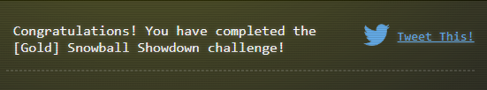

## Objective


## Hints
## Solution

### Bronze & Silver
>[!CAUTION]
>The method shown here will get you both bronze and silver once you win, but it can be achieved independently. If you do not change the variable in the URL and complete the challenge by beating Wombly, you will be granted a Bronze medal.

- Create a Private Room
- Edit the URL from `https://hhc24-snowballshowdown.holidayhackchallenge.com/game.html?username=RoamingB33F&roomId=11fd7f4a9&roomType=private&id=8c59fdc6-07dc-439d-b309-6449c847bcc4&dna=<dna>&singlePlayer=false` to `&singlePlayer=true`
- Play to Win by Hitting Wombly with a snowball. 

>[!NOTE]
>The game may freeze or may stutter a bit, do not relent, as it is still processing the events. You can get frozen too, so be careful


### Gold
>[!TIP]
>By playing all the other challenges, there are hints about this snowball fight having a weapon system. So you should look through the source code in `reconnecting-websocket.min.js` to identify any weapon systems. A trick that I tried is that Weapon System can be abbreviated to WS, which in JavaScript commonly refers to WebSocket. 
- Find the code for the game by going into Web Development Tools, and  Selecting Sources


- Looking at the code for the game, we can identify that the web socket has a weapon system attached to it:
```javascript
let b = () => {
            r < a.length - 1 ? 3 == ++r ? (mainScene.bomberContainer.setDepth(2),
            mainScene.tweens.add({
                targets: mainScene.bomberContainer,
                x: a[r].x,
                y: a[r].y,
                duration: a[r].duration,
                onUpdate() {
                    !mainScene.bomberContainer.bombHasDetached && mainScene.bomberContainer.x > GAME_WIDTH / 2 + 200 && (mainScene.bomberContainer.bombHasDetached = !0,
                    mainScene.bomberContainer.dwarfBomb.setAngle(-45),
                    mainScene.time.delayedCall(500, () => {
                        mainScene.bomberContainer.chat_bubble.setVisible(!0),
                        mainScene.bomberContainer.chatBubbleText.setVisible(!0)
                    }
                    ),
                    mainScene.tweens.add({
                        targets: [mainScene.bomberContainer.chat_bubble, mainScene.bomberContainer.chatBubbleText],
                        x: "+=300",
                        y: "+=" + GAME_HEIGHT,
                        duration: 4e3,
                        onComplete() {}
                    }),
                    mainScene.tweens.add({
                        targets: mainScene.bomberContainer.dwarfBomb,
                        x: "+=300",
                        y: "+=" + GAME_HEIGHT,
                        angle: -90,
                        duration: 4e3,
                        onUpdate() {
                            if (!mainScene.bomberContainer.dwarfBomb.hasExploded && mainScene.bomberContainer.dwarfBomb.y > 780) {
                                mainScene.bomberContainer.dwarfBomb.hasExploded = !0;
                                let e = mainScene.getWorldPosition(mainScene.bomberContainer.dwarfBomb);
                                mainScene.bomberContainer.chat_bubble.destroy(),
                                mainScene.bomberContainer.chatBubbleText.destroy(),
                                mainScene.bomberContainer.dwarfBomb.destroy(),
                                mainScene.healingTerrain = !1;
                                let a = 100;
                                for (let r = a; r <= 775; r += 25)
                                    mainScene.time.delayedCall(50 * (r / 25), () => {
                                        mainScene.drawTransparentCircle(mainScene.bgcanvas, e.x, e.y, r)
                                    }
                                    );
                                mainScene.add.particles(e.x, e.y, "particle", {
                                    lifespan: 2e3,
                                    speed: {
                                        min: 400,
                                        max: 1e3
                                    },
                                    scale: {
                                        start: 4,
                                        end: 0
                                    },
                                    gravityY: 150,
                                    blendMode: "ADD",
                                    emitting: !1
                                }).once("complete", e => {
                                    e.destroy()
                                }
                                ).explode(2e3)
                            }
                        },
                        onComplete() {}
                    }))
                },
                onComplete() {
                    a[r].flipX && (mainScene.bomberContainer.scaleX = -1),
                    b()
                }
            })) : mainScene.tweens.add({
                targets: mainScene.bomberContainer,
                x: a[r].x,
                y: a[r].y,
                scale: a[r].scale,
                alpha: a[r].alpha,
                duration: a[r].duration,
                onComplete() {
                    a[r].flipX && (mainScene.bomberContainer.scaleX = -1),
                    b()
                }
            }) : mainScene.ws.sendMessage({
                type: "moasb",
                launch_code: "85e8e9729e2437c9d7d6addca68abb9f"
            })
        }
        ;
        b()
```
- In this snippet of the code, we can see the components of a bomb, but at the end of it we see a ws (websocket) that is sending a moasb message. This is likely a representation of the `Mother of All Bombs` but instead of MOAB, it is `Mother of All Snow Balls` MOASB. Maybe we can send that over to Wombley's side.
- In the console provide the same message to the system to launch the bombs at Wombley
```javascript
mainScene.ws.sendMessage({type:"moasb",launch_code:"85e8e9729e2437c9d7d6addca68abb9f"})
```


