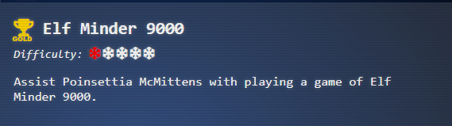
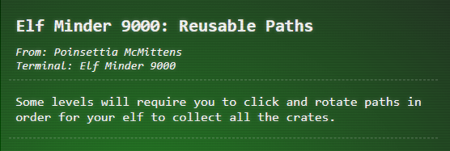
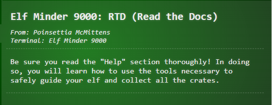
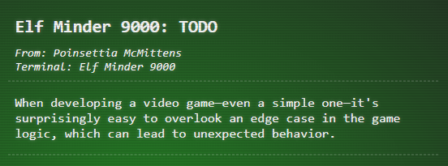
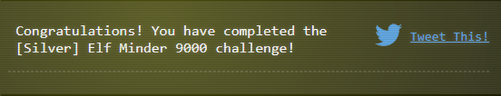
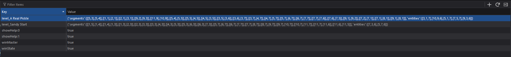
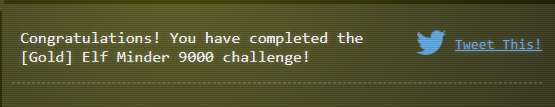
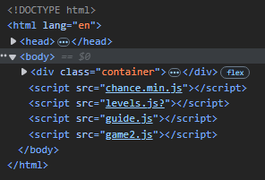

# Elf Minder 9000

## Objectives


## Challenge
_I need you to help me focus because this whole "moving back to the North Pole" situation has really thrown me off my game! It's a simple puzzle where you guide an elf to the exit as quickly as possible, but I've noticed some strange
issues with the springs. If I had made this game, it would be much more stable, though I won't comment any further on that!_
## Hints







## Rules
<video src="https://github.com/user-attachments/assets/31c71bdf-3455-405c-affc-b1f41a02f776"></video>

## Solution (Silver)
> [!NOTE] 
> The solutions demonstrated below are the solutions that I came up with when doing the challenge. Note that these solutions
are not optimized for the good score, bad score, or time, only that the meet the minimum requirement of getting the final
flag before the 999 ticks expire

### Sandy Start
<video src="https://github.com/user-attachments/assets/cee7c341-83d3-494a-b73c-6ede2ef85177"></video>

### Waves & Crates
<video src="https://github.com/user-attachments/assets/027826b5-a150-4c4e-99cd-85607ca36a52"></video>

### Tidal Treasures
<video src="https://github.com/user-attachments/assets/f6138af9-dfe2-496e-9d0b-5115f4428b88"></video>

### Dune Dash
<video src="https://github.com/user-attachments/assets/b8d75aef-808c-4846-99a5-bfa2079ac798"></video>

### Coral Cove
<video src="https://github.com/user-attachments/assets/d52e6868-b94c-487c-a75b-d48ecc182c37"></video>

### Shell Seekers
<video src="https://github.com/user-attachments/assets/372bb157-aaa0-4f89-893d-e804d394ec18"></video>

### Palm Grove Shuffle
<video src="https://github.com/user-attachments/assets/046c0a1a-7e0e-4e17-b1c8-1bc2232025ca"></video>

### Tropical Tangle
<video src="https://github.com/user-attachments/assets/08d0e6ed-6693-4a5f-bd9a-2de8302f9d62"></video>

### Crate Caper
<video src="https://github.com/user-attachments/assets/06223d5c-e8b7-4729-b04a-e3b3b10497c3"></video>

### Shoreline Shuffle
<video src="https://github.com/user-attachments/assets/86480985-88e7-463d-9203-a22e04203415"></video>

### Beachy Bounty
<video src="https://github.com/user-attachments/assets/d0c8cff4-5297-45be-9b3c-bbd4ad789510"></video>

### Driftwood Dunes
<video src="https://github.com/user-attachments/assets/1f0170fb-14c0-49b1-82e2-0e5deaf846e7"></video>

After completing all 12 of the puzzles, you will be awarded the silver completion for the Elf Minder 9000 challenge.


## Solution (Gold)

### Bonus Stage - `A Real Pickle`

#### No Cheating Method
> [!IMPORTANT]
> If the player jumps using a spring and in the jump direction there is no path, but a positioned element, the player
> jumps back to the starting point of the first segment.

> [!IMPORTANT]
> If you place the end flag path and spring first, then the spring will diagonally jump. Change this order and the spring
> will jump somewhere else

<video src="https://github.com/user-attachments/assets/c0e9ed32-0094-4b1a-8a89-6a8ca9a8fa27"></video>

#### Let's Play Around A Bit
<video src="https://github.com/user-attachments/assets/8ac558c9-f431-47ac-b213-024eccd204f9"> </video>

> [!CAUTION]
> Requires modification of the local storage. Be sure to only modify the local storage of this challenge and not of other
> sites as this may result in unexpected changes. Additionally, modification of the contents may result in several errors
> in the game. If this occurs simply refresh the page or delete the key from storage. This however may result in the 
> placements being lost

> [!NOTE]
> You can modify game.segments to create diagonal path segments, but these will fail due to sanity checks that occur. This may also occur if you try to delete all obstacles from the level.
 
> [!TIP]
> You can learn about the code and how you can specifically create the intended effect by examining the section below  [Code Review](#Code%20Review)

#### Reproduction Steps
This puzzle is not possible without a few modifications. In order support the modifications, we need 1 extra spring to create an obstacle. To do this we have to modify the JSON structure in local storage. The structure is as follows:
- **segements** : consists of the starting grid coordinate and the ending grid coordinate for each line within a single block
- **entities** : consists of the placement by row, column and entity type for a given resource. 

```javascript
// Excerpt from guide.js
const EntityTypesRef = {
    0: 'start',
    1: 'end',
    2: 'crate',
    3: 'blocker',
    4: 'hazard',
    5: 'steam',
    6: 'portal',
    7: 'spring',
};

```

Modify your `Local Storage` (available via the development tools in your browser) to contain the following for the key 
`level_A Real Pickle`:
```json
{
  "segments":[
    [ [5,3], [5,4] ],
    [ [1,1], [2,1] ],
    [ [2,1], [3,1] ],
    [ [9,2], [9,3] ],
    [ [11,9], [10,9] ],
    [ [5,4], [5,5] ],
    [ [5,5], [4,5] ],
    [ [4,5], [3,5] ],
    [ [3,5], [3,6] ],
    [ [3,6], [3,7] ],
    [ [3,7], [4,7] ],
    [ [4,7], [5,7] ],
    [ [5,7], [6,7] ],
    [ [6,7], [7,7] ],
    [ [7,7], [7,6] ],
    [ [7,6], [7,5] ],
    [ [9,1], [9,2] ],
    [ [7,2], [7,1] ],
    [ [7,1], [8,1] ],
    [ [9,1], [8,1] ]
  ],
  "entities":[
    [3,1,7],
    [10,9,6],
    [5,1,7],
    [7,5,7],
    [9,3,6]
  ]
}
```
- At first nothing will show on the screen. Hit the start button, then restart, and everything should show up.
- Rotate segments as normal to follow the path to get crates and use ladder to go to the end flag





## Be Stubborn

### Stop Guessing, Just Edit
> [!TIP]
> By adding a `edit=1` to the game URL, a level editor in started

 
**Identified By the code: **
```javascript
const urlParams = __PARSE_URL_VARS__();
const levelNum = urlParams.level ? urlDecode(urlParams.level) : '';
const rid = urlParams.id;
const isEditor = !!urlParams.edit;

if (isEditor) {
    adminControls.classList.remove('hidden');
    console.log('⚡⚡⚡⚡⚡⚡⚡⚡⚡⚡⚡⚡⚡⚡⚡');
    console.log('⚡ Hey, I noticed you are in edit mode! Awesome!');
    console.log('⚡ Use the tools to create your own level.');
    console.log('⚡ Level data is saved to a variable called `game.entities`.');
    console.log('⚡ I\'d love to check out your level--');
    console.log('⚡ Email `JSON.stringify(game.entities)` to evan@counterhack.com');
    console.log('⚡⚡⚡⚡⚡⚡⚡⚡⚡⚡⚡⚡⚡⚡⚡');
}
```

So by modifying the url we place entities where we think the should be, save and refresh it tyo have a modified level 
that can be completed. This is similar to the solution provided in the cheat method above, as the ultimate change that 
stems from the edit level is the entities being changed. 

### Code Review
```javascript
function getSpringTarget(springCell) {
        const journey = this.hero.journey;
        const dy = journey[1][1] - journey[0][1];
        const dx = journey[1][0] - journey[0][0];

        let nextPoint = [ springCell[0], springCell[1] ];
        let entityHere;
        let searchLimit = 15;
        let searchIndex = 0;
        let validTarget;

        do {
            searchIndex += 1;
            nextPoint = [ nextPoint[0] + dx, nextPoint[1] + dy ];
            
            entityHere = this.entities.find(entity => 
                ~[
                    EntityTypes.PORTAL,
                    EntityTypes.SPRING,
                ].indexOf(entity[2]) &&
                searchIndex &&
                entity[0] === nextPoint[0] &&
                entity[1] === nextPoint[1]);
            
            if (searchIndex >= searchLimit) {
                break;
            }

            validTarget = this.isPointInAnySegment(nextPoint) || entityHere;
        } while (!validTarget);

        if (this.isPointInAnySegment(nextPoint) || entityHere) {
            if (entityHere) return this.segments[0][0]; // fix this
            return nextPoint;
        } else {
            return;
        }        
    }
```
This function above,calculates the location the Elf will land on when using the Spring to jump. It determines where the 
Elf will land by selecting the next cell in the direction the Elf is moving (noted in the [rules](#rules)). It determines
if the square contains a Portal/Tunnel (EntityTypes.PORTAL) or a Spring (EntityTypes.SPRING) which we know based on the
extracted code of 
```javascript
entityHere = this.entities.find(entity => 
                ~[
                    EntityTypes.PORTAL,
                    EntityTypes.SPRING,
                ].indexOf(entity[2]) &&
                searchIndex &&
                entity[0] === nextPoint[0] &&
                entity[1] === nextPoint[1]);
```
So what happens here? It returns to where the path starts. That path start may be the beginning flag, or it may be another
segment. But lets verify if that is correct:
```javascript
if (this.isPointInAnySegment(nextPoint) || entityHere) {
            if (entityHere) return this.segments[0][0]; // fix this
            return nextPoint;
        } else {
            return;
        }   
```
OH NO!! Its not correct. It returns to `segments[0][0]`, which is the first segment start location. Ie. This return is 
not actually point to the beginning of the path, but to the first segment placed on the board. `ORDER MATTERS` So you 
can jump to any square that is not blocked.

### Just Let Me Cheat Via JavaScript 
- Fine! Lets do it, so lets look at the source code here and see what we have available


- `game2.js` -- Wait!! Why is there a game2? Is there others? We can try to see those by exploring what changes with the url.
	- https://hhc24-elfminder.holidayhackchallenge.com/game2.js -> Original File
	- https://hhc24-elfminder.holidayhackchallenge.com/game1.js -> Maybe Previous Version? (Content `( ͡° ͜ʖ ͡°)`) 
		- Looks like they thought about this, but did they go all the way?
	- https://hhc24-elfminder.holidayhackchallenge.com/game0.js -> Yep, went all the way! But what about if there is no number, like the original version or something? (Content `( ͡° ͜ʖ ͡°)`) 
	- [hhc24-elfminder.holidayhackchallenge.com/game.js](https://hhc24-elfminder.holidayhackchallenge.com/game.js) -> Well this one is different! [Source Code](../../../Assets/code/prologue/elf-minder/game.js) 
		- Guess we found [edit mode](#Stop%20Guessing,%20Just%20Edit) again
- `chance.min.js`
- `levels.js`
- `guide.js` 

- Okay, so should we build a custom solution that represents the game mechanics so that the solution to brute force all possibilities? 
	- Nope! Sorry don't have that kind of time, but we can preload your local storage with winning paths, and so only thing required is rotations

```javascript
function storePuzzleData() {
  const puzzles  = {
    "level_A Real Pickle": {
      segments: [[[1,1],[2,1]],[[1,7],[2,7]],[[2,7],[3,7]],[[11,9],[11,8]],[[8,7],[9,7]],[[9,7],[10,7]],[[3,7],[3,6]],[[3,6],[3,5]],[[3,5],[4,5]],[[4,5],[5,5]],[[5,5],[5,4]],[[5,4],[5,3]],[[6,5],[7,5]],[[7,5],[7,6]],[[7,6],[7,7]],[[7,7],[8,7]],[[9,1],[9,2]],[[9,2],[9,3]]],
      entities: [[2,1,7],[10,7,7],[1,7,6],[9,7,7],[9,3,6]]
    },
    "level_Beachy Bounty": {
      segments: [[[1,5],[1,4]],[[1,4],[1,3]],[[1,3],[1,2]],[[1,2],[1,1]],[[1,1],[2,1]],[[5,5],[6,5]],[[6,5],[7,5]],[[3,1],[2,1]],[[9,9],[10,9]],[[10,9],[11,9]],[[11,9],[11,8]],[[11,8],[11,7]],[[11,7],[11,6]],[[11,6],[11,5]],[[9,5],[8,5]],[[9,5],[9,6]],[[9,6],[9,7]],[[9,7],[9,8]],[[9,8],[9,9]]],
      entities: [[3,1,6],[7,5,6]]
    },
    "level_Coral Cove": {
      segments: [[[11,1],[11,2]],[[11,2],[11,3]],[[11,3],[10,3]],[[10,3],[9,3]],[[9,3],[8,3]],[[8,3],[7,3]],[[7,3],[7,2]],[[7,2],[7,1]],[[7,1],[6,1]],[[6,1],[5,1]],[[5,1],[4,1]],[[4,1],[3,1]],[[3,1],[3,2]],[[3,2],[3,3]],[[3,3],[3,4]],[[3,4],[3,5]],[[3,5],[4,5]],[[4,5],[5,5]],[[5,5],[5,6]],[[5,6],[5,7]],[[1,9],[1,8]],[[1,8],[1,7]],[[6,7],[7,7]],[[7,7],[8,7]],[[8,7],[9,7]],[[9,7],[10,7]],[[10,7],[11,7]],[[11,7],[11,8]],[[11,8],[11,9]]],
      entities: [[5,7,6],[1,9,6]]
    },
    "level_Crate Caper": {
      segments: [[[11,9],[10,9]],[[10,9],[9,9]],[[5,5],[6,5]],[[6,5],[7,5]],[[3,5],[4,5]],[[5,1],[5,2]],[[5,2],[5,3]],[[5,3],[5,4]],[[5,9],[5,8]],[[5,8],[5,7]],[[5,7],[5,6]],[[11,1],[10,1]],[[10,1],[9,1]]],
      entities: [[5,5,6],[11,9,6],[9,1,7]]
    },
    "level_Driftwood Dunes": {
      segments: [[[1,9],[1,8]],[[1,8],[1,7]],[[7,7],[7,6]],[[7,6],[7,5]],[[7,5],[8,5]],[[8,5],[9,5]],[[9,5],[9,4]],[[9,4],[9,3]],[[9,3],[9,2]],[[9,2],[9,1]],[[9,1],[8,1]],[[8,1],[7,1]],[[7,1],[6,1]],[[6,1],[5,1]],[[5,1],[5,2]],[[5,2],[5,3]],[[7,8],[7,9]],[[7,9],[8,9]],[[8,9],[9,9]],[[9,9],[10,9]],[[10,9],[11,9]]],
      entities: [[1,7,6],[7,7,6]]
    },
    "level_Dune Dash": {
      segments: [[[7,9],[6,9]],[[5,9],[5,8]],[[5,8],[5,7]],[[5,7],[5,6]],[[5,6],[5,5]],[[5,5],[6,5]],[[6,5],[7,5]],[[7,5],[8,5]],[[8,5],[9,5]],[[9,5],[9,4]],[[9,4],[9,3]],[[9,3],[9,2]],[[9,2],[9,1]],[[9,1],[8,1]],[[1,1],[2,1]],[[2,1],[3,1]],[[11,7],[11,8]],[[11,8],[11,9]]],
      entities: [[5,9,6],[3,1,7],[11,7,6]]
    },
    "level_Palm Grove Shuffle": {
      segments: [[[1,1],[2,1]],[[2,1],[3,1]],[[7,1],[8,1]],[[8,1],[9,1]],[[9,1],[9,2]],[[9,2],[9,3]],[[9,7],[9,8]],[[9,8],[9,9]],[[9,9],[8,9]],[[8,9],[7,9]],[[11,9],[10,9]],[[9,3],[9,4]],[[9,4],[9,5]],[[9,5],[8,5]],[[8,5],[7,5]],[[7,5],[6,5]],[[6,5],[5,5]],[[5,5],[5,4]],[[5,4],[5,3]],[[5,3],[4,3]],[[4,3],[3,3]],[[3,3],[2,3]],[[2,3],[1,3]],[[1,3],[1,4]],[[1,4],[1,5]],[[1,5],[1,6]],[[1,6],[1,7]],[[1,7],[2,7]],[[2,7],[3,7]],[[3,7],[4,7]],[[4,7],[5,7]],[[5,7],[5,6]],[[9,7],[9,6]]],
      entities: [[3,1,7]]
    },
    "level_Sandy Start": {
      segments: [[[1,5],[2,5]],[[2,5],[3,5]],[[3,5],[4,5]],[[4,5],[5,5]],[[5,5],[5,4]],[[5,4],[5,3]],[[5,3],[6,3]],[[6,3],[7,3]],[[7,3],[7,4]],[[7,4],[7,5]],[[7,5],[7,6]],[[7,6],[7,7]],[[7,7],[8,7]],[[8,7],[9,7]],[[9,7],[10,7]],[[10,7],[11,7]],[[11,7],[11,6]],[[11,5],[11,6]]],
      entities: []
    },
    "level_Shell Seekers": {
      segments: [[[1,9],[2,9]],[[2,9],[3,9]],[[3,9],[4,9]],[[4,9],[5,9]],[[5,9],[5,8]],[[5,8],[5,7]],[[5,7],[4,7]],[[4,7],[3,7]],[[3,7],[2,7]],[[2,7],[1,7]],[[1,7],[1,6]],[[1,6],[1,5]],[[1,5],[1,4]],[[1,4],[1,3]],[[1,3],[1,2]],[[1,2],[1,1]],[[1,1],[2,1]],[[2,1],[3,1]],[[3,1],[4,1]],[[4,1],[5,1]],[[5,1],[5,2]],[[5,2],[5,3]],[[5,3],[5,4]],[[5,4],[5,5]],[[5,5],[6,5]],[[6,5],[7,5]],[[7,5],[7,4]],[[7,4],[7,3]],[[7,3],[8,3]],[[8,3],[9,3]],[[9,3],[10,3]],[[10,3],[11,3]],[[11,3],[11,4]],[[11,4],[11,5]],[[11,5],[10,5]],[[10,5],[9,5]],[[9,5],[9,6]],[[9,6],[9,7]],[[9,7],[10,7]],[[10,7],[11,7]],[[11,7],[11,8]],[[11,8],[11,9]]],
      entities: []
    },
    "level_Shoreline Shuffle": {
      segments: [[[1,9],[2,9]],[[2,9],[3,9]],[[3,9],[3,8]],[[1,3],[1,4]],[[1,4],[1,5]],[[1,5],[1,6]],[[1,6],[1,7]],[[1,7],[2,7]],[[2,7],[3,7]],[[3,7],[4,7]],[[4,7],[5,7]],[[5,7],[5,6]],[[5,6],[5,5]],[[5,5],[5,4]],[[5,4],[5,3]],[[9,8],[9,9]],[[9,9],[10,9]],[[10,9],[11,9]],[[9,3],[9,4]],[[9,4],[9,5]],[[9,5],[9,6]],[[9,7],[8,7]],[[8,7],[7,7]],[[7,7],[6,7]],[[9,7],[9,6]]],
      entities: [[3,8,7]]
    },
    "level_Tidal Treasures": {
      segments: [[[1,5],[1,4]],[[1,4],[1,3]],[[1,3],[2,3]],[[2,3],[3,3]],[[3,3],[3,4]],[[3,4],[3,5]],[[3,5],[3,6]],[[3,6],[3,7]],[[3,7],[2,7]],[[2,7],[1,7]],[[1,7],[1,8]],[[1,8],[1,9]],[[11,3],[11,4]],[[11,4],[11,5]]],
      entities: [[1,9,6],[11,3,6]]
    },
    "level_Tropical Tangle": {
      segments: [[[11,9],[10,9]],[[10,9],[9,9]],[[9,9],[8,9]],[[8,9],[7,9]],[[7,9],[6,9]],[[6,9],[5,9]],[[5,9],[5,8]],[[5,7],[5,8]],[[4,9],[3,9]],[[3,9],[2,9]],[[2,9],[1,9]],[[1,9],[1,8]],[[1,8],[1,7]],[[1,7],[1,6]],[[1,6],[1,5]],[[1,5],[1,4]],[[1,4],[1,3]],[[1,3],[1,2]],[[1,2],[1,1]],[[5,6],[5,5]],[[5,5],[5,4]],[[5,4],[5,3]],[[5,3],[5,2]],[[5,2],[5,1]],[[5,7],[5,6]],[[5,1],[6,1]],[[6,1],[7,1]],[[7,1],[8,1]],[[11,3],[11,4]],[[11,4],[11,5]],[[8,1],[9,1]]],
      entities: [[11,3,6],[9,1,6]]
    },
    "level_Waves and Crates": {
      segments: [[[1,5],[1,6]],[[1,6],[1,7]],[[1,7],[2,7]],[[2,7],[3,7]],[[3,7],[4,7]],[[4,7],[5,7]],[[5,7],[6,7]],[[6,7],[7,7]],[[7,7],[7,6]],[[7,6],[7,5]],[[7,5],[7,4]],[[7,4],[7,3]],[[7,3],[6,3]],[[6,3],[5,3]],[[5,3],[4,3]],[[4,3],[3,3]],[[3,3],[3,2]],[[3,2],[3,1]],[[3,1],[4,1]],[[4,1],[5,1]],[[5,1],[6,1]],[[6,1],[7,1]],[[7,1],[8,1]],[[8,1],[9,1]],[[9,1],[9,2]],[[9,2],[9,3]],[[9,3],[10,3]],[[10,3],[11,3]],[[11,3],[11,4]],[[11,4],[11,5]]],
      entities: []
    }
  };

Object.entries(puzzles).forEach(([name, data]) => {
    localStorage.setItem(name, JSON.stringify(data));
  });
}
storePuzzleData();
```