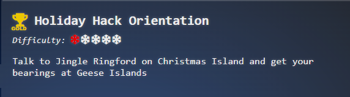
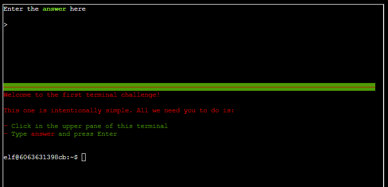
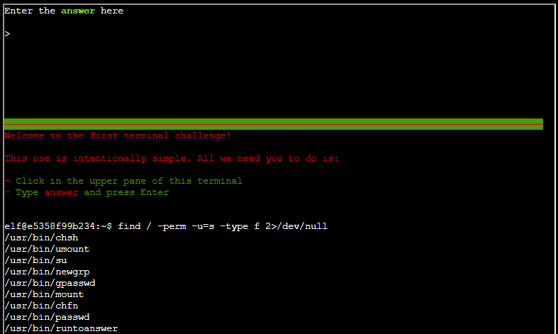
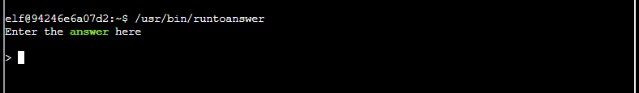
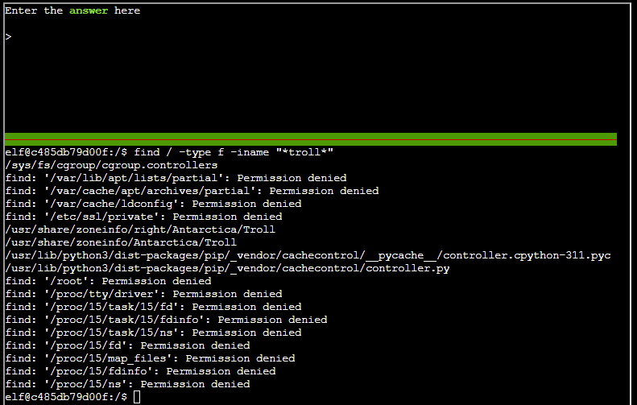
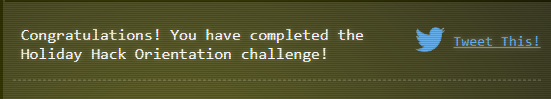

# First Terminal
## Objectives

## Challenge
_I'm Jingle Ringford, and while we're currently at Frosty's Beach on Christmas Island transitioning from the 2023 to 2024. SANS Holiday Hack Challenge, we'll soon head back to the North Pole. Although Santa's busy packing, I'm here to give newcomers a quick orientation and present you with a magical never-melting snowball souvenir. You can find your Objectives, Hints, and other Challenge resources by clicking the snowball on your avatar._ 

_Now, click on the Cranberry Pi Terminal and follow the on-screen instructions._
## Solution (Silver)
The first terminal was the introduction to the Holiday Hack Challenge. In this challenge, your only objective it to was to put `answer` in the top part of the window next to the `>` symbol.

**Answer:** `answer`
## There's More?
When you explore the bottom terminal you can see that you can move through the operating system, to which you can explore or test a few commands. I was not able to identify anything of particular value, such as a hidden flag or achievement in this terminal
### Finding Binaries
- Look for binaries that have suid `find / -perm -u=s -type f 2>/dev/null`

- run the `/usr/bin/runtoanswer` and provide `answer` to it it will grant the trophy and immediately close

### Finding Trolls
- Looking for trolls using grep `find / -type f -iname "*troll*"` which only shows time zones. So no real trolls this time. Must have defeated them in 2023.

## What's Next

### Prerequisite For
- [Elf Connect](Elf%20Connect.md)
- [Elf Minder 9000](Elf%20Minder%209000.md)
### Awards

